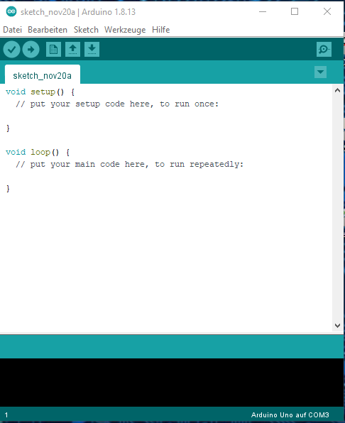

Bots2LEarn – selbst fahrender Roboter

Skript zum Kurs

Inhalt
======


# 1. Grundlagen
=============

## 1.1 Was ist ein Arduino?
------------------------

Ein Arduino ist ein Microcontroller, der darauf spezialisiert ist,
eingehende Signale (Inputs) zu verarbeiten und entsprechend seiner
Programmierung Signale auszugeben (Outputs). Der Arduino kann sowohl
digitale Signale (Spannung an/Spannung aus) als auch analoge Signale
(verschiedene Spannungen) verarbeiten. Dafür besitzt er unterschiedliche
Anschlüsse, die „Pins“ genannt werden. Es gibt verschiedene Varianten
(„Boards“) des Arduino. In diesem Kurs werden wir den Arduino-Nano
verwenden.

## 1.2. Die Arduino IDE
--------------------

Zum Programmieren des Arduinos verwenden wir die Arduino IDE. Diese
findet ihr unter:

<https://www.arduino.cc/en/software#download>

Wählt hier die für euer Betriebssystem passende Version aus und ladet
sie herunter.

Ihr öffnet die IDE mit einem Doppelklick auf die Desktop-Verknüpfung.
Danach öffnet sich das folgende Fenster:



***Abbildung 1: Das Fenster der IDE***


1.3 Aufbau eines Programms
--------------------------

In jedem neu geöffneten Programm („sketch“) befindet sich bereits der
folgende Code:

Abbildung 2: Grundstruktur eines Arduinoprogramms

Ein Arduino-Programm hat mindestens zwei Abschnitte: Das setup und die
loop. Über dem setup können Variablen definiert und libraries importiert
werden. Ihr könnt später eure Programme mit eigenen Abschnitten
(„Funktionen“) erweitern.

<span class="underline">setup</span>

Alle Befehle des Setups werden nur einmal zu Beginn des Programms
ausgeführt. Dazu gehört unter anderem das Initialisieren der Pins und
des Seriellen Monitors.

<span class="underline">loop</span>

Die Befehle der Loop („Schleife“) werden nach einmaliger Ausführung des
Setups endlos wiederholt. In der Loop befindet sich das eigentliche
Programm, also die Aktionen die der Arduino durchführen soll.

1.4 Erste Schritte
------------------

### 1.4.1 Das erste Programm

Das erste Programm, welches ihr selber schreiben sollt, soll die LED auf
dem Arduino-Board blinken lassen.

Material: Arduino Nano, Verbindungskabel

Im Setup fügt ihr den Befehl

```cpp
pinMode(13,OUTPUT);

hinzu. Mit dem Befehl pinMode() legt ihr fest, welche Pins ihr verwenden
wollt, und ob diese Pins Input oder Output sind.

In der loop fügt ihr die Befehle:

digitalWrite(13,HIGH);

delay(1000);

digitalWrite(13,LOW);

delay(1000);
```
hinzu. Der Befehl digitalWrite() wird benutzt, um die digitalen Pins des
Arduino anzusteuern. Angegeben wird der Pin, der angesteuert werden soll
und den Zustand, den der Pin annehmen soll. Digitale Pins können die
Zustände HIGH oder LOW annehmen.

Mit delay() könnt ihr Pausen in euer Programm einfügen. Dazu gebt ihr
eine Zeitspanne in Millisekunden an. Eine Sekunde sind 1000
Millisekunden.

Das Fenster der IDE sollte nun so aussehen:

Nun klickt ihr auf das Häkchen links oben. Anschließend wird sich ein
Fenster öffnen, dass von euch verlangt euer Programm zu speichern. Wählt
einen aussagekräftigen Namen aus und speichert das Programm unter einem
sinnfollen Namen ( LED\_Blinken\_lassen). Achtet dabei darauf keine
Sonderzeichen, Lerzeichen oder umlaute zu nutzen. Jetzt steht in der
Zeile unter eurem Code „Kompilieren abgeschlossen.“ Kompilieren
bedeutet, dass der Computer das Programm so übersetzt, dass der Arduino
es auch versteht.

Anschließend verbindet ihr euren Arduino über das Verbindungskabel mit
eurem Computer. Nun müsst ihr nur noch der IDE mitteilen, wo der Arduino
angeschlossen ist. Dazu klickt ihr auf „Werkzeuge“. Stellt sicher, dass
bei „Board“ der passende Arduino ausgewählt ist (meist der Arduino Uno).
Direkt darunter, bei „Port“ müsst ihr den Anschluss auswählen.

Jetzt seid ihr bereit, das Programm hochzuladen. Klickt dazu auf den
Pfeil nach rechts, direkt neben dem Häkchen.

Nachdem das Programm hochgeladen wurde (dies dauert einige Sekunden),
sollte die LED auf dem Arduino-Board blinken, mit jeweils einer Sekunde
leuchten und einer Sekunde Pause.

###

### 1.4.2 Eine LED am Breadboard

Für eure erste Schaltung sollt ihr eine LED auf dem Breadboard mit dem
Arduino ansteuern.

Material: LED, Widerstand mit 100Ω oder 200Ω, Breadboard, Jumperkabel,
Arduino Nano, Verbindungskabel

Steckt zunächst die LED auf dem Breadboard fest. Achtet dabei darauf,
dass die beiden Drähte (Pole) der LED nicht über das Breadboard
verbunden sind. Verbindet einen Pol des Widerstands mit dem kürzeren
Bein (Minuspol) der LED.

Anschließend verbindet ihr das längere Bein (der Pluspol) der LED mit
einem digitalen Pin und den zweiten Pol des Widerstands mit einem der
GND-Pins.

Abbildung 3: Schaltbild 1.4

Als Programm benutzen wir den Sketch aus 1.4.1. Entweder ihr schließt
die LED an Pin 13 an, oder ihr verwendet einen anderen Pin. Letzteres
bedeutet aber, dass ihr im Programm die Pinnummer ändern müsst.

2. Bauteile am Roboter
======================

2.1 Fotowiderstand
------------------

### 2.1.1 Exkurs: Ohmsches Gesetz und Reihenschaltung

In einem Stromkreis werden drei verschiedene Werte unterschieden: Die
Spannung (U), der Strom (I) und der Widerstand (R). Verändert sich einer
der Werte, hat das auch Einfluss auf die anderen Werte. Diese
Veränderungen werden durch das Ohmsche Gesetz beschrieben.

*U* = *R* • *I*  

Eine Möglichkeit, Widerstände in einer Schaltung zu kombinieren nennt
sich Reihenschaltung. Die besondere Eigenschaft der Reihenschaltung ist,
dass der Strom durch die Widerstände gleichbleibt, sich aber die
Spannung verändert. Eine solche Schaltung mit zwei Widerständen
bezeichnet man auch als Spannungsteiler.

### 2.1.2 Den Fotowiderstand benutzen

Material: Arduino Nano, Breadboard, Fotowiderstand, 1x 1kΩ Widerstand,
Breadboardkabel

Um die Lichtstärke mit einem Fotowiderstand zu messen benötigen wir
einen Spannungsteiler. Dieser besteht aus einem festen Widerstand von
1000Ω und dem Fotowiderstand. Der Fotowiderstand wird am ersten Kontakt
mit dem Pin 5V, am zweiten Kontakt mit einem analogen Pin und dem festen
Widerstand verbunden. Der zweite Kontakt des festen Widerstands wird mit
dem Pin GND verbunden.

Abbildung 4: Schaltbild 2.1

Um die Werte des Fotowiderstands auslesen zu können benötigen wir einen
weiteren Befehl: analogRead(). Mit analogRead() lassen sich analoge Pins
auslesen. Das Ergebnis ist eine ganze Zahl im Bereich von 0 bis 1023.

```cpp
int *variablenname*=analogRead(*Pinnummer*);
```

Die Nummern von analogen Pins beginnen stets mit einem „A“.

Ein Programm zum Auslesen eines Fotowiderstandes sieht zum Beispiel so
aus:

Wenn ihr dieses Programm ausführt, liest der Arduino den Wert an Pin A3
aus. Allerdings erfahren wir nicht, welcher Wert ausgelesen wird, bzw.
wie sich der ausgelesene Wert (und damit die Lichtverhältnisse) ändern.
Damit wir die Werte lesen können benötigen wir den Seriellen Monitor.
Mit diesem kann man während der Ausführung des Programms die Werte von
Variablen und sogar Texte auf dem Bildschirm ausgeben lassen.

Zunächst muss der Serielle Monitor initialisiert werden. Dazu schreibt
ihr den Befehl:

Serial.begin(9600);

In das setup. Um den Wert auszugeben ergänzt man die loop um den Befehl:

Serial.println(wert);

Nun ladet ihr das Programm auf den Arduino hoch. Erst wenn das Hochladen
abgeschlossen ist könnt ihr den Seriellen Monitor öffnen. Dies geht über
den Menüpunkte „Werkzeuge“-&gt; „Serieller Monitor“ oder über dieses
Symbol rechts oben im Programmfenster:

Die Werte die der Arduino ausliest werden nun in Echtzeit ausgegeben,
viel zu schnell um sie zu lesen. Wir ergänzen daher die Loop um einen
delay-Befehl mit 100ms Dauer. Der Arduino führt nun nur noch ca. 10
Messungen pro Sekunde durch, wodurch wir die Werte besser ablesen
können.

2.2 Ultraschallsensor
---------------------

Material: Arduino Nano, Breadboardkabel, Ultraschallsensor

Ein Ultraschallsensor wird verwendet, um Entfernungen zu messen. Er
sendet aus einem seiner „Augen“ (Pötte) einen Ultraschallimpuls. Dieser
prallt von Hindernissen vor dem Ultraschallsensor ab und wird vom
anderen „Auge“ des Sensors empfangen. Mit der Zeit, die zwischen diesen
Impulsen vergeht sowie der Schallgeschwindigkeit lässt sich die Distanz
zum Hindernis ausrechnen. ´

Der Ultraschallsensor besitzt 4 Anschlüsse. Wir verbinden den Anschluss
VCC mit 5V am Arduino, GND mit GND und Trig und Echo mit jeweils einem
digitalen Pin. Im Setup definieren wir Trig (kurz für „Trigger“) als
Output und Echo als Input.

Abbildung 5: Schaltbild 2.2

Um die Entfernung zu messen schalten wir zunächst den Trigger-Pin für
eine kurze Zeit auf LOW, und danach für 10ms auf HIGH, um einen
Ultraschallimpuls auszusenden.

Mit dem Befehl pulseIn() wird die Zeit gemessen, bis der Echo-Pin ein
Signal empfängt:

*variable*= pulseIn(*PinNummer*, *Zustand*);

Die Entfernung berechnen wir mit der Formel:

$\\frac{\\text{dauer}}{2} \\bullet 0,03432$ „dauer“-&gt;wert von
pulseIn()

Die Ausgabe der Werte erfolgt über den seriellen Monitor.

Das fertige Programm zur Entfernungsmessung mit dem Ultraschallsensor:

Abbildung 6: Programm zur Entfernungsmessung

2.3 LED-Ring
------------

### 2.3.1 Exkurs: Was ist ein Array?

Ein Array (dt. „Feld“) ist eine Ansammlung von Werten des gleichen Typs
(z.B. ganze Zahlen, Kommazahlen, Zeichen), die in einer bestimmten
Reihenfolge angeordnet sind. Die Position eines Wertes wird auch „Index“
genannt. Möchte man auf einen bestimmten Wert zugreifen, schreibt man:

*name\_des\_arrays*\[*index*\]

Möchte man einem Index einen bestimmten Wert zuweisen, schreibt man:

*name\_des\_arrays*\[*index*\] = *wert*;

Wichtig: Der Index wird von Null aus gezählt. In einem Array mit 12
Positionen ist also der höchste Index 11.

### 2.3.2 Den LED-Ring benutzen

Material: LED-Ring, Arduino Nano

Der LED Ring besteht aus 12 RGB-LEDs (mehrfarbige LEDs) und wird über
die Library FastLED angesteuert. Damit der Arduino weiß, dass wir
FastLED verwenden schreiben wir über dem setup:

\#include &lt;FastLED.h&gt;

Außerdem definieren wir zwei Konstanten: Einmal die Anzahl unserer LEDs
und den digitalen Pin über den wir den LED-Ring ansteuern:

\#define NUM\_LED 12

\#define DATA\_PIN 12

Zuletzt definieren wir ein Array, über das wir auf die LEDs zugreifen
können:

CRGB leds\[NUM\_LEDS\];

Im setup initialisieren wir den LED-Ring mit dem Befehl:

FastLED.addLeds&lt;NEOPIXEL, DATA\_PIN&gt;(leds, NUM\_LEDS);

**<span class="underline">Den LED-Ring ansteuern</span>**

In der Loop werden die Farbwerte der LEDs festgelegt. Dafür gibt es zwei
Möglichkeiten: setRGB() und setHSV()

<span class="underline">setRGB()</span>

leds\[*index*\]=setRGB(*wert\_rot*, *wert\_grün*, *wert\_blau*);

Bei setRGB müssen je ein Wert für die Intensität des roten, des grünen
und des blauen Lichts festelegt werden. Aus der Kombination der Werte
ergeben sich dann die restlichen Farben. Alle Werte müssen im Bereich
von 0 bis 255 liegen.

<span class="underline">setHSV()</span>

leds\[*index*\]=setHSV(*farbton*, *sättigung*, *helligkeit*);

Bei setHSV muss ein Wert für den Farbton eingegeben werden. Dieser
beschreibt die Position des Farbtons auf einem Spektrum. Die Werte
werden von der Farbe Rot ausgehend gezählt. Sättigung beschreibt die
Intensität der Farbe. Alle Werte müssen im Bereich von 0 bis 255 liegen.

Mit dem Befehl

FastLED.show();

schalten wir den LED-Ring an. Nun leuchten alle LEDs für die wir zuvor
einen Farbwert definiert haben.

Es gibt auch einige vordefinierte Farbwerte. Diese können wir mit dem
folgenden Befehl aufrufen:

leds\[index\]=CRGB::Farbname;

Eine Liste mit Farbnamen findet ihr im Anhang.

Ein einfaches Programm für den LED-Ring sieht zum Beispiel so aus:

Abbildung 7: Lauflicht-Programm

Dieses Programm erzeugt ein Lauflicht mit sich ändernden Farben.

2.4 Motoren und H-Brücke
------------------------

Damit unser Roboter sich fortbewegen kann braucht er Motoren. Diese
werden wir über eine H-Brücke ansteuern.

Material: Arduino Nano, H-Brücke, 2 Gleichstrommotoren, Breadboardkabel

Die H-Brücke hat 8 Anschlüsse, die wir mit dem Arduino verbinden müssen:

<table>
<thead>
<tr class="header">
<th>Anschluss</th>
<th>Pin am Arduino</th>
</tr>
</thead>
<tbody>
<tr class="odd">
<td>Schwarzes Kabel</td>
<td>GND</td>
</tr>
<tr class="even">
<td>Rotes Kabel</td>
<td>VIN</td>
</tr>
<tr class="odd">
<td>ENA</td>
<td>D10</td>
</tr>
<tr class="even">
<td>IN1</td>
<td>D9</td>
</tr>
<tr class="odd">
<td>IN2</td>
<td>D8</td>
</tr>
<tr class="even">
<td>IN3</td>
<td>D7</td>
</tr>
<tr class="odd">
<td>IN4</td>
<td>D6</td>
</tr>
<tr class="even">
<td>ENB</td>
<td>D5</td>
</tr>
</tbody>
</table>

An den Batterieclip schließt ihr, sobald ihr euer Programm ausführen
wollt eine 9V-Batterie an.

Abbildung 8: Schaltbild 2.4

Für jeden Motor werden drei digitale Pins am Arduino belegt. Jeweils
zwei (IN1, IN2 sowie IN3, IN4) geben die Richtung des Motors vor. Diese
Pins werden, je nach gewünschter Richtung, an- und ausgeschaltet. Die
Pins ENA und ENB bestimmen die Geschwindigkeit der Motoren über
Pulsweitenmodulation.

Um ENA und ENB anzusteuern verwenden wir den Befehl

analogWrite(*PinNummer*, *Wert*); Wert: 0 bis 255

Ein einfaches Programm zur Steuerung von Motoren sieht z.B. so aus:

Abbildung 9: Programm mit Gleichstrommotoren

3. Anhang
=========

3.1 Cheatsheet
--------------

### Kommentare

//ein Kommentar in einer Zeile

/\* ein Kommentar

ueber mehrere Zeilen\*/

Kommentare werden vom Roboter ignoriert und ermöglichen Erklärungen,
Anmerkungen, etc. innerhalb des Codes. Umlaute (ä,ö,ü,ß) dürfen die
Kommentare nicht enthalten.

### Operatoren

<table>
<thead>
<tr class="header">
<th>Operator</th>
<th>Bedeutung</th>
<th>Operator</th>
<th>Bedeutung</th>
</tr>
</thead>
<tbody>
<tr class="odd">
<td>=</td>
<td>Zuweisung (eines Wertes zu einer Variablen)</td>
<td>&gt;</td>
<td>größer</td>
</tr>
<tr class="even">
<td>+</td>
<td>addieren</td>
<td>&gt;=</td>
<td>größer gleich</td>
</tr>
<tr class="odd">
<td>-</td>
<td>subtrahieren</td>
<td>&lt;=</td>
<td>kleiner gleich</td>
</tr>
<tr class="even">
<td>*</td>
<td>multiplizieren</td>
<td>&amp;&amp;</td>
<td>logisches UND</td>
</tr>
<tr class="odd">
<td>/</td>
<td>dividieren</td>
<td>||</td>
<td>logisches ODER</td>
</tr>
<tr class="even">
<td>%</td>
<td>modulo (Rest einer Ganzzahldivision)</td>
<td>!</td>
<td>logisches NICHT</td>
</tr>
<tr class="odd">
<td>==</td>
<td>gleich</td>
<td>++</td>
<td>erhöhen um 1</td>
</tr>
<tr class="even">
<td>!=</td>
<td>ungleich</td>
<td>--</td>
<td>verringen um 1</td>
</tr>
<tr class="odd">
<td>&lt;</td>
<td>kleiner</td>
<td></td>
<td></td>
</tr>
</tbody>
</table>

### Libraries und Setup

<table>
<thead>
<tr class="header">
<th>Befehl</th>
<th>Erklärung</th>
<th>Beispiel</th>
</tr>
</thead>
<tbody>
<tr class="odd">
<td>#include&lt;<em>Name_der_library</em>&gt;</td>
<td>Importiert eine Bibliothek</td>
<td>#include&lt;fastLED&gt;</td>
</tr>
<tr class="even">
<td>#define <em>Name Wert</em></td>
<td>Legt eine Konstante fest. Beim Kompilieren des Programms werden alle „Erwähnungen“ von <em>Name</em> durch <em>Wert</em> ersetzt.</td>
<td>#define KONSTANTE 12</td>
</tr>
<tr class="odd">
<td><p>pinMode(<em>pinNummer</em>, <em>pinArt);</em></p>
<p><em>pinArt:</em> INPUT, OUTPUT</p></td>
<td>Legt fest, ob ein bestimmter Pin ein Input oder Output ist. Bei analogen Pins nicht zwangsläufig notwendig.</td>
<td><p>pinMode(13,OUTPUT);</p>
<p>pinMode(A3,INPUT);</p></td>
</tr>
<tr class="even">
<td>Serial.begin(<em>baudrate</em>);</td>
<td>Legt fest, das der Serielle Monitor benutzt werden soll</td>
<td>Serial.begin(9600);</td>
</tr>
</tbody>
</table>

### Variablen und Datentypen

Variablen werden wie folgt definiert:

***Datentyp*** *name* = *wert*;

Es gibt (unter anderem) folgende Datentypen:

<table>
<thead>
<tr class="header">
<th>Bezeichnung</th>
<th>Verwendet für</th>
<th>Beispiele</th>
</tr>
</thead>
<tbody>
<tr class="odd">
<td>int</td>
<td>Ganze Zahlen</td>
<td>66 ; -974856 ; 2</td>
</tr>
<tr class="even">
<td>double</td>
<td>Fließkommazahlen</td>
<td>3.11 ; 4.77729 ; 1227.00</td>
</tr>
<tr class="odd">
<td>char</td>
<td>Zeichen</td>
<td>‚a‘ ‚+‘ ‚9‘ ‚?‘</td>
</tr>
</tbody>
</table>

Achtung bei char und double: Statt eines Kommas wird bei double ein
Punkt verwendet. Werte einer Variablen vom Typ char werden in einfachen
Anführungszeichen angegeben.

Wenn man der Variablen nicht gleich einen Wert zuweisen möchte, kann man
sie auch nur deklarieren (dem Programm mitteilen, dass man eine Variable
mit einem bestimmten Typ und einem bestimmten Namen nutzen möchte).

Variablen werden wie folgt deklariert:

**Datentyp** *name*;

Auch mit Variablen können Konstanten festgelegt werden. Dafür wird die
Deklaration/Definition mit „const“ ergänzt:

const **Datentyp** *name*

### Einfache Ein- und Ausgabe, sonstige wichtige Befehle

<table>
<thead>
<tr class="header">
<th>Befehl</th>
<th>Erklärung</th>
<th>Beispiel</th>
</tr>
</thead>
<tbody>
<tr class="odd">
<td><p>digitalWrite(pinNummer, Zustand);</p>
<p>Zustand: HIGH, LOW</p></td>
<td>Schaltet den digitalen Pin auf HIGH (Spannung an) oder LOW(Spannung aus)</td>
<td><p>digitalWrite(12, HIGH);</p>
<p>digitalWrite(led, LOW);</p></td>
</tr>
<tr class="even">
<td>digitalRead(pinNummer);</td>
<td>Liest den Wert am digitalen Pin aus. Das Ergebnis ist entweder HIGH oder LOW</td>
<td><p>digitalRead(12);</p>
<p>digitalRead(button);</p></td>
</tr>
<tr class="odd">
<td>analogRead(pinNummer);</td>
<td>Liest den Wert am analogen Pin aus. Das Ergebnis liegt zwischen 0 und 1023</td>
<td>AnalogRead(foto_wider);</td>
</tr>
<tr class="even">
<td><p>analogWrite(pinNummer, Wert);</p>
<p>Wert: 0 – 255 (ganzzahlig)</p></td>
<td>Lässt den gewählten Pin (entweder Analog oder ~) einen analogen Wert zwischen 0 und 255 ausgeben</td>
<td><p>analogWrite(A3, 44);</p>
<p>analogWrite(led, 255);</p></td>
</tr>
<tr class="odd">
<td><p>Serial.print(Ausgabe);</p>
<p>Ausgabe: String („text“) oder die Werte von Variablen.</p></td>
<td>Gibt die Ausgabe auf dem Seriellen Monitor aus</td>
<td><p>Serial.print(„Arduino ist toll”);</p>
<p>Serial.print(helligkeit);</p></td>
</tr>
<tr class="even">
<td>Serial.println(Ausgabe);</td>
<td>Wie Serial.print(); nur mit Zeilenumbruch</td>
<td></td>
</tr>
<tr class="odd">
<td><p>delay(wert);</p>
<p>Wert in ms</p></td>
<td>Wartet eine bestimmte Zeit (1000ms=eine Sekunde)</td>
<td><p>delay(1000);</p>
<p>delay(30);</p>
<p>delay(zeit); (zeit vom Typ int)</p></td>
</tr>
<tr class="even">
<td><p>map(wert, alte_untergrenze, alte_obergrenze, neue_untergrenze, neue_obergrenze);</p>
<p>Alle Werte vom Typ int</p></td>
<td>Rechnet wert, der ursprünglich im Zahlenbereich zwischen alte_untergrenze und alte_obergrenze lag auf den Zahlenbereich zwischen neue_untergrenze und neue:obergrenze um.</td>
<td><p>[x hat den Wert 550 und ist das Ergebnis eines AnalogRead()-Befehls. Nun soll es in den Wertebereich von AnalogWrite „übersetzt“ werden].</p>
<p>x=map(x,0,1023,0,255);</p></td>
</tr>
</tbody>
</table>

### Kontrollstrukturen: Anweisungen

<table>
<thead>
<tr class="header">
<th>Befehl</th>
<th>Erklärung</th>
<th>Beispiel</th>
</tr>
</thead>
<tbody>
<tr class="odd">
<td><p>if(Bedingung){</p>
<p>Befehl 1;</p>
<p>Befehl 2;</p>
<p>…</p>
<p>}</p></td>
<td>Überprüft, ob die gegebene Bedingung zutrifft. Wenn ja, werden die Befehle innerhalb der geschweiften Klammer ausgeführt. Wenn nicht werden sie übersprungen. Bedingungen können auch mit Operatoren verknüpft werden.</td>
<td><p>int z=18;</p>
<p>if(z&lt;20){</p>
<p>Serial.println(„z ist kleiner als 20);</p>
<p>}</p></td>
</tr>
<tr class="even">
<td><p>if(Bedingung){</p>
<p>Befehl 1;</p>
<p>Befehl 2;</p>
<p>…</p>
<p>}</p>
<p>else{</p>
<p>Befehl 3;</p>
<p>Befehl 4;</p>
<p>…</p>
<p>}</p></td>
<td>Kann nur in Kombination mit mindesten einer if-Anweisung verwendet werden. Trifft die Bedingung der if-Anweisung nicht zu, werden die Befehle in der else-Anweisung ausgeführt.</td>
<td><p>int z=18;</p>
<p>if(z&lt;20){</p>
<p>Serial.println(„z ist kleiner als 20);</p>
<p>}</p>
<p>else{</p>
<p>Serial.println(„z ist größer als 20);</p>
<p>}</p></td>
</tr>
<tr class="odd">
<td><p>if(Bedingung){</p>
<p>Befehl 1;</p>
<p>Befehl 2;</p>
<p>…</p>
<p>}</p>
<p>else if(Bedingung2){</p>
<p>Befehl 3;</p>
<p>Befehl 4;</p>
<p>…</p>
<p>}</p></td>
<td>Kann nur in Kombination mit mindestens einer if-Anweisung verwendet werden. Trifft die Bedingung in der if-Anweisung nicht zu, wird die Bedingung der if-else-Anweisung überprüft. Trifft die Bedingung zu werden die Befehle in den geschweiften Klammern ausgeführt.</td>
<td><p>int z=18;</p>
<p>if(z&lt;20){</p>
<p>Serial.println(„z ist kleiner als 20);</p>
<p>}</p>
<p>else if(z&lt;30){</p>
<p>Serial.println(„z ist größer als 20, aber kleiner als 30);</p>
<p>}</p>
<p>else{</p>
<p>Serial.println(„z ist größer als 30“)</p></td>
</tr>
<tr class="even">
<td><p>switch(Variable){</p>
<p>case wert_1:</p>
<p>//Befehle</p>
<p>break;</p>
<p>case wert_2:</p>
<p>//Befehle</p>
<p>break;</p>
<p>…</p>
<p>default:</p>
<p>//Befehle</p>
<p>break;</p>
<p>Variable: Nur Werte vom Typ int/char</p></td>
<td><p>Überprüft den Wert einer Variablen. Ist für ein Wert ein Fall (case) definiert, werden alle Befehle dieses Falls ausgeführt. Ist für einen Wert kein Fall definiert werden die Befehle aus „default“ ausgeführt.</p>
<p>Am Ende jedes Falles muss eine „break;“ Anweisung stehen.</p></td>
<td><p>switch(zahl){</p>
<p>case 1:</p>
<p>Serial.println(„zahl = 1“);</p>
<p>break;</p>
<p>case 2:</p>
<p>Serial.println(„zahl=2“);</p>
<p>break;</p>
<p>default:</p>
<p>Serial.println(„zahl ist weder 1 noch 2“);</p>
<p>break;</p>
<p>}</p></td>
</tr>
</tbody>
</table>

### Kontrollstrukturen: Schleifen

<table>
<thead>
<tr class="header">
<th>Befehl</th>
<th>Erklärung</th>
<th>Beispiel</th>
</tr>
</thead>
<tbody>
<tr class="odd">
<td><p>for(startwert; endbedingung; schrittweite){</p>
<p>//befehle</p>
<p>}</p>
<p>Startwert: Nur Variablen und Werte vom Typ int</p>
<p>Schrittweite:</p>
<p>var++ -&gt; Erhöhung des Wertes von var um 1</p>
<p>var-- -&gt;Verkleinerung des Wertes von var um 1</p>
<p>var=var+n -&gt; Erhöhung des Wertes von var um n</p>
<p>var=var-n -&gt;Verkleinerung des Wertes von var um n</p></td>
<td><p>Auch Zählschleife genannt.</p>
<p>Vor der ersten Ausführung der Schleife wird der Startwert in einer Variable festgelegt. Vor jeder Ausführung wird überprüft, ob die Endbedingung erfüllt ist. Ist sie es nicht, werden die Befehle in den geschweiften Klammern ausgeführt. Nach dem die Befehle ausgeführt wurden, wird der Wert in der Variable vergrößert/verkleinert. Anschließend startet eine weitere Wiederholung (Überprüfung, Befehle, Wert verändern). Sobald bei einer Überprüfung die Endbedingung erreicht ist, endet die Schleife</p></td>
<td><p>for(int i=0; i=10; i++){</p>
<p>Serial.println(i);</p>
<p>}</p>
<p>for(int i=5; i=10; i++){</p>
<p>pinMode(i, INPUT);</p>
<p>}</p>
<p>int j;</p>
<p>Serial.println(“COUNTDOWN”);</p>
<p>for(j=10; j&gt;0; j--){</p>
<p>Serial.println(j);</p>
<p>if(j==5){</p>
<p>Serial.println(„Der halbe Countdown ist um“);</p>
<p>}</p></td>
</tr>
<tr class="even">
<td><p>while(Bedingung){</p>
<p>//Befehle</p>
<p>}</p></td>
<td>Vor jeder Wiederholung wird die Bedingung überprüft. Ist sie erfüllt, werden die Befehle innerhalb der Schleife ausgeführt. Ist sie nicht erfüllt endet die Schleife.</td>
<td><p>int i;</p>
<p>while(i&lt;100){</p>
<p>i=i+1;</p>
<p>}</p>
<p>//endlosschleife</p>
<p>while(1){</p>
<p>//befehle</p>
<p>}</p></td>
</tr>
</tbody>
</table>

### Funktionen erstellen

Wenn man eine bestimmte Abfolge von Befehlen an mehreren Stellen in
seinem Programm braucht kann es nützlich sein, diese in einer Funktion
zusammenzufassen.

#### Struktur einer Funktion:

Rückgabetyp Funktionsname (Übergabeparameter){

//Befehle

return rückgabewert;

}

#### Rückgabetypen

<table>
<thead>
<tr class="header">
<th>Rückgabetyp</th>
<th>Erklärung</th>
</tr>
</thead>
<tbody>
<tr class="odd">
<td>int</td>
<td>Der Rückgabewert ist vom Typ int.</td>
</tr>
<tr class="even">
<td>double</td>
<td>Der Rückgabewert ist vom Typ double.</td>
</tr>
<tr class="odd">
<td>char</td>
<td>Der Rückgabewert ist vom Typ char.</td>
</tr>
<tr class="even">
<td>void</td>
<td>Es wird kein Wert zurückgegeben. „return rückgabewert;“ fällt weg.</td>
</tr>
</tbody>
</table>

Übergabeparameter sind Werte, die die Funktion verarbeiten soll.
Allerdings sind sie optional, d.h. eine Funktion muss keine
Übergabeparameter haben.

#### Beispiele für Funktionen

int addieren(int zahl1, int zahl2){

int rueck=zahl1+zahl2;

return rueck;

}

void ausgabe(double kommazahl){

Serial.println(kommazahl);

}

int gib\_mir\_fuenf(){

return 5;

}

### Befehle für FastLED

<table>
<thead>
<tr class="header">
<th>Befehl</th>
<th>Erklärung</th>
<th>Beispiel</th>
</tr>
</thead>
<tbody>
<tr class="odd">
<td>CRGB name[groeße];</td>
<td>Deklariert ein Array vom Typ CRGB mit der Größe groeße.</td>
<td>CRGB leds[12];</td>
</tr>
<tr class="even">
<td><p>FastLed.addLeds&lt;Typ, DatenPin&lt;(LED_Array,</p>
<p>Anzahl LEDs);</p></td>
<td>Initialisiert im Setup den LED Ring</td>
<td>FastLed.addLeds&lt;NEOPIXEL, DATA_PIN&gt;(leds, NUM_LEDS);</td>
</tr>
<tr class="odd">
<td><p>setRGB(wert_rot,</p>
<p>wert_gruen,</p>
<p>wert_blau);</p>
<p>Alle Werte zwischen 0 und 255</p></td>
<td>Legt die Farbe einer LED mit einem RGB-Wert fest.</td>
<td><p>leds[1]=setRGB(250,0,0);</p>
<p>leds[2]=setRGB(230,20,0);</p></td>
</tr>
<tr class="even">
<td><p>setHSV(farbton, sättigung, helligkeit);</p>
<p>Alle Werte zwischen 0 und 255</p></td>
<td>Legt die Farbe einer LED mit einem HSV-Wert fest.</td>
<td><p>leds[1]=setHSV(200, 250, 150);</p>
<p>leds[2]=setHSV(0,0,0);</p></td>
</tr>
<tr class="odd">
<td>CRGB::Farbname;</td>
<td>Legt die Farbe einer LED auf einen vordefinierten Wert fest.</td>
<td><p>leds[1]=CRGB::Black;</p>
<p>leds[2]=CRGB::Red;</p></td>
</tr>
</tbody>
</table>

### Sonstige Befehle

<table>
<thead>
<tr class="header">
<th>Befehl</th>
<th>Erklärung</th>
<th>Beispiel</th>
</tr>
</thead>
<tbody>
<tr class="odd">
<td><p>pulseIn(<em>pin</em>,<em>zustand</em>);</p>
<p>zustand: HIGH oder LOW</p></td>
<td>Ab dem Befehl pulseIn wird die Zeit gemessen bis pin den gewünschten Zustand erreicht. Wird zur Entfernungsmessung mit dem Ultraschallsensor verwendet.</td>
<td>Dauer=pulseIn(echo,HIGH);</td>
</tr>
</tbody>
</table>
