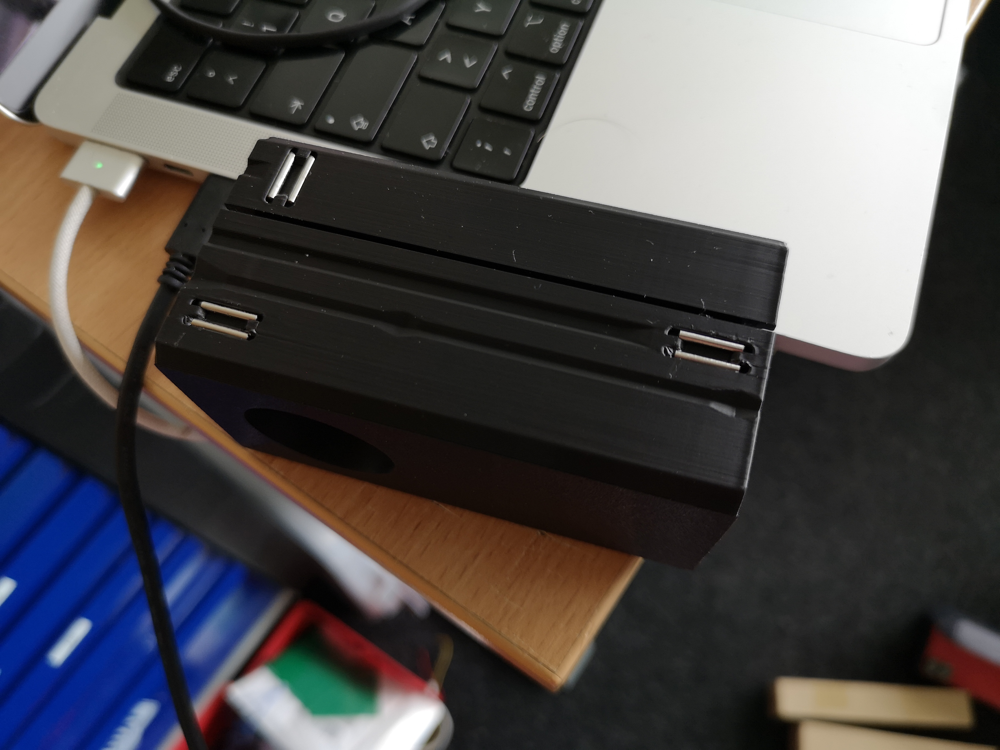

# openUC2 FiveD v4

## Design Files

:::warn
Coming soon-ish
:::


## Version 4

This is a novel version of the XYZ microscope that also includes fluorescence imaging. It is not based on the UC2 cubes anymore but featues a monolithic body that is not made out of metal sheet!

More information are comming soon!


## Introduction

A first video explains the basic operation of the device

<div style={{position: 'relative', paddingBottom: '56.25%', height: 0, overflow: 'hidden'}}>
  <iframe 
    style={{position: 'absolute', top: 0, left: 0, width: '100%', height: '100%'}}
    src="https://www.youtube.com/embed/T0cRZOXp5fk?si=dgLqVprYvSsl_5Sr" 
    title="YouTube video player" 
    frameBorder="0" 
    allow="accelerometer; autoplay; clipboard-write; encrypted-media; gyroscope; picture-in-picture" 
    allowFullScreen
  />
</div>

## Software

The device runs using ImSwitch with the following Configuration. Find the ImSwitch Installer here: https://github.com/openUC2/ImSwitchInstaller/releases/tag/v0.0.2 (go to latest release)

[Config](https://github.com/openUC2/ImSwitchConfig/blob/master/imcontrol_setups/example_uc2_hik_histo_andrew_1-12-24.json)
```json
{
  "positioners": {
    "ESP32Stage": {
      "managerName": "ESP32StageManager",
      "managerProperties": {
        "rs232device": "ESP32",
        "isEnable": true,
        "enableauto": false,
        "stepsizeX": -0.3125,
        "stepsizeY": -0.3125,
        "stepsizeZ": 0.3125,
        "homeSpeedX": 15000,
        "homeSpeedY": 15000,
        "homeSpeedZ": 15000,
        "isDualaxis": true,
        "homeDirectionX": 1,
        "backlashXOld": 15,
        "backlashYOld": 40,
        "backlashX": 0,
        "backlashY": 0,
        "homeEndstoppolarityY": 0,
        "homeDirectionY": -1,
        "homeDirectionZ": 0,
        "homeXenabled": 1,
        "homeYenabled": 1,
        "homeZenabled": 0,
        "initialSpeed": {
          "X": 15000,
          "Y": 15000,
          "Z": 15000
        }
      },
      "axes": [
        "X",
        "Y",
        "Z"
      ],
      "forScanning": true,
      "forPositioning": true
    }
  },
  "rs232devices": {
    "ESP32": {
      "managerName": "ESP32Manager",
      "managerProperties": {
        "host_": "192.168.43.129",
        "serialport": "COM5",
        "baudrate":115200,
        "debug":1
      }
    }
  },
  "lasers": {
    "LED": {
        "analogChannel": null,
        "digitalLine": null,
        "managerName": "ESP32LEDLaserManager",
        "managerProperties": {
          "rs232device": "ESP32",
          "channel_index": 1
        },
        "wavelength": 0,
        "valueRangeMin": 0,
        "valueRangeMax": 1023
      },
      "Laser 488": {
        "analogChannel": null,
        "digitalLine": null,
        "managerName": "ESP32LEDLaserManager",
        "managerProperties": {
          "rs232device": "ESP32",
          "channel_index": 2
        },
        "wavelength": 635,
        "valueRangeMin": 0,
        "valueRangeMax": 1023
      },
      "Laser 635": {
        "analogChannel": null,
        "digitalLine": null,
        "managerName": "ESP32LEDLaserManager",
        "managerProperties": {
          "rs232device": "ESP32",
          "channel_index": 3
        },
        "wavelength": 488,
        "valueRangeMin": 0,
        "valueRangeMax": 1023
      }

    },
  "detectors": {
    "WidefieldCamera": {
      "analogChannel": null,
      "digitalLine": null,
      "managerName": "HikCamManager",
      "managerProperties": {
        "isRGB": 1,
        "cameraListIndex": 0,
        "cameraEffPixelsize": 0.2257,
        "hikcam": {
          "exposure": 0,
          "gain": 0,
          "blacklevel": 100,
          "image_width": 1000,
          "image_height": 1000
        }
      },
      "forAcquisition": true,
      "forFocusLock": true
    },
    "Observer": {
      "analogChannel": null,
      "digitalLine": null,
      "managerName": "OpenCVCamManager",
      "managerProperties": {
        "cameraListIndex": 1,
        "cameraListIndexWIN": 0,
        "isRGB":1,
        "opencvcam": {
          "exposure": 10
        }
      },
      "forAcquisition": true
    }
  },
  "autofocus": {
    "camera": "WidefieldCamera",
    "positioner": "ESP32Stage",
    "updateFreq": 10,
    "frameCropx": 780,
    "frameCropy": 400,
    "frameCropw": 500,
    "frameCroph": 100
  },
  "mct": {
    "monitorIdx": 2,
    "width": 1080,
    "height": 1920,
    "wavelength": 0,
    "pixelSize": 0,
    "angleMount": 0,
    "patternsDirWin": "C:\\Users\\wanghaoran\\Documents\\ImSwitchConfig\\imcontrol_slm\\488\\",
    "patternsDir": "/users/bene/ImSwitchConfig/imcontrol_sim/488"
  },
  "PixelCalibration": {},
  "focusLock": {
    "camera": "WidefieldCamera",
    "positioner": "ESP32StageManager",
    "updateFreq": 4,
    "frameCropx": 0,
    "frameCropy": 0,
    "frameCropw": 0,
    "frameCroph": 0
  },
  "availableWidgets": [
    "Settings",
    "View",
    "Recording",
    "Image",
    "Laser",
    "Positioner",
    "Autofocus",
    "MCT",
    "UC2Config",
    "ImSwitchServer",
    "PixelCalibration",
    "HistoScan",
    "ROIScan"
  ],
  "nonAvailableWidgets": [
    "STORMRecon",
    "DPC",
    "Hypha",
    "FocusLock",
    "HistoScan",
    "FocusLock",
    "FOVLock"
  ]
}
```


## Assembly Instructions

### Assembly of the Optics Cube


*Necessary Parts to assemble the Optics module: Two halfs to mount the optics/beamsplitters, two lids and screws*


*Add mirror to the beamsplitter component*


*Add the mirror + objective lens to the assembly (ensure the focus cannot move after you insert the lens; fixing the lens is not necessary as we want to rotate the field of view eventually)*


*Close the two halfs and screw them together with M3x25mm; (old version: add the 12mmx1mm rods for the sliding mechanism by glueing them)*


*Fully Assembled module with locking mechanism (metal rods)*


*Fluorescent Cube*


*Fluorescent Cube inside Optics Module*


## Inserting the Modules

This shows how the optics module have to be slided into the FiveD assembly. There is a series of groves, slides and accompanying spring-loaded mechanisms to keep the module in exactly one place. It is mechanically well defined. The way to slide it in is a bit involved, but worth it:


*one of the positioning spheres (without spring) beaks first*


*immediately after this comes the first spring-loaded ball*


*Both balls have to pass over this hill on their bhan. But since one of them is spring-loaded, this should work.


*the second spring ball now plays along*


*The last two fixed balls find their groove almost immediately before the front ball moves up its ramp to the pins*


*Final position. All fixed balls in their "pin yokes" and both spring balls press the optics module against them*.


### Final result


## Safety

- in case of shattered glass, make sure you don't cut yourself
- Make sure you don't hurt yourself
- The moving parts can potentially hurt your finger
- The electronics - if used in a wrong way - can harm you
- edges may be sharp, make sure you don't cut yourself
