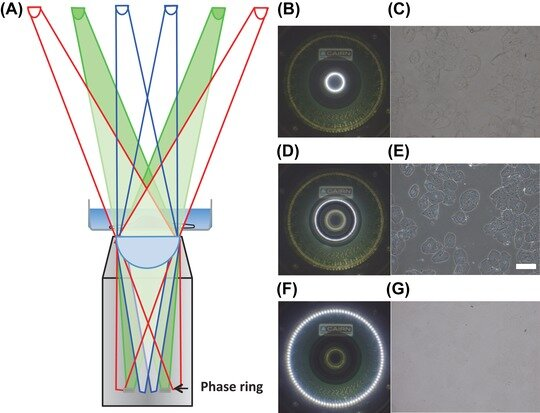
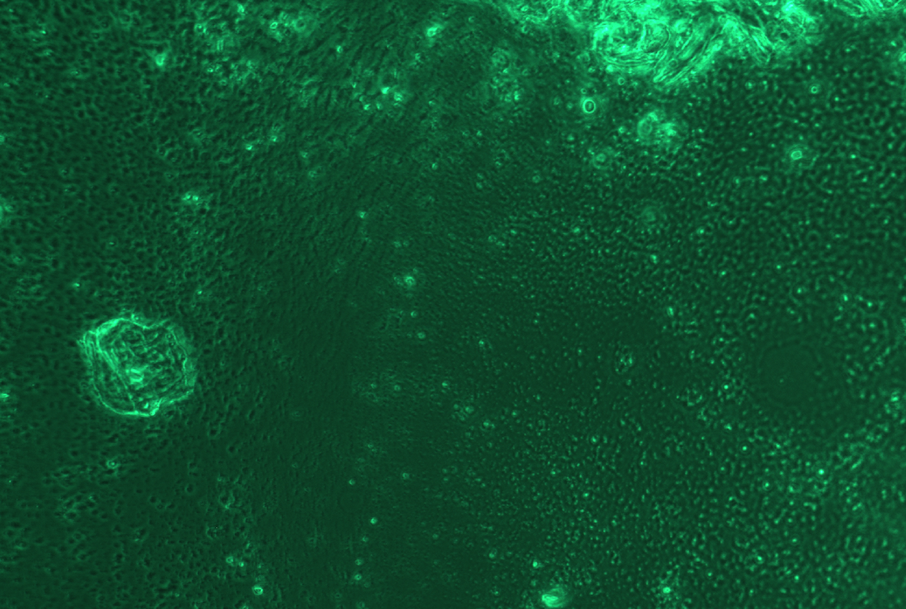
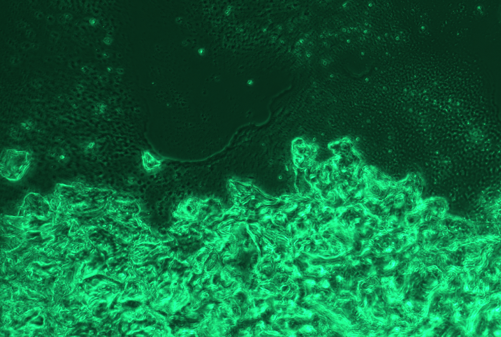

# openUC2 Phase-Contrast Setup Tutorial

  <iframe 
    style={{position: 'absolute', top: 0, left: 0, width: '100%', height: '100%'}}
    src="https://www.youtube.com/embed/XsAOPgMxt7Y" 
    title="YouTube video player" 
    frameBorder="0" 
    allow="accelerometer; autoplay; clipboard-write; encrypted-media; gyroscope; picture-in-picture" 
    allowFullScreen
  />

### Introduction: Understanding Phase-Contrast Microscopy

Phase-contrast works by employing a unique ring-shaped illumination to highlight the specimen. The objective lens then features a corresponding ring-shaped phase apparatus located in its back focal plane. Light that doesn't scatter off the specimen is delayed and attenuated at the phase plate. This ensures that only scattered light is phase-shifted, leading to enhanced image contrast.

For those who want a deeper dive into the exact mechanics of Zernike phase-contrast, we recommend consulting external references. UC2 system's phase-contrast doesn't rely on traditional lens systems. Instead, a LED ring comprising three concentrically arranged rings facilitates the ring-shaped illumination. A specialized phase-contrast microscope objective, embedded with a positive phase ring in its rear focal plane, facilitates the necessary shift of the unscattered light.

Now, let’s get into the practical steps of setting up the UC2 system for phase-contrast.

### Setting Up Phase-Contrast in the UC2 System

1. **Mount the LED Light Source**  
Begin by placing the LED light source above your sample.

2. **Detach the Camera**  
Unscrew the camera from the metal flange.

3. **Turn on the Outer Ring**  
Using our website interface, activate the outer LED ring. Looking through the lens at the location where the camera was mounted, you should be able to see this ring.

4. **Align the Illumination Ring with the Objective’s Phase Ring**  
Move the illumination arm to ensure that the lighting ring precisely overlays the dark ring of the objective. The light source can be adjusted in both the X and Y axes. Adjust the height of the illumination arm such that its size matches that of the phase ring in the objective.

5. **Secure the Illumination Arm and Re-attach the Camera**  
Once the rings align perfectly, tighten the screws on the illumination arm to secure it in place. Next, reattach the camera.

6. **Observing in Positive Phase-Contrast**  
With everything set up, you can now observe specimens on your screen using the camera in positive phase-contrast.

**Tips for Improved Imaging**  
- When turning on all three LEDs (Red, Green, Blue), artifacts might appear due to slight offset in ring position from each light source. For sharper images, it's advisable to focus only on a single channel – Red, Green, or Blue.
- Focusing on a single channel not only sharpens the image but also reduces chromatic aberrations.

**Need Help?**
If you have any questions or face difficulties during the setup, don't hesitate to reach out to us via email or drop us a message.

---

Note: This tutorial provides a generalized guide. Always refer to your UC2 microscope's user manual for detailed instructions and safety precautions.

## Theoretical Background: LED-Based Phase-Contrast in the UC2 System

### Source of Methodology:
The UC2 system’s approach to phase-contrast microscopy draws inspiration from the method detailed in K.F. Webb's article titled "Condenser-free contrast methods for transmitted-light microscopy," published in the Journal of Microscopy, Volume 265, Issue 3. https://onlinelibrary.wiley.com/doi/10.1111/jmi.12181

### Rethinking Traditional Phase-Contrast Systems:
Traditional phase-contrast microscopy relies on a combination of a condenser lens and a ring aperture to realize phase-contrast. The UC2 system brings an innovative shift to this classic setup by replacing the lens-based illumination system with an LED ring. This LED-based setup, while non-conventional, provides contrast levels remarkably comparable to its lens-based counterparts.

### Addressing Misalignment Challenges:
One of the challenges that arise with this setup is misalignment. The LED ring's position relative to the objective lens is of paramount importance. The precise alignment ensures that the LED light interacts with the sample optimally, producing high-contrast, sharp images. Any deviation can degrade image quality. Webb’s article delves deeper into the complications of misalignment, offering comprehensive insights.

### Importance of LED Ring Positioning:
For optimal performance, it's essential to adjust the LED ring's location in the XYZ axes. The primary objective is to ensure that the LED ring corresponds perfectly to the phase-ring located in the back focal plane of the objective lens. Achieving this alignment is crucial for maximizing image contrast and clarity.

### IN pictures (from https://onlinelibrary.wiley.com/doi/10.1111/jmi.12181)

*Alignment of the rings in XYZ is crucial*

*The effect of contrast loss dependent on the LED ring's position in Z*

## Results

*Cheek cells that have be acquired using the phase-contrast and an RGB camera. Together with the RGB illumination using the neopixels, an overlay of 3 images cause the "rainbow" effect*

*The cheek cells are relatively thick and cause some additional image degradation (i.e. multiple scattering)*

*Using only the green line of the ring improves overall contrast and reduces the artifact*

*Multiple cell layers visualized with the UC2 XYZ phase-contrast microscope*
