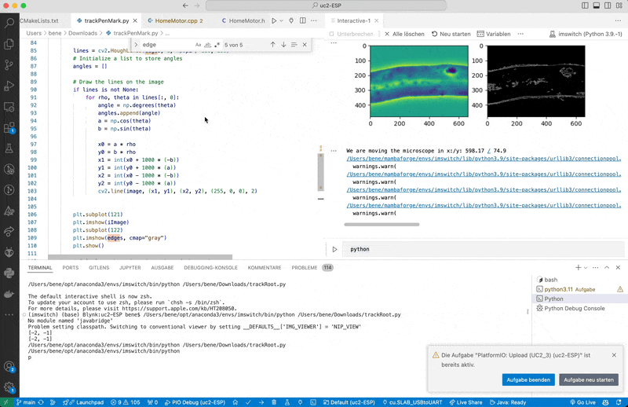

# Smart Microscopy Using openUC2 and ImSwitch

This tutorial will guide you through setting up a smart microscopy workflow using the openUC2 microscope and the ImSwitch software. We will perform a closed-loop experiment where the microscope follows a line based on image processing results.

## Prerequisites

1. **ImSwitch Software**: Ensure that ImSwitch is running and accessible. For example, if running on the same computer, the URL might be `https://localhost:8002` (check logs for the exact port).
2. **SSL Certificate**: Access the REST API (e.g., https://localhost:8002/docs) in a browser and accept the security warning to use the web viewer (https://youseetoo.github.io/imswitch/index.html). Enter the URL and port under connections.

## Closed-Loop Feedback Pipeline

The pipeline will:
1. Snap an image
2. Create a background image
3. Subtract the background
4. Compute edges using the Canny filter
5. Perform Hough transform to find straight lines
6. Determine the mean orientation of the lines
7. Compute the next XY coordinate to move
8. Return to the initial position

### Installation

Install the necessary package:
```sh
pip install https://github.com/openUC2/imswitchclient/archive/refs/heads/main.zip
```

### Code Implementation

You can run the following code in a Jupyter notebook or Visual Studio Code. Adjust the client initialization to match your setup.

```python
# Load dependencies
import cv2
import numpy as np
import tifffile as tif
import matplotlib.pyplot as plt
import os
import imswitchclient.ImSwitchClient as imc
import numpy as np
import matplotlib.pyplot as plt
import time
from simple_pid import PID

# Setup PID controller
controller = PID(2, 0.1, 2)
controller.send(None)

# Initialize the client
client = imc.ImSwitchClient(host="192.168.137.1", port=8002)

# Retrieve the first positioner's name and current position
positioner_names = client.positionersManager.getAllDeviceNames()
positioner_name = positioner_names[0]
currentPositions = client.positionersManager.getPositionerPositions()[positioner_name]
initialPosition = (currentPositions["X"], currentPositions["Y"])

# Loop through the process
for iimage in range(10):
    # Snap image
    scalingFactor = .5
    pixel_to_stage = 1 / scalingFactor
    gaussianKernel = 201
    print("Taking image")
    iImage = client.recordingManager.snapNumpyToFastAPI(scalingFactor)
    mCrop = np.max(iImage.shape)
    Ny, Nx = iImage.shape

    # Remove background
    mBackground = cv2.GaussianBlur(iImage, (gaussianKernel, gaussianKernel), 0)
    iImage = iImage / mBackground
    iImage = iImage[Nx//2-mCrop:Nx//2+mCrop, Ny//2-mCrop:Ny//2+mCrop]

    # Process image
    image = np.uint8(iImage * 255)[:, :, np.newaxis]
    image[image > 100] = 0
    edges = cv2.Canny(image, 50, 150, apertureSize=3)
    lines = cv2.HoughLines(edges, 1, np.pi / 180, 100)

    # Calculate main orientation
    angles = [np.degrees(theta) for rho, theta in lines[:, 0]] if lines is not None else []
    main_orientation = np.mean(angles)
    dy = np.cos(np.radians(main_orientation)) * Nx / 2
    dx = np.sin(np.radians(main_orientation)) * Ny / 2

    # Handle NaN values
    dx = dx if not np.isnan(dx) else np.random.randint(-100, 100)
    dy = dy if not np.isnan(dy) else np.random.randint(-100, 100)

    newPosition = (dx * pixel_to_stage, dy * pixel_to_stage)
    print(f"We are moving the microscope in x:/y: {round(newPosition[0], 2)} / {round(newPosition[1], 2)}")

    client.positionersManager.movePositioner(positioner_name, "X", newPosition[0], is_absolute=False, is_blocking=True)
    client.positionersManager.movePositioner(positioner_name, "Y", newPosition[1], is_absolute=False, is_blocking=True)

# Return to the initial position
client.positionersManager.movePositioner(positioner_name, "X", initialPosition[0], is_absolute=True, is_blocking=True)
client.positionersManager.movePositioner(positioner_name, "Y", initialPosition[1], is_absolute=True, is_blocking=True)
```

### Result

The microscope will follow a line for 10 steps and then return to the initial position.



This workflow demonstrates a basic smart microscopy setup using openUC2 and ImSwitch, allowing for closed-loop experiments based on real-time image processing. Adapt and expand this pipeline for your specific experiments and applications.
