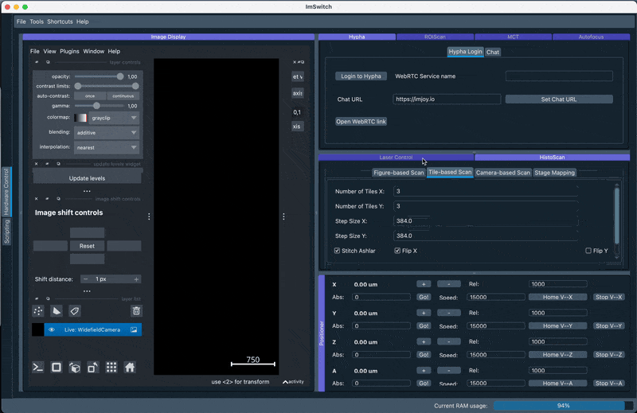

# Stage Scanning and Image Stitching (ASHLAR)

We have multiple ways to perform stage scanning and stitching using ImSwitch. Below you can find dedicated documentation for some of them:

1. Use ImScripting to take snapshots, save them locally and perform stitching using ASHLAR offline
2. Perform GUI-based stitching and perform stitching using ASHLAR / simple pixel assignmens online (e.g. within/after the scanning process)
3. Stitching using the Chatbot

## 1. Using Imswitch for Image Retrieval and Stitching with Interactive ImScripting

### Overview
This documentation outlines the steps to use Imswitch and Interactive IMScripting to retrieve images and stitch them together. The process involves configuring the motor settings, capturing images in a grid pattern, and stitching these images using ASHLAR.

The following code can be executed inside the ImSwitch's ImScripting editor.

```python
# install a modified version of ashlar that enables loading numpy arrays directly without going through a file
# python -m pip install https://github.com/openUC2/ashlar/archive/refs/heads/master.zip
import numpy as np
import time
import threading
import os
import tifffile
import re
from ashlar.scripts import ashlar
from ashlar.scripts.ashlar import process_images
from pathlib import Path

# Calculate the image size and the overlap of the images based on pixel size and resolution.
mPixelSize = 1.0  # micron - use a calibration chart to get this right!
input_dir = "./mScanImages"
output_dir = "./mStitchedImage"
input_name = "TmpTileFile.ome.tif"
output_name = "ResultingStitchedImage.ome.tif"
initialPosX = 0
initialPosY = 0
maximum_shift_microns = 1000
Nx = 5
Ny = 5
# please try changing these two values to make it match!
flip_x=True
flip_y=False

# create the folders and names
Path(input_dir).mkdir(parents=True, exist_ok=True)
Path(output_dir).mkdir(parents=True, exist_ok=True)
ashlar_output_file = os.path.join(output_dir, output_name)
ashlar_input_file = os.path.join(input_dir, input_name)

mFrameShape = api.imcontrol.snapImage(True, False).shape
xDim = mFrameShape[1] * mPixelSize
yDim = mFrameShape[0] * mPixelSize
mOverlap = 0.8  # 90% overlap at the edges

# Set the motor control to 0 and define the motor speeds for the X, Y, and Z axes.
positionerName = api.imcontrol.getPositionerNames()[0]
api.imcontrol.setPositionerSpeed(positionerName, "X", 20000)
api.imcontrol.setPositionerSpeed(positionerName, "Y", 20000)
api.imcontrol.setPositionerSpeed(positionerName, "Z", 2000)

## Capture images in a 2x3 grid pattern. The stage moves to the start position and captures images at each step. Each image is saved with coordinates as the filename.
iiter = 0

USE_OME = False
if USE_OME:# on MAC ARM M1 it may not work..
    with tifffile.TiffWriter(input_name) as tif: ## Define the input and output directories, and the pixel size. Open a new TIFF file to write the collected tiles, read each image, extract the position from the filename, prepare metadata, and write the image with metadata into the TIFF file. Finally, use ASHLAR to stitch the images together.
        for ix in np.arange(Nx):
            for iy in np.arange(Ny):
                mPos = (ix * xDim * mOverlap + initialPosX, iy * yDim * mOverlap + initialPosY)
                api.imcontrol.movePositioner(positionerName, "XY", mPos, True, True)
                time.sleep(0.5)
                mFrame = api.imcontrol.snapImage(True, False)
                metadata = {
				  'Pixels': {'PhysicalSizeX': mPixelSize, 'PhysicalSizeXUnit': 'm', 'PhysicalSizeY': mPixelSize, 'PhysicalSizeYUnit': 'm'},
				  'Plane': {'PositionX': ix, 'PositionY': iy}
			 	}
                tif.write(mFrame, metadata=metadata)
                iiter += 1
    ashlar.main(['', ashlar_input_file, '-o', ashlar_output_file, '--pyramid', '-m%s' % maximum_shift_microns, "-flip_x", flip_x, "-flip_y", flip_y])

else: # this is a workaround with a numpy reader instead
	mImageList = []
	position_list = []
	for ix in range(Nx):
		for iy in range(Ny):
			mPos = (ix * xDim * mOverlap + initialPosX, iy * yDim * mOverlap + initialPosY)
			api.imcontrol.movePositioner(positionerName, "XY", mPos, True, True)
			time.sleep(0.5)
			mFrame = api.imcontrol.snapImage(True, False)
			mImageList.append(mFrame)
			position_list.append(mPos)
			print(mPos)
	arrays = [np.expand_dims(np.array(mImageList),1)]  # (num_images, num_channels, height, width)
	# create a 2D list of xy positions
	position_list = np.array(position_list)

	# Process numpy arrays
	process_images(filepaths=arrays,
					output='ashlar_output.tif',
					align_channel=0,
					flip_x=flip_x,
					flip_y=flip_y,
					flip_mosaic_x=False,
					flip_mosaic_y=False,
					output_channels=None,
					maximum_shift=maximum_shift_microns,
					stitch_alpha=0.01,
					maximum_error=None,
					filter_sigma=0,
					filename_format='cycle_{cycle}_channel_{channel}.tif',
					pyramid=False,
					tile_size=1024,
					ffp=None,
					dfp=None,
					barrel_correction=0,
					plates=False,
					quiet=False,
					position_list=position_list,
					pixel_size=mPixelSize)
	mImage = tifffile.imread('ashlar_output.tif')

	#display the resulting tiles
	api.imcontrol.displayImageNapari("Tiles", arrays[0], isRGB=False)

	print(position_list)
	# display the resulting image
	api.imcontrol.displayImageNapari("StitchedImage", mImage, isRGB=False)
```

### Additional Image Processing
Additional commands can be used to manipulate the stitched image if needed (depends if the image looks weird or not..):

*Flip X-Axis*
```python
ashlar.main(['', collected_tiles_file, '-o', ashlar_output_file, '--pyramid', '-m%s' % maximum_shift_microns, "--flip-x"])
```

*Flip Both Axes and Mirror Images in X-Direction*
```python
ashlar.main(['', collected_tiles_file, '-o', ashlar_output_file, '--pyramid', '-m%s' % maximum_shift_microns, "--flip-mosaic-x"])
```

### In action

Here we use the loading of numpy images inside ImSwitch and process them with Ashlar to directly dipslay them in Napari.
Make sure the orientation is set as in the animation below according to the [Stage Calibration](./StageCalibration.md) results.

```py
# keep this number low (e.g. 1-2 to check the correction direction of X/Y)
Nx = 2
Ny = 2
# please try changing these two values to make it match!
flip_x=True
flip_y=False
```


## 2. Perform GUI-based stitching and perform stitching using ASHLAR in the Main GUI

Navigate to the HistoScan Menu and perform the grid-based scanning. Select ASHLAR stitching and the appropriate flipping of the axes (will be suggested by the previously performed stage mapping) and run the scanning. The stitched result will be displayed after some computational time which may vary depending on your CPU and memory availabililty.




## 3. Stitching using the Chatbot

A recent experimental feature is to use the [BioImage.io](https://bioimage.io/#/) chatbot and provide a customized extension to interact with the microscope. The extension is implemented in the [HyphaController](https://github.com/openUC2/ImSwitch/blob/master/imswitch/imcontrol/controller/controllers/HyphaController.py) and exposes certain functions to the chatbot interface. This lets us formulate prompts that will then interact with the microscope. Below we formulate a simple query:

```
Can you turn on the light of the uc2 microscope to 512 and perform a slide scan with default parameters?
```

which gets interpreted on the microscope side

```
Tool Call: U2MicroscopeSetIllumination
Arguments:
- channel: 0

- intensity: 512

Result: Set the illumination!
Tool Call: U2MicroscopeSlideScan
Arguments:
- numberTilesX: 3

- numberTilesY: 3

- stepSizeX: 0

- stepSizeY: 0

- nTimes: 1

- tPeriod: 1

- illuSource: ``

- initPosX: 0

- initPosY: 0

- isStitchAshlar: true

- isStitchAshlarFlipX: true

- isStitchAshlarFlipY: false

Result: Started slide scanning!
```

The result is a scan and a following stitching routine using ASHLAR:


