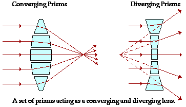

# Optics and Imaging for Medical Photonics Students

## Derived from the Advanced Optical Imaging Workshop, Plymouth
**Instructor:** Noah Russell, 2009©  
**Institute:** IBIOS – Institute of Biophysics, Imaging and Optical Science, University of Nottingham, UK  
**Purpose:** Practical Course – Physics 3 for Medical Photonics Students  

### 1 Introduction
This workshop involves exercises guiding students through optics, image formation, and illumination methods.

### 2 Prisms – Reflection and Refraction
- **Refractive Index (n):** `n = c/v` (c is the speed of light in a vacuum, v is the speed in the material)
- **Dispersion:** Variation of refractive index with wavelength (e.g. rainbows)
- **Snell's Law:** `n1 sin θ1 = n2 sin θ2`

### 3 Lenses
- **Lenses:** Defined by focal length (f), characterizing the deflection of light
- **Aberrations:** Chromatic and spherical aberrations affect image quality
- **Numerical Aperture (NA):** `NA = n sin θ`, where n is the refractive index, θ is the angle of steepest rays
- **Resolution:** The smallest distance between distinct points, calculated by `R = 1.22 λ / (NAillumination + NAimaging)` or `R = 0.61 λ / NA` for highly scattering samples

## 4 Image Formation - Finite Conjugate

Image formation depends on the positioning of an object relative to the lens' focal point. Several cases exist, such as for convex and concave lenses, and the key beams to consider are:

1. A beam parallel to the optic axis.
2. A beam through the focal point.
3. A beam through the center of the lens.

### Real and Virtual Images
- **Real Image:** Inverted and on the opposite side of the lens as the object. Used in cameras, telescopes, microscopes, and eyes.
- **Virtual Image:** On the same side of the lens as the object. Used in magnifying glasses and microscope eyepieces.

### Formulas
- **Gaussian Lens Equation:** `1/f = 1/s1 + 1/s2`
- **Magnification (M):** `M = y2 / y1 = - s2 / s1`

    By convention:
    - Convex lenses: f > 0
    - Concave lenses: f < 0
    - Real images: s2 > 0
    - Virtual images: s2 < 0
    - s1 > 0 always
    - Negative magnification: Image is inverted.

### Exercise
- **Task 1:** Form an image of the LED emitter with M = -1, using the Gaussian lens equation to calculate the focal length.
- **Task 2:** Determine the focal length of a convex lens using a distant light source.
- **Task 3:** Form a magnified image of the LED emitter with M = -4. Confirm distances empirically and measure the image size to calculate the emitter size.
- **Task 4:** Describe the effect on the image's location when the lamp moves closer and then past the focal point of the lens.

## 5 Image Formation - Infinite Conjugate

Infinite conjugate imaging differs from finite in that the object is placed in the focal plane of a lens, creating parallel rays. Using a second lens, the magnification equation for infinite conjugate systems is:

- **Magnification (M):** `M = - f2 / f1`

### Properties of Infinite Conjugate Systems
- More flexible and practical than finite conjugate systems.
- Allows insertion of optical components like filters without shifting the image.
- Used in both finite-optics and infinity-optics microscopes.

### Exercise
- **Task 1:** Add a second lens to the optical rail and place the LED and screen at respective focal points. Measure the image size and calculate the magnification and emitter size.
- **Task 2:** Confirm the same magnification regardless of the distance between the two lenses.

## 6 Illumination of the Sample - Direct Illumination

Illumination methods include transmission microscopy (opposite side) and reflection or epi-fluorescent microscopy (same side).

### Issues with Direct Illumination
- Placing the light source close to the sample is inefficient, as light scatters in all directions.

### Exercise
- **Task 1:** Set up an infinite conjugate imaging system (f=30 objective lens and f=75 tube lens). Determine the magnification, numerical aperture, and resolution.
- **Task 2:** Place the lamp behind the sample and confirm the image on the screen, checking the magnification.

Using simple illumination can be inefficient, but understanding the principles of image formation and illumination in microscopy offers deeper insights into their applications.

## 7 Illumination of the Sample - Critical Illumination

Critical illumination involves forming an image of the light source on the sample, achieving the brightest possible illumination.

### Exercise
- Set up an infinite conjugate imaging system for illuminating the sample.
- Measure the images' size and check the magnifications.
- Experiment with the aperture diaphragm's effect on illumination.

## 8 Illumination of the Sample - Koehler Illumination

Koehler illumination provides uniform illumination by forming an image of the filament on the aperture diaphragm.

### Exercise
- Reconfigure the system to set up Koehler illumination.
- Experiment with field and aperture diaphragms and observe the image's change.

## 9 The Eyepiece

The eyepiece lens is necessary to view the image directly and creates a virtual image for the eye to focus.

### Exercise
- Set up an eyepiece lens and identify the Ramsden disc.
- Observe the magnified image and simulate the eye's lens and retina.

## 10 Field Planes and Aperture Planes

The system includes field and aperture planes, which can be manipulated to enhance image properties.

### Exercise
- Add a beam splitter and lenses to form an image of the back focal plane (BFP).
- Calculate the magnification.

## 11 Cameras

Digital cameras can be used instead of screens or eyepieces, but their magnification needs to be optimized for the best resolution and field of view.

### Exercise
- Replace screens with digital cameras and reposition for focus.
- Determine if the microscope setup is optimal for the given camera.

### To Sort

