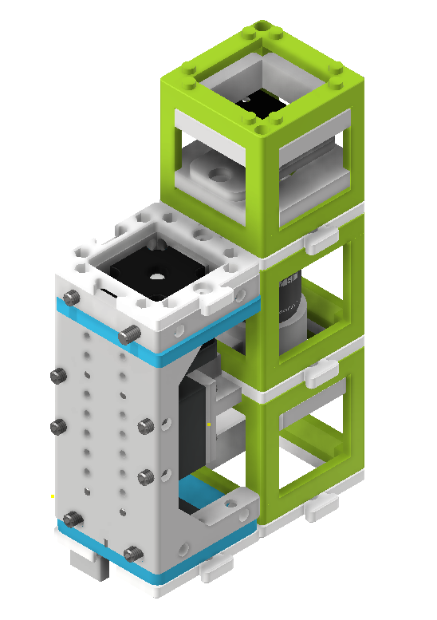
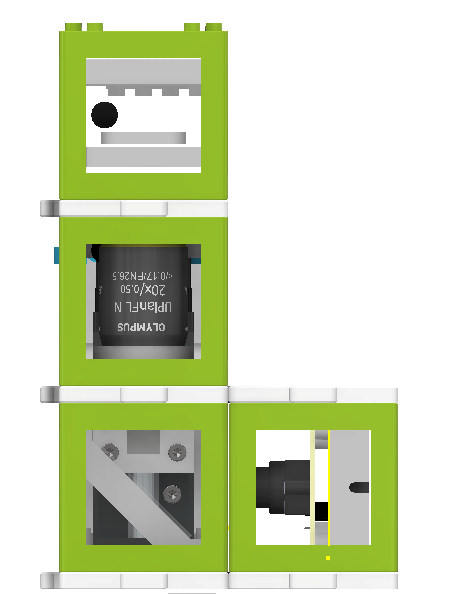
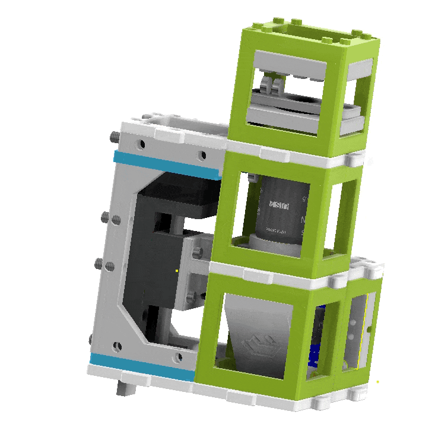

The openUC2 Electronics Kit enables the construction of a finite-corrected digital microscope with automated features. The kit includes various components and cubes that can be assembled to create a versatile microscope capable of imaging microscopic samples using a digital webcam. The setup features a motorized Z-stage with a resolution of approximately 300 nanometers per step (when using 16 microsteps) and a ring-shaped LED array for digital phase-contrast imaging of transparent samples.

**Components Included in the Kit:**

**In Cubes:**
1. Camera
2. Motorized Z-Stage (NEMA 11)
3. 1x openUC2 LED Array (3 circles)
4. 10x Baseplates

**Not in Cubes:**
1. 1x Objective Lens (10x, finite, or 4x finite - compatible with RMS thread)
2. 1x openUC2 Electronic (ESP32-based)
3. Box + Foam Insert
4. Micro USB Cable
5. Controller
6. 12V Power Supply

**Microscope Assembly:**
The assembly process involves combining the different cubes and components to build the finite-corrected microscope. A webcam, Z-stage, 45° folding mirror, sample mount, and LED array are assembled in an L-shape configuration. These cubes are stacked on top of each other to form a complete microscope setup. Optionally, the LED array can be placed in the same cube as the sample or on a separate layer above the sample, creating a 4-layer "tower" setup.

*Steps involved in assembling the finite-corrected digital microscope.*

Once assembled, the microscope's folded beampath achieves a tubelength of approximately 100mm, which is less than the required 160mm according to the RMS standard for finite-corrected objective lenses. As a result, the magnification is slightly reduced. However, this setup provides a practical example of how to build compact and automated microscopes.

*Side view of the assembled microscope.*

**Instructional Videos:**
Two videos guide users through the assembly process:

1. Assembling a standard microscope.
2. Assembling a finite-corrected microscope with a webcam.

**Microscope Control:**
The motor and the LED array are connected to the openUC2 electronics module. Users can control the hardware components using Web-Serial (Chrome only for now) or the Python interface.

*openUC2 electronics module for controlling the microscope components.*

**Web-Serial Interface:**
For control via the web, a new Web-Serial interface is implemented (experimental) and can be accessed at: https://youseetoo.github.io/indexWebSerialTest.html.

**Getting a Sharp Image:**
To achieve a sharp image, it is recommended to test the microscope with a nearly transparent sample and the LED illumination turned on. Users can adjust the focus by hand to find the optimal position (~10-15mm from the last lens). Once found, the sample adapter can be placed at that position, roughly aligning the sample with the focus. Fine adjustments to the focus can then be made using the focus adjustment buttons provided.

## Images to Sort

