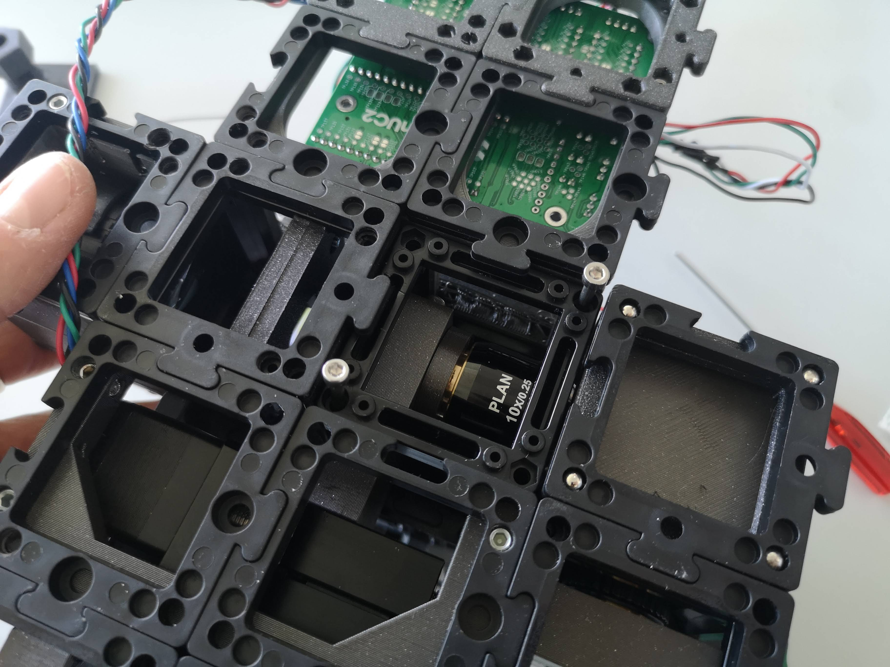

This is a work in progress. The text for the pictures will follow in a moment..


## The fully assembled Light-sheet Microscope


## Using Fluorescent Marker Pen to Align Focus and Light-sheet Position


## Find the focus of the light-sheet in the center of the FOV


## Adjusting the sheet with the kinematic mirror


## ImSwitch data acquisition and Reconstruction

<iframe width="560" height="315" src="https://www.youtube.com/embed/N00-kKrRXX4" title="YouTube video player" frameborder="0" allow="accelerometer; autoplay; clipboard-write; encrypted-media; gyroscope; picture-in-picture; web-share" allowfullscreen></iframe>


## Fully assembled Light-sheet micrsocope


## Removing the Sample Cube (e.g. Aquarium)


## Fixing the XYZ stage from below


## Mount the sample on a metal tip


## Swap the sample mounting plate


## Add Sample Cube (old version /w pins)


## Add Sample (new version /w magnets)




## Add Syringe


## ImSwitch configuration for the ligth-sheet

```json
{
  "positioners": {
    "ESP32Stage": {
      "managerName": "ESP32StageManager",
      "managerProperties": {
        "rs232device": "ESP32",
        "enableauto": 0,
        "isEnable": 1
      },
      "axes": [
        "X",
        "Y",
        "Z",
        "A"
      ],
      "forScanning": true,
      "forPositioning": true
    }
  },
  "rs232devices": {
    "ESP32": {
      "managerName": "ESP32Manager",
      "managerProperties": {
        "host_": "192.168.43.129",
        "serialport_": "COM3",
        "serialport": "/dev/cu.usbserial-A50285BI"
      }
    }
  },
  "lasers": {
    "488 Laser": {
      "analogChannel": null,
      "digitalLine": null,
      "managerName": "ESP32LEDLaserManager",
      "managerProperties": {
        "rs232device": "ESP32",
        "channel_index":1,
        "filter_change": false,
        "laser_despeckle_period": 10,
        "laser_despeckle_amplitude": 0
      },
      "wavelength": 488,
      "valueRangeMin": 0,
      "valueRangeMax": 1024
    },
    "LED Matrix": {
      "analogChannel": null,
      "digitalLine": null,
      "managerName": "ESP32LEDLaserManager",
      "managerProperties": {
        "rs232device": "ESP32",
        "channel_index": "LED",
        "filter_change": false,
        "filter_axis": 3,
        "filter_position": 32000,
        "filter_position_init": -0
      },
      "wavelength": 635,
      "valueRangeMin": 0,
      "valueRangeMax": 255
    }
  },
  "detectors": {
    "WidefieldCamera": {
      "ExtPackage": "imswitch_det_webcam",
      "analogChannel": null,
      "digitalLine": null,
      "managerName": "GXPIPYManager",
      "managerProperties": {
        "cameraListIndex": 1,
        "gxipycam": {
          "exposure": 20,
          "gain": 0,
          "blacklevel": 10,
          "image_width": 1000,
          "image_height": 1000
        }
      },
      "forAcquisition": true,
      "forFocusLock": true
    }
    },
  "rois": {
    "Full chip": {
      "x": 600,
      "y": 600,
      "w": 1200,
      "h": 1200
    }
  },
  "LEDMatrixs": {
    "ESP32 LEDMatrix": {
      "analogChannel": null,
      "digitalLine": null,
      "managerName": "ESP32LEDMatrixManager",
      "managerProperties": {
        "rs232device": "ESP32",
        "Nx": 4,
        "Ny": 4
      },
      "wavelength": 488,
      "valueRangeMin": 0,
      "valueRangeMax": 32768
    }
  },
  "autofocus": {
    "camera": "WidefieldCamera",
    "positioner": "ESP32Stage",
    "updateFreq": 10,
    "frameCropx": 780,
    "frameCropy": 400,
    "frameCropw": 500,
    "frameCroph": 100
  },
  "uc2Config": {
    "defaultConfig": "pindefWemos.json",
    "defaultConfig2": "pindefUC2Standalon2.json",
    "defaultConfig1": "pindefUC2Standalon.json"
  },
  "mct": {
    "monitorIdx": 2,
    "width": 1080,
    "height": 1920,
    "wavelength": 0,
    "pixelSize": 0,
    "angleMount": 0,
    "patternsDirWin": "C:\\Users\\wanghaoran\\Documents\\ImSwitchConfig\\imcontrol_slm\\488\\",
    "patternsDir": "/users/bene/ImSwitchConfig/imcontrol_sim/488"
  },
  "dpc": {
    "wavelength": 0.53,
    "pixelsize": 0.2,
    "NA":0.3,
    "NAi": 0.3,
    "n": 1.0,
    "rotations": [0, 180, 90, 270]
  },
  "webrtc":{},
  "PixelCalibration": {},
  "availableWidgets": [
    "Settings",
    "Positioner",
    "View",
    "Recording",
    "Image",
    "Laser",
    "UC2Config",
    "Joystick",
    "Lightsheet",
    "LEDMatrix"
  ],
  "nonAvailableWidgets":[
    "STORMRecon",
    "LEDMatrix",
    "MCT",

    "ImSwitchServer",
    "PixelCalibration",
    "Hypha",
    "FocusLock",
    "HistoScan",

    "FocusLock"]
}
```
