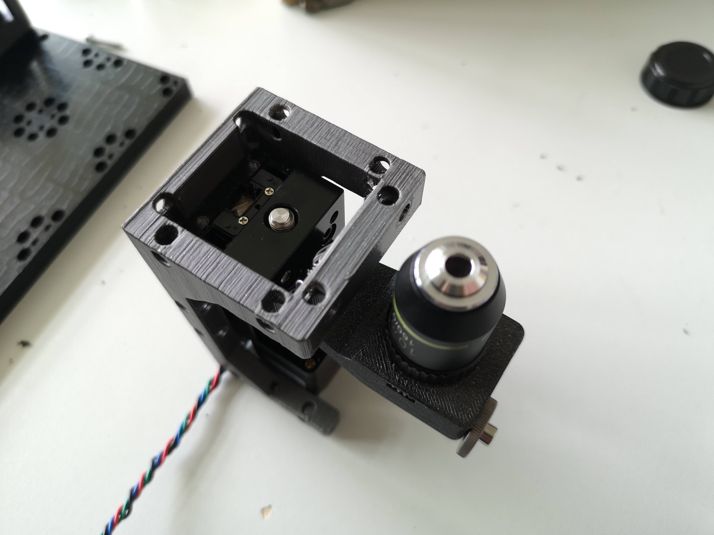

# Workshop Manual: Building a Light-Sheet Microscope with UC2

In this experiment, we will explore the concept of optical sectioning to improve the resolution along the optical axis and the XY plane. The Light-Sheet Microscope, also known as the Light-Sheet Microscopy or Lattice Light-Sheet Microscopy, is a powerful technique used to acquire volumetric images of samples, such as zebrafishes. This technique enables us to visualize biological specimens in three dimensions with high resolution and minimal phototoxicity.

## Background Information

Traditional microscopy techniques have limitations in both axial and lateral resolution. Optical sectioning is a method that aims to improve the resolution along the optical axis, enabling better separation of different components within a sample. One well-known technique for optical sectioning is confocal microscopy, but it requires complex setups and scanning of the sample.

Approximately 200 years ago, ultramicroscopy was established as a method to improve optical sectioning. Unlike traditional transmission microscopy, ultramicroscopy illuminates the sample from the side, creating dark-field illumination, where only scattered light is used for image formation. Light-sheet microscopy takes this concept further and shapes an optical sheet to illuminate a single plane of the sample. This plane is then imaged by a microscope objective oriented perpendicularly to the sheet. By moving the sample through this setup step by step, a three-dimensional stack can be acquired.

## Learning Objectives:

1. Understand the principles of light-sheet microscopy and optical sectioning.
2. Assemble the basic components of the light-sheet microscope using the UC2 toolbox.
3. Construct a three-dimensional stack of a sample using the light-sheet microscope.

## UC2 Light-sheet setup

This is the sketch of the microscope that we will realize with UC2 cubes:

## Step 1: Assembling the Basic Components

The core components of the light-sheet microscope are as follows:

- A fiber-coupled laser emitting at 488 nanometers, collimated with a polarimeter.

- A cylindrical lens with a focal length of 100 mm to create a one-dimensional focus.
- A kinematic mirror to adjust the laser beam position.

- A lens with a focal length of approximately 10 mm to shape the laser beam.
- A four-fold objective lens to transform the light sheet into the sample plane.

- An aquarium to hold the sample, with windows for excitation and detection.

- A LED for transmission illumination.

- A ten-fold objective lens with a long working distance for detection.

- An emission filter and a tube lens connected to a monochromatic CMOS camera for image acquisition.

- A micrometer-precise XYZ stage to move the sample.

### A Video walk-through the process of the light-sheet assembly

  <iframe 
    style={{position: 'absolute', top: 0, left: 0, width: '100%', height: '100%'}}
    src="https://www.youtube.com/embed/FLtDSjuhrro" 
    title="YouTube video player" 
    frameBorder="0" 
    allow="accelerometer; autoplay; clipboard-write; encrypted-media; gyroscope; picture-in-picture" 
    allowFullScreen
  />

### Final assembly

*Z-stage for the objective lens*

*Almost Fully assembled UC2 Lighthseet microscope*

## Step 2: Light-Sheet Generation and Sample Preparation

The fiber-coupled laser emits light at a wavelength of 488 nanometers, which is ideal for exciting fluorescent molecules commonly used in biological imaging, such as green fluorescent protein (GFP). The collimated laser beam passes through a cylindrical lens, creating a one-dimensional focus with a width of approximately 10 mm.

The kinematic mirror allows precise control of the laser beam position, ensuring proper alignment. The lens further shapes the laser beam into an optical sheet, which is then directed into the sample plane by the four-fold objective lens.

The sample, such as a zebrafish embryo, is held in a small aquarium filled with water. The sample is positioned such that the light sheet intersects it, and fluorescence signals are emitted only where the light sheet illuminates.

## Step 3: Image Acquisition

Using the XYZ stage, move the sample in the focal plane of the ten-fold objective lens. The camera will capture images as the sample is moved, allowing you to create a three-dimensional stack of the object. The long working distance of the objective lens allows sufficient space between the lens and the sample, reducing the potential for photodamage and phototoxicity.

## Benefits of Light-Sheet Microscopy

Light-sheet microscopy offers several advantages for imaging biological samples:

- Optical sectioning: The light-sheet illuminates only the focal plane, minimizing background noise and out-of-focus signals.
- Reduced phototoxicity: With the sample illuminated only in the focal plane, light-sheet microscopy reduces photodamage and photobleaching, allowing long-term imaging of live samples.
- High-speed imaging: Light-sheet microscopy enables rapid volumetric imaging, capturing dynamic processes in real-time.
- High resolution: The combination of optical sectioning and minimal scattering allows for high-resolution imaging, revealing fine cellular structures.

## Bill-of-Material

This is a list of components that are used in the latest version of the openUC2 light-sheet microscope. This is subject to changes. If you are interested to build one of these devices and need a kit, please, don't hesitate to contact us via Mail, Github or other channels :)
Find more information on www.openuc2.com

| Category | Amount | Part | Shop | Price (€) | Comment | Quantity | URL/Source | Alternative |
|-------------------|---------|----------------------------------------------------------|------------|---------|---------|---------|----------------------------------------------------------------------------------------------------------------------------------------------------------|---------------------------------------------------------------------------------------|
| External Parts | 1 | Cylindrical lens, comar | Thorolabs | 150 | | 1 | [Link](https://www.thorlabs.com/thorproduct.cfm?partnumber=LJ1567L1) | |
| | 1 | Camera, monochrome, CMOS | Daheng | 350 | | 1 | [Link](https://www.machinevisionkamera.de/USB3-Bildverarbeitungskamera-12.2MP-Monochrome-Sony-IMX226-MER2-1220-32U3M) | |
| | 1 | Focusing stage, micrometer, motorized (NEMA12) | China | 100 | | 1 | Haoran | |
| | 1 | 10x objective, NA0.3, long-working distance | USA | 250 | | 1 | [Link](https://bolioptics.com/10x-infinity-corrected-plan-achromatic-microscope-objective-lens-bm05073332/) | |
| | 1 | XYZ stage, AliExpress, micrometer | China | 250 | | 1 | [Link](https://de.aliexpress.com/item/33013923564.html?gatewayAdapt=glo2deu) | [Link](https://www.mjkzz.de/products/xyz-40x40mm-manual-microstage?variant=43281669488885) |
| | 3 | Motor for stage | China | 80 | | 3 | [Link](https://eckstein-shop.de/PololuStepperMotorNEMA11Bipolar200StepsRev28C39732mm38V067APhase) | [Link](https://de.nanotec.com/produkte/2604-captive-nema8-linear-actuator-lga20) |
| | 1 | Tube lens | China | 200 | | 1 | [Link](https://www.berrybase.de/100mm-teleobjektiv-c-mount) | |
| | 1 | Fiber laser | China | 200 | | 1 | Haoran | [Link](https://www.lasertack.com/en/50mw-488nm-fiber-coupled-laser-nds7175-nds4116-nds4216/) |
| | 1 | Mirror | PGI | 5 | | 1 | [Link](https://pgi-shop.de/vorderflaechen-glasspiegel-30-0-x-40-0-mm/) | |
| | 1 | 4x objective lens finite | China | 10 | | 1 | Haoran | |
| | 1 | Fiber Collimator | China | 100 | | 1 | Haoran | |
| | 14 | Baseplates | openUC2 | 3 | | 14 | | |
| | 8 | Cubes | openUC2 | 5 | | 10 | | |
| | 1 | Solid baseplate (aluminium) | openUC2 | - | | 1 | | |
| | 1 | Excitation filter (Thorlabs) | Thorolabs | 120 | | 1 | [Link](https://www.thorlabs.com/thorproduct.cfm?partnumber=FELH0500) | |
| Inserts | 1 | Fiber Collimator Mount | openUC2 | 5 | | 1 | | |
| | 1 | Cylindrical Lens Mount | openUC2 | 5 | | 1 | | |
| | 1 | 45° Mirror Mount (kinematic) | openUC2 | 25 | | 1 | | |
| | 1 | RMS Lens Mount | openUC2 | 5 | | 1 | | |
| | 1 | Sample mount (printed) | openUC2 | 30 | | 1 | | |
| | 1 | Base for XYZ Stage | openUC2 | 2 | | 1 | | |
| | 1 | Sample mount for XYZ Stage | openUC2 | 15 | | 1 | | |
| | 1 | Holder for Z-stage motorized | openuc2 | 30 | | 1 | | |
| | 1 | Holder for Tubelens | openUC2 | 10 | | 1 | | |
| | 1 | Holder for UC2 Electronics | openUC2 | 30 | | 1 | | |
| Electronics | 1 | Electronics, Powersupply, Stepper driver | openUC2 | 100 | | 1 | | |
| | 2 | USB cables (camera, micro) | Germany | 60 | | 2 | | |
| | 1 | Playstation Controller | Germany | 50 | | 1 | | |
| | 1 | Box + Foam insert | openUC2 | 100 | | 1 | [Link](https://www.contorion.de/p/stier-universal-outdoor-koffer-flugtauglich-lxbxh-418x317x151-mm-86520627?aid=&targetid=&campaignid=19484268152&utm_medium=SEA&utm_source=google&utm_campaign=[4]_Shopping_STIER_PMax&gclid=Cj0KCQiAw8OeBhCeARIsAGxWtUyHb9BCPHC_ap3qEnnl6NLGITkMEiZFRu66OuupmgptESC4aGEiri8aAgdREALw_wcB) | |
| Labour & Shipping | - | Labour + Shipping | - | 500 | | 1 | | |
| TOTAL | - | - | - | 2790 | | - | | |

The 3D printing files can be found here: `./STL.zip`

## Conclusion

Congratulations! You have successfully built a light-sheet microscope using the UC2 modular toolbox. This powerful technique allows you to acquire high-resolution three-dimensional images of samples like zebrafishes. With the ability to perform optical sectioning and minimal phototoxicity, light-sheet microscopy is a valuable tool for studying biological structures in 3D. You can now explore the fascinating world of 3D biological imaging and discover new insights into the complexities of life at the microscopic level. Happy imaging!

[def]: docs\02_Investigator\04_Lightsheet\IMAGES\Lightsheet\IMG_20240607_114311.jpg
