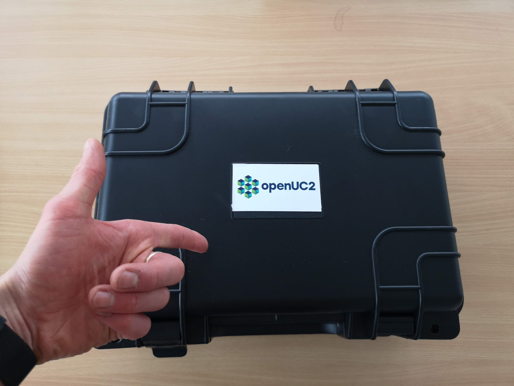
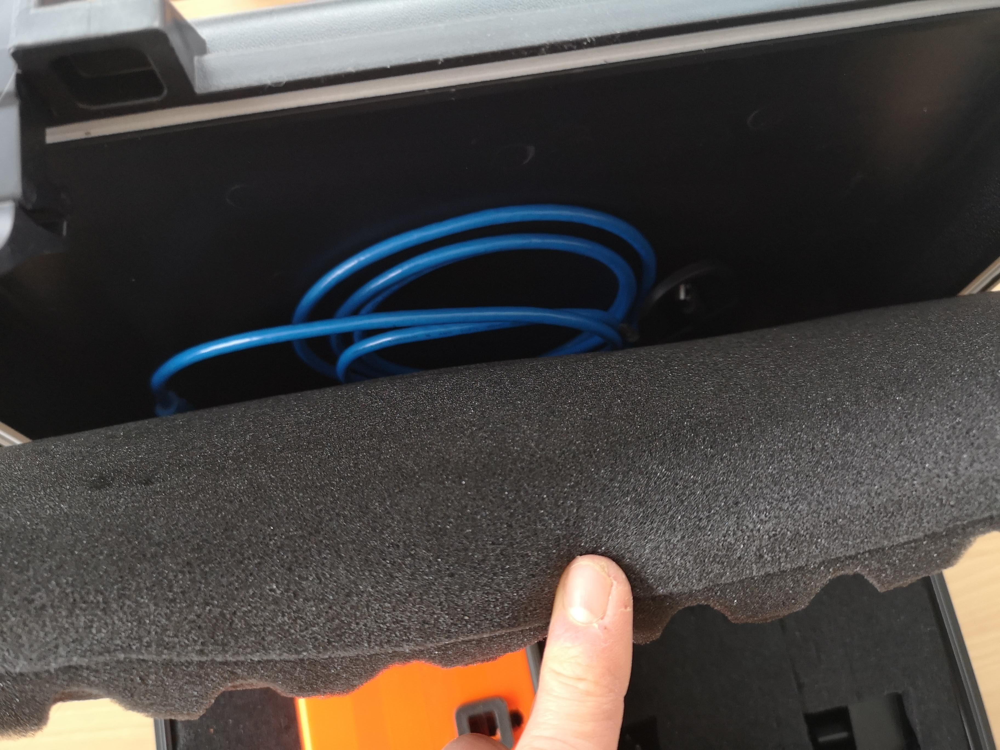
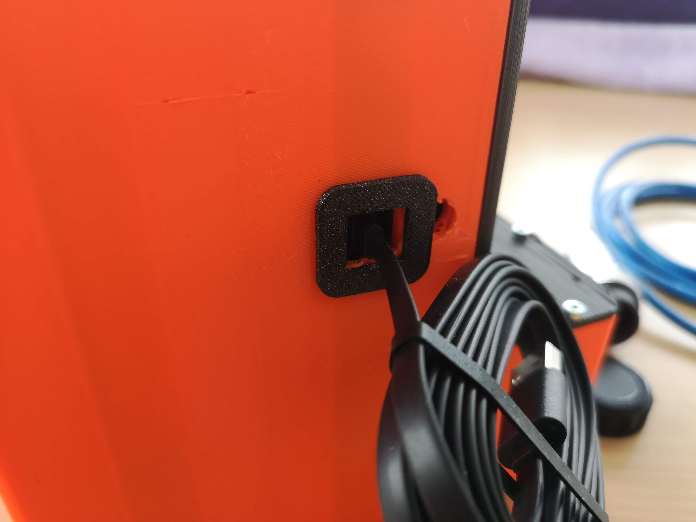
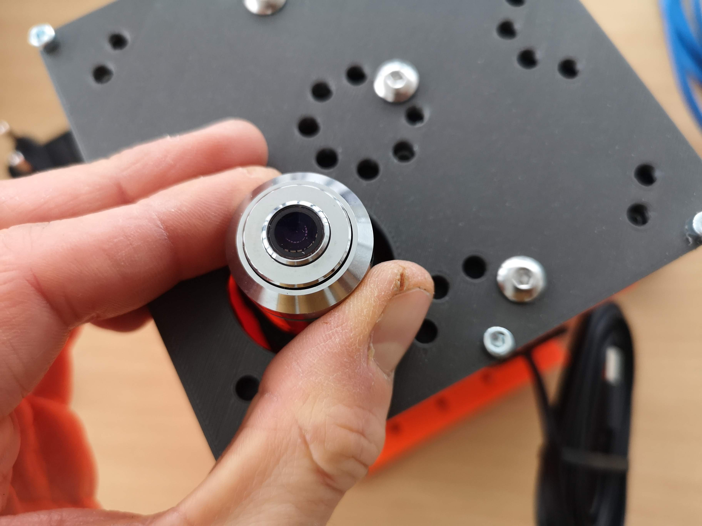
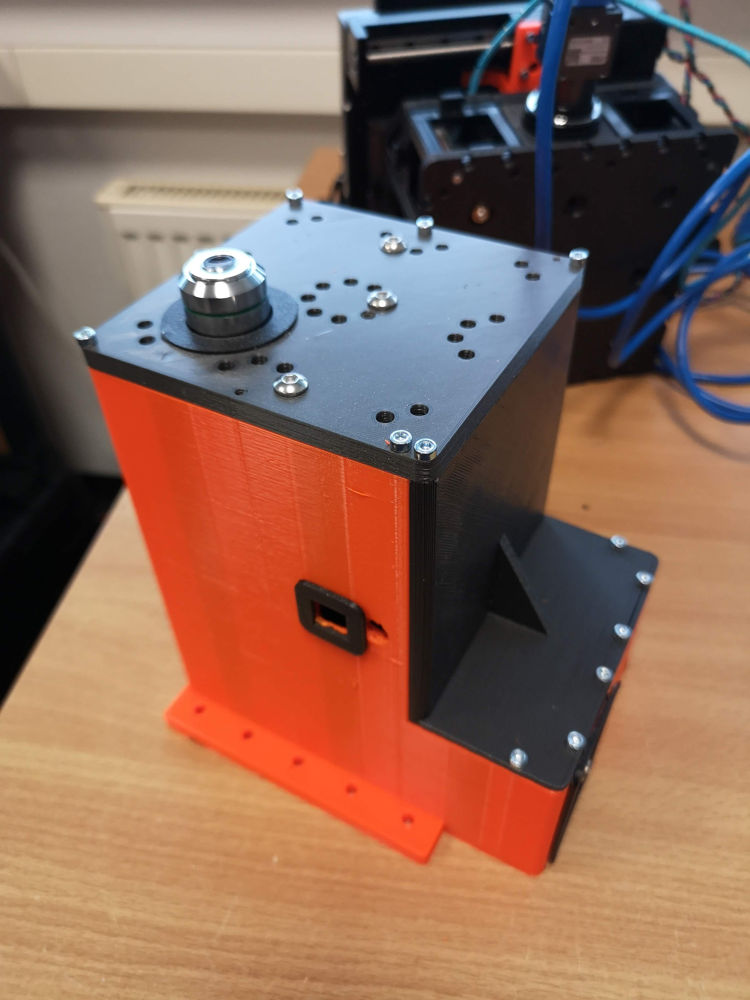
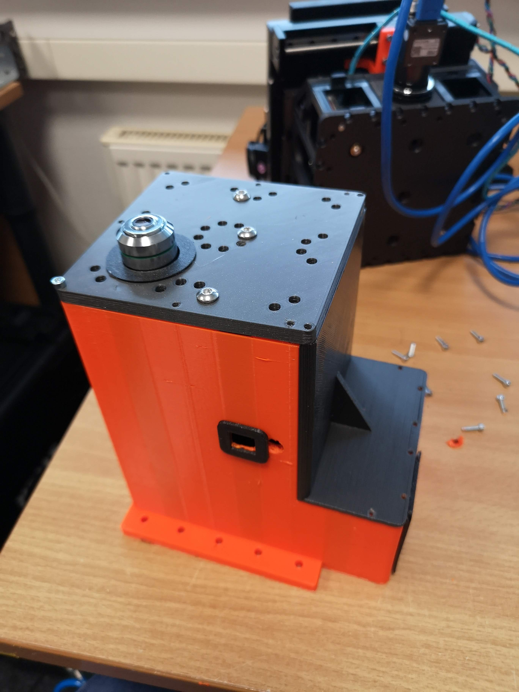
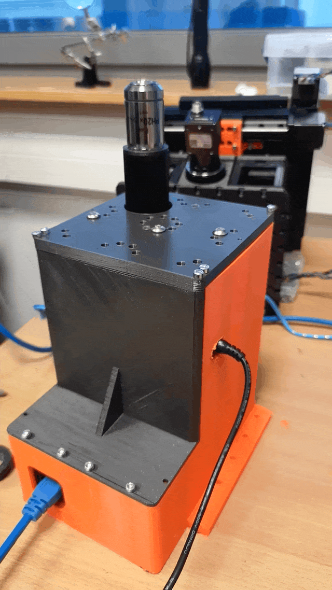

# Z-Microscope


## Unpacking the microscope


The hardcover plastic case contains all you need for the microscope:

 - USB micro cable
 - USB3 camera cable
 - 12V power-supply
 - Sweet treat
 - The actual microscope
 - The objective lens


The actual Box looks like this:




Please also find the treat and make sure you provide yourself with enough sugar throughout this unpacking routine :-)


The foam holds the microscope in place (the actual colour may differ from what you may see):


The cables are hidden behind the foam:




Check if you find the content of the box:


## Getting started

First of all we need to wire up the microscope. For this we will start with the 12V power supply. Unfortunately the powersocket is inside the case, hence you have to first eat some candy in order to better find the spot ;-)


The same holds true for the USB connection to the microcontroller board. You need to hook it up like that:



Once done, we continue with inserting the objective lens. Eventually the lens is already inserted and you just need to check if the lens is centered correctly



The microscope should look like this:


## Wire up the microscope to your computer

In order to get the microscope working, we first need to install additional drivers. For the Daheng Camera, this would be:

- Daheng SDK for windows which can be downloaded from this link: https://www.get-cameras.com/SoftwareDevelopmentKit-Industrial-camera
- the openUC2 electronics board uses an ESP32, which needs the CH340 USB-Serial driver: https://learn.sparkfun.com/tutorials/how-to-install-ch340-drivers/all


For additional information and an in-depth explanation for the UC2e system, please have a look [here](https://openuc2.github.io/docs/Electronics/Advanced/UC2-ESP/Setup_Buildenvironment)


## Troubleshoot

We learn from mistakes. So lets start learning. The system is fully open, meaning, you can adjust and change the vast majority of the parts on your own. The entire system consists of the openUC2 frame / skeleton and the 3D printed housing to shield it from dust and light. By removing all M3 cylindrical screws, you can detech the housing from the inner structure to eventually repair or alter the system.



A 2.5m hex key will help you for finishing this job:



Lift the lid and the microscpe will follow (make sure all cables are detached):


Now you can start working on the "inner bits":


## In Action

Here you see the extended focussing of the objective lens:



## Connecting the microscope to the browser and controll it

We encourage you to use the UC2ified ImSwitch software to control the microscope. You can find it in this repository: https://github.com/openUC2/ImSwitch/

However, if you want to quick-start the microscope and see if it works, you can open your browser and use the WEB-Serial interface to interact with the microscope.

Go to https://youseetoo.github.io/ and connect to your board (most right option saying **ESP32 DEV-based UC2 standalone board V2**). Select the COM Port which is holding the ESP32 and hit the *LOG* option, once the dialog opens. The alternative option will help you updating the firmware on the device. An in-depth explanation on how the firmware works can be found [here](https://openuc2.github.io/docs/Electronics/Advanced/UC2-ESP/Setup_Buildenvironment).

In general, you need to send `JSON` strings in order to control the system. The strings relevant for the Z-microscope are:

### Home the Z-axis

It's important to always home the Motors in order to avoid them from getting stuck in an end position (**ATTENTION!**). The following string will move the motor until the endstop is hit. Afterwards it will release the switch:

```json
{"task":"/home_act", "home": {"steppers": [{"stepperid":3, "timeout": 2000, "speed": 15000, "direction":1, "endposrelease":3000}]}}
```

Afterwards the internal position is set to 0. You can check that by entering:

```json
{"task": "/motor_get"}
```


### Move the Z-axis:

The motor (Nema12) with 200 steps/revolution runs with 16 microstepps and offers a leadscrew with 1mm/revolution. Hence, one step corresponds to `312.5nm`. Running the motor can be issued with the following command:

```json
{"task":"/motor_act",
    "motor":
    {
        "steppers": [
            { "stepperid": 3, "position": 1000, "speed": 15000, "isabs": 3, "isaccel":0}
        ]
    }
}
```

- `stepperid`: 3 correpsonds to the Z-axis
- `position`: steps to go (not physical units!)
- `speed`: steps / minute (do not exceed 20000)
- `isabs`: absolute or relative motion
- `isaccel`: for now, use only non-accelerated motion!


## Safety

- in case of shattered glass, make sure you don't cut yourself
- Make sure you don't hurt yourself
- The moving parts can potentially hurt your finger
- The electronics - if used in a wrong way - can harm you
- edges may be sharp, make sure you don't cut yourself
