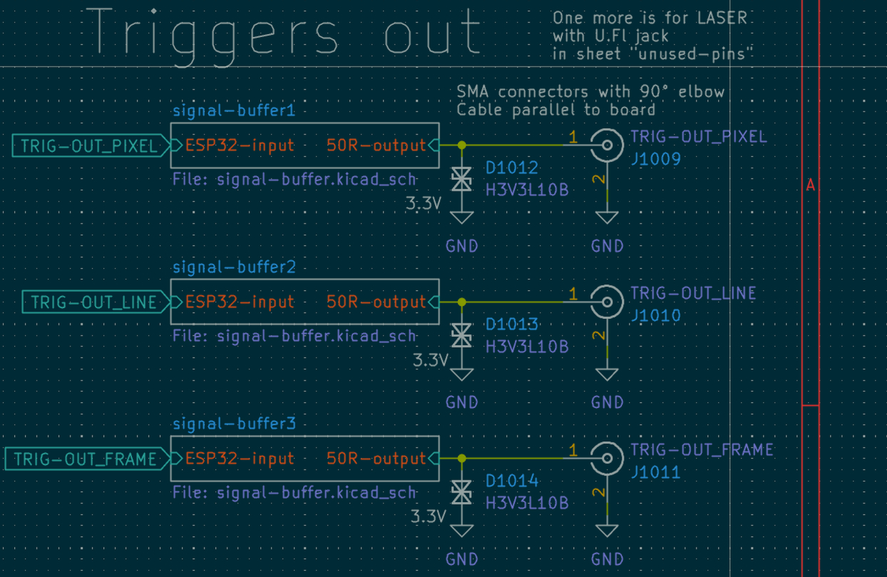
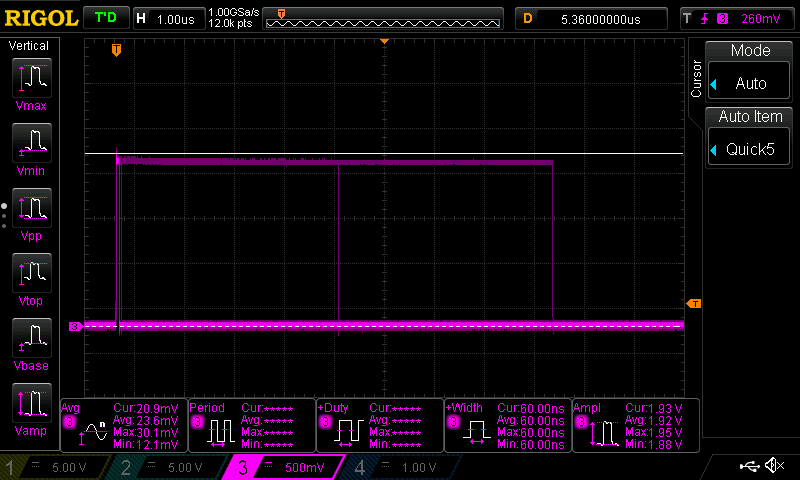
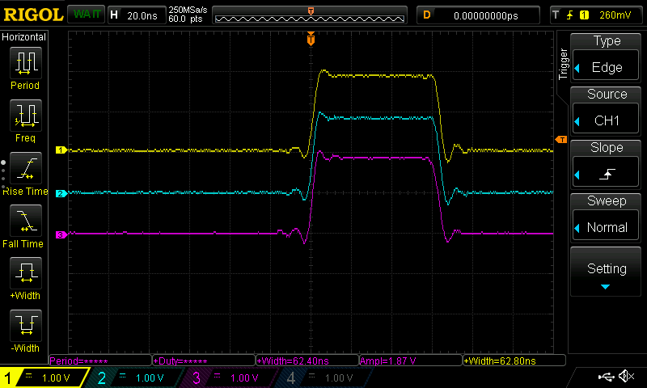
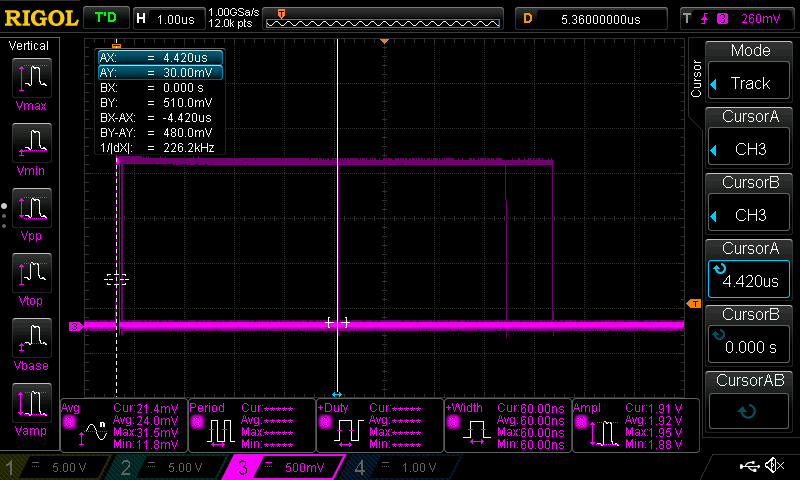
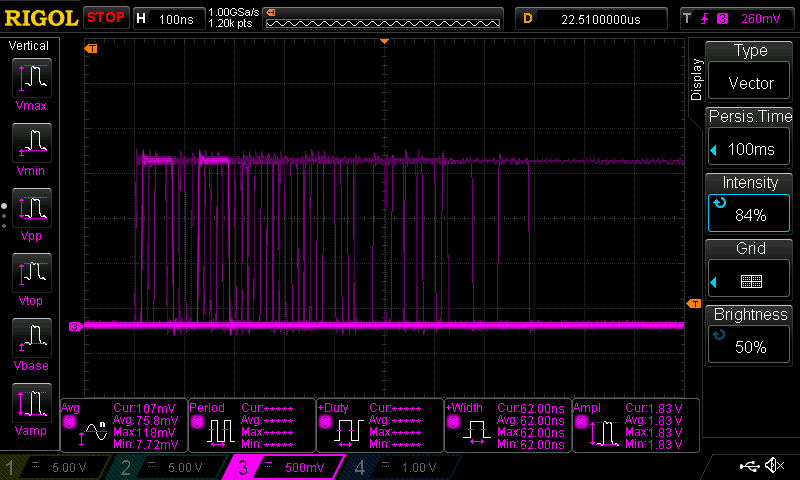
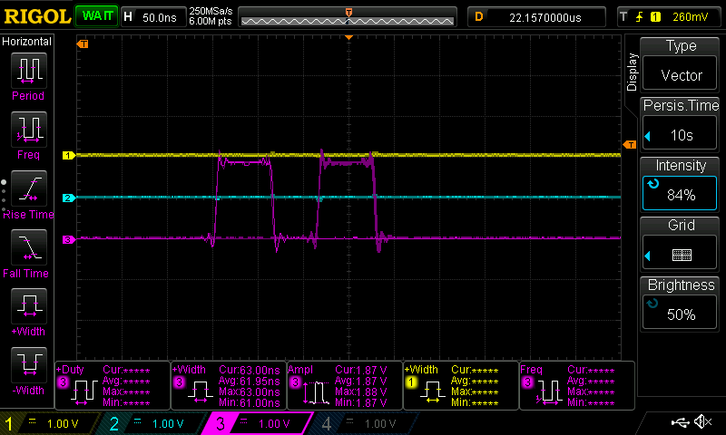

# Profiling the trigger outputs of the GalvoBox

Insights into the trigger outputs of the GalvoBox, which are used for synchronization with external devices. The trigger outputs are labeled "FRAME", "LINE", and "PIXEL" on the PCB, and they indicate the timing of frame, line, and pixel events during scanning.

:::tip
The firmware code for the galvo scanner can be found [here](https://github.com/youseetoo/uc2-esp32/blob/main/main/src/scanner/HighSpeedScannerCore.cpp)
:::

## Output stage and why the measured voltage depends on termination

The three trigger outputs are driven from 3.3 V logic through a buffer stage and then pass a 22 Ω series resistor before reaching the SMA center pin.

Buffer stage detail:

### High impedance probing (1 MΩ scope input, no termination)

With a normal probe and a 1 MΩ scope input, you are effectively not loading the output. The measured signal sits close to the CMOS high level, around 3.3 V.

### Coax plus termination (50 Ω style load)

If you terminate the line (or approximate 50 Ω at the scope end), the output is now driving a much heavier load through the series resistor and the buffer output impedance. The measured peak amplitude drops accordingly. With your 47 Ω termination hack you measured about 1.9 V peak (image below).

Cable termination setup:

Measured amplitude with termination:

Practical implication:

* Expect about 3.3 V only when the downstream input is high impedance.
* Expect reduced amplitude when the downstream load is close to 50 Ω.

## Pulse widths: why most are ~60 ns, but some become ~4 to 5 µs

### Typical width (~60 to 63 ns)

Most pulses are very short, around 60 to 63 ns (depending on channel and measurement threshold). This matches how the PIXEL trigger is generated in the raster loop: the firmware toggles the pin using two back to back GPIO register writes (set then clear) with no deliberate delay in between.

Width statistics:

### Rare longer widths (~4.4 to 5.0 µs)

You also saw a smaller population of much longer pulses around 4.4 µs and around 4.96 µs. That is consistent with the pulse being stretched when execution is delayed between the GPIO set and clear operations. Two causes in the firmware are relevant:

1. Interrupt or task preemption landing between GPIO.out_w1ts and GPIO.out_w1tc, stretching an otherwise minimal pulse into the microsecond range.
2. Explicit microsecond holds exist in the helper functions for LINE and FRAME:

   * `triggerPulseLine()` sets the pin, delays `esp_rom_delay_us(5)`, then clears.
   * `triggerPulseFrame()` does the same.

Even if your main raster path currently uses the set-clear mask method for first pixel events, these helper functions explain why a ~5 µs pulse width is a plausible mode of operation in other build variants or future refactors.

Observation of long width cases:

Example capture around 4.4 µs:

## Timing: why the first period is tightly ~22 µs but later pulses spread

You measured the time to the next pulses after a trigger event and found the first interval is very consistently around 22 µs, with occasional slips to about 22.1 µs, while later pulses show more spread.

Distribution example:

Repeat measurement showing stable first interval:

This aligns with the raster scheduler model in firmware:

* Each sample is scheduled by incrementing a software deadline `next_t += sample_period_us`.
* The loop busy waits until `esp_timer_get_time()` reaches `next_t`.
* The PIXEL trigger is emitted at that scheduled moment.

So the nominal pixel period is `config.sample_period_us`. When that value is about 22 µs, the nominal pixel rate is about 45.45 kHz, close to your scope readout.

Zoomed out frequency view and duty cycle context:

Why the later spread happens:

* The trigger train is bursty, not a continuous clock. PIXEL pulses are only emitted during the imaging region `(i >= img_start && i < img_end)`, not during pre, flyback, or settle samples.
* Any occasional overrun or interrupt latency can shift individual pulses later, which shows up as timing jitter under persistence.

## Meaning of FRAME, LINE, PIXEL in the current raster implementation

In raster mode, triggers are emitted only during the imaging region and are synchronized on first pixel events:

* First pixel of first line: FRAME + LINE + PIXEL toggle together
* First pixel of subsequent lines: LINE + PIXEL toggle together
* Other pixels: only PIXEL toggles

This is implemented by composing a GPIO bitmask and doing one set write followed immediately by one clear write, which makes FRAME and LINE edges align with the first PIXEL edge at those events.

Channel view with all three connected (1 yellow FRAME, 2 cyan LINE, 3 pink PIXEL):

## Summary of observations and where they stem from

* 3.3 V seen without termination: high impedance probing of a 3.3 V buffered output.
* ~1.9 V with termination: voltage division due to heavy load plus series resistor and driver impedance.
* ~60 to 63 ns typical width: back to back GPIO set and clear in the raster loop for PIXEL and for masked multi trigger events.
* ~4.4 to 5.0 µs occasional width: delayed clear caused by interrupt latency or use of the 5 µs delay helpers for LINE and FRAME.
* ~22 µs nominal period: matches `sample_period_us` scheduling with busy wait timing.
* timing spread later in the burst: gating of triggers to imaging region plus occasional scheduling jitter and overruns.
