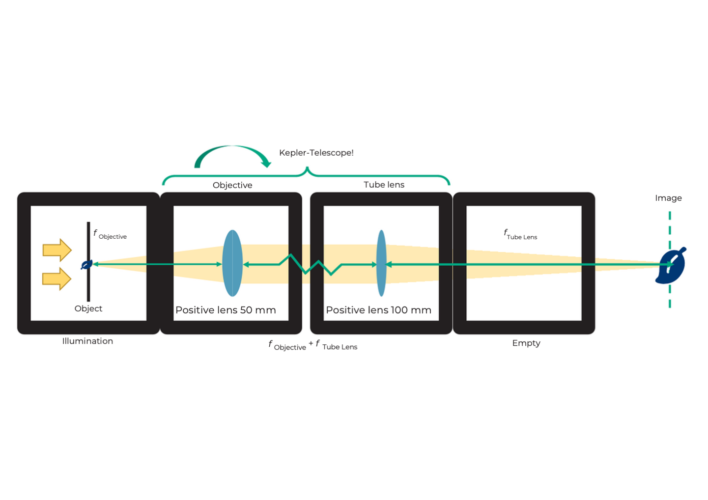
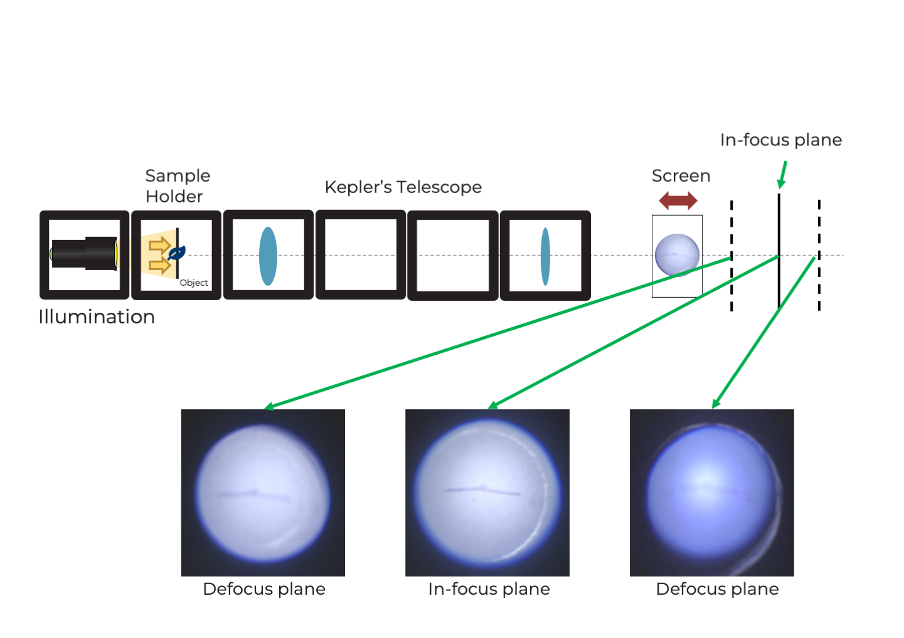
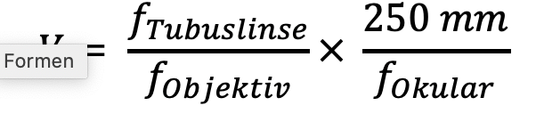
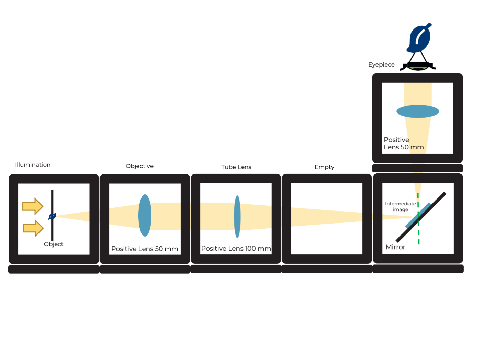
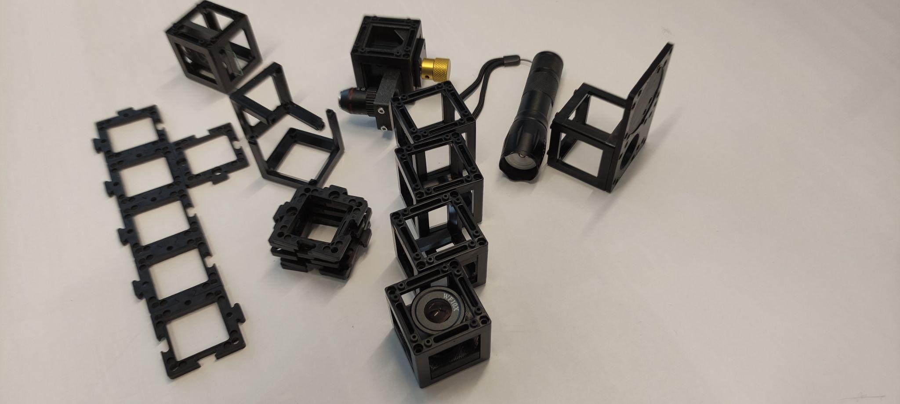
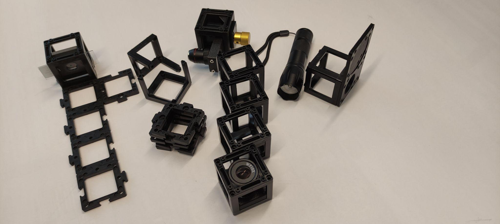
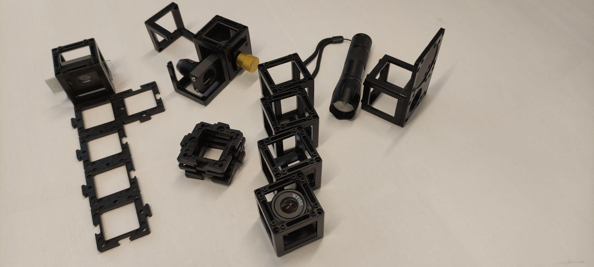
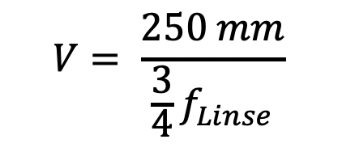

# Microscopio óptico con "óptica al infinito"

¿Qué pasa cuando le das la vuelta al telescopio de Kepler?

 

Coloca el objeto a unos 40 mm delante de la lente y encuentra la imagen a unos 100 mm detrás de la lente del tubo (usando un papel o la pared como pantalla), como se muestra en el diagrama. Mueve las lentes hasta obtener una imagen nítida.

Coloca el objeto junto con la lente sobre el papel como una sola unidad. Coloca la lente del tubo a una distancia de 100 mm de tu pantalla (papel, pared). Cambia la distancia entre las lentes – ¿cambia la imagen?

 

## Esto significa "óptica al infinito"

Un microscopio es un dispositivo que permite observar o capturar imágenes de objetos con un gran aumento.

La imagen se llama **imagen intermedia** porque a menudo se amplía aún más con un ocular.

El objeto está aproximadamente en el plano focal del lado del objeto de la lente. Así, todos los rayos incidentes se convierten en un haz paralelo de rayos detrás de la lente. La lente tiene una distancia focal corta.

La lente del tubo crea una imagen real al recoger los rayos paralelos que inciden en su plano focal. Si las colocamos detrás de la lente, el objeto se proyectará desde el plano focal de la lente. La lente del tubo tiene una distancia focal más larga que el objetivo.

La imagen en el plano de la imagen intermedia está invertida, volteada, ampliada y es real. La imagen real puede verse en una pantalla.

 

## Esto significa "óptica al infinito"

¿Cuál es el aumento de la imagen?

Aumento de la imagen

Las lentes del telescopio de Kepler también pueden utilizarse para un microscopio, pero en un orden diferente.
Mientras el objeto esté en el plano focal de la lente y la pantalla en el plano focal de la lente del tubo, la distancia entre ambas lentes no importa, ya que los rayos de luz son paralelos.

 

## Tutorial: Microscopio óptico con óptica al infinito

### Materiales necesarios:

- Telescopio de Kepler
- Lámpara de mano
- Soporte para muestras (en cubo) con muestra

### Diagrama (vista lateral):

### Instrucciones para montar el microscopio óptico con óptica al infinito:

**Paso 1: Añadir la muestra**

Coloca el cubo de la muestra detrás de la lente positiva de 50 mm. No olvides añadir las placas base.

**Paso 2: Fijar los cubos con las placas base**

Utiliza la lámpara para iluminar la muestra. Busca una pantalla (cuaderno, hoja de papel) para proyectar la imagen.

**Paso 3: Ajustar la distancia**

Apaga la luz ambiente para ver claramente la imagen en la pantalla. Ajusta la distancia entre el microscopio y la pantalla hasta que veas una imagen enfocada (consulta el diagrama).

## Microscopio con "óptica al infinito" y ocular

¿Puedes ver la imagen microscópica a través del ocular con tus ojos? ¿Qué efecto tiene el espejo? Monta el microscopio sin el espejo. Asegúrate de dejar dos espacios vacíos entre la lente del tubo y el ocular. ¿Qué observas?

 

Una introducción rápida a los espejos y sus aplicaciones se encuentra aquí:

  <iframe 
    style={{position: 'absolute', top: 0, left: 0, width: '100%', height: '100%'}}
    src="https://www.youtube.com/embed/azxLqej7yqU" 
    title="YouTube video player" 
    frameBorder="0" 
    allow="accelerometer; autoplay; clipboard-write; encrypted-media; gyroscope; picture-in-picture" 
    allowFullScreen
  />

## ¿Para qué sirve el ocular?

Los microscopios modernos están equipados con la llamada "óptica al infinito". En este caso, la lente no produce una imagen intermedia real. La luz sale de la lente como rayos paralelos infinitos. Al final del tubo "infinito" hay una lente de tubo. Esta crea una imagen intermedia, que luego se amplía nuevamente a través del ocular.

La imagen detrás del ocular está invertida, volteada, ampliada y es virtual. La imagen virtual puede verse con el ojo.

Esta configuración es muy útil en los microscopios modernos, ya que permite colocar componentes adicionales como filtros entre el objetivo y la lente del tubo sin afectar el trayecto óptico.

Un filtro puede usarse para cambiar el brillo y el color de la imagen.

 

## Para eso sirve el ocular

¿Cuál es el aumento después del ocular?

Aumento total

Un ocular es, en realidad, solo una lente que amplía la imagen intermedia. Forma la imagen virtual de tal manera que puedes verla con los ojos.

 

Con el espejo no solo puedes verte a ti mismo, sino también reflejar la luz entrante en cualquier dirección. Así puedes plegar el camino óptico y hacerlo más cómodo para trabajar. El espejo no afecta el aumento, pero sí rota la imagen en una dirección.

 

## Tutorial: Microscopio óptico con óptica al infinito y ocular

### Materiales necesarios:

- Telescopio de Kepler
- Lámpara de mano
- Ocho placas base
- Soporte para muestras (en cubo) con muestra
- Espejo (en cubo)
- Cubo vacío
- Ocular (en cubo)

### Diagrama (vista lateral):

### Instrucciones para montar el microscopio óptico con óptica al infinito y ocular:

**Paso 1: Añadir el cubo de muestra**

Coloca el cubo de la muestra en el telescopio de Kepler junto a la lente convergente de 50 mm.

**Paso 2: Montar junto a la lente de 100 mm**

Junto a la lente convergente de 100 mm, monta un cubo vacío y luego el cubo con el espejo.

**Paso 3: Colocar el ocular**

Coloca el ocular sobre el cubo con el espejo con la orientación correcta. Ilumina la muestra desde una distancia considerable.

**Paso 5: Ajustar para una imagen nítida**

Mira a través del ocular. Ajusta la distancia de las lentes hasta que veas una imagen nítida. Nota: Si no ves la muestra, intenta ajustar cuidadosamente la posición del portaobjetos hasta que la veas.

## Microscopio óptico con "óptica finita"

Coloca los cubos en las posiciones mostradas en el diagrama a continuación y mira a través del ocular.

Construye el microscopio como un sándwich añadiendo una segunda capa usando una placa base. Mira por el ocular desde arriba.

 

¿Ves la imagen a través del ocular como antes? ¿Puedes encontrar la imagen intermedia real con un pedazo de papel?

 

Gira el engranaje pequeño en el soporte de la lente. Así se mueve o se enfoca la lente. Si ya no puedes girarlo más, también puedes mover la lente dentro del soporte.

 

## Tutorial: Microscopio óptico con óptica finita y ocular

### Materiales necesarios:

- Objetivo de microscopio (4x) con montaje de engranaje (etapa lineal)
- Lámpara con base
- Doce placas base
- Soporte de muestra (en cubo) con muestra
- Espejo (en cubo)
- Tres cubos vacíos
- Ocular (en cubo)

### Diagrama (vista lateral):

## Instrucciones para montar el microscopio óptico con óptica finita:

**Paso 1: Conecta las placas base**

Conecta las placas base de la siguiente manera.

**Paso 2: Coloca la muestra**

Coloca la muestra en la placa base más a la izquierda.

**Paso 3: Construye y coloca los cubos**

Construye un cubo con el objetivo del microscopio en su interior y coloca tanto el objetivo como los cubos con engranaje en las siguientes dos placas base. Incluye todas las imágenes adicionales como se muestra.

**Subpaso 1:**

**Subpaso 2:**

**Subpaso 3:**

**Paso 4: Refleja la luz**

Coloca dos cubos vacíos y el cubo con el espejo en la última placa base de manera que refleje la luz proveniente de la muestra hacia arriba.

**Paso 5: Fija los cubos**

Coloca placas base encima de los cubos para fijarlos firmemente.

**Paso 6: Coloca el ocular**

Coloca el ocular encima del cubo con espejo. Asegúrate de la orientación correcta del ocular.

**Paso 7: Ilumina la muestra**

Fija la lámpara con una base e ilumina la muestra desde cierta distancia. Mira por el ocular y ajusta la distancia del microscopio usando el engranaje hasta ver una imagen nítida de la muestra.

## "Óptica finita" versus "óptica infinita"

Las lentes de microscopios antiguos o más pequeños suelen ser lentes denominadas finitas. Se comportan como una lente con una distancia focal extremadamente corta y crean una imagen intermedia detrás de la lente a una distancia definida por la longitud del tubo. Esta longitud está impresa y corresponde a 160 mm en nuestra lente. Allí se crea una imagen intermedia real que luego es ampliada por el ocular.

Los microscopios pueden enfocar el objeto moviendo el objeto o la lente. Aquí movemos la lente mediante un mecanismo simple. La rotación del engranaje se traduce en un desplazamiento del objetivo. Para movimientos mayores, también puedes mover la lente sobre el riel.

  

 

## "Óptica finita" versus "óptica infinita"

¿Cuál es el aumento de la imagen intermedia? ¿Y cuál es el aumento después del ocular?

aumento del objetivo

como está impreso

aumento del ocular  

aumento total  

La imagen es más grande que con el microscopio de óptica infinita. El aumento del objetivo aquí es de 4×. Si calculaste el aumento con el microscopio anterior, esto seguramente no te sorprende.

 

La imagen intermedia ahora es formada solo por la lente y está a 160 mm detrás de ella. Descubriremos por qué en el siguiente paso.

 

## Objetivo y ocular

 

## Esta es la lente

Una lente es un sistema óptico que crea una imagen ampliada de un objeto. Los diferentes números impresos en la lente tienen distintos significados:

La lente de 4× tiene solo una lente en su interior. Las lentes con mayor aumento son sistemas completos de lentes.

La lente también es una lente convergente con una distancia focal corta. La lente 4x tiene una distancia focal de f = 32 mm. Cuando se utiliza como lupa, tiene un mayor aumento que la lente de 40 mm. El campo de visión es nítido pero pequeño.

 

## El ocular

Un ocular es en realidad una lupa porque amplía la imagen intermedia. El ocular que usamos aquí es un ocular tipo Ramsden.  
Una sola lente también puede usarse como ocular. Sin embargo, con un ocular Ramsden compuesto por un sistema de lentes, el campo de visión es mejor porque produce menos errores en los bordes del campo. El ocular Ramsden consta de dos lentes con la misma distancia focal. Su distancia focal es f del ocular Ramsden = 3/4 f de la lente

¿Cuál es el aumento del ocular Ramsden?

Cada ocular tiene un llamado disco de Ramsden, que es el diámetro más pequeño del haz de luz que sale del microscopio a través del ocular.

 

El campo de visión es más grande y la imagen se ve más clara con el ocular Ramsden.  
Cada ocular tiene un llamado disco de Ramsden, que es el diámetro más pequeño

 

