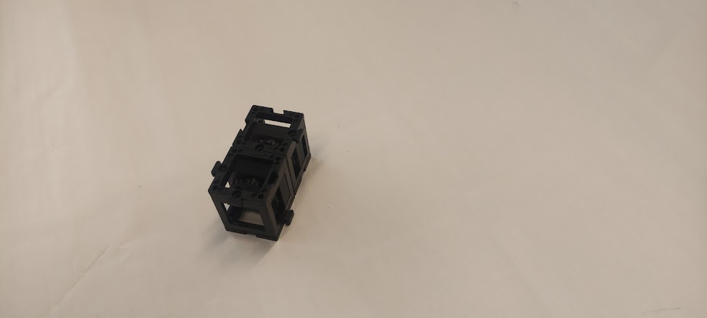
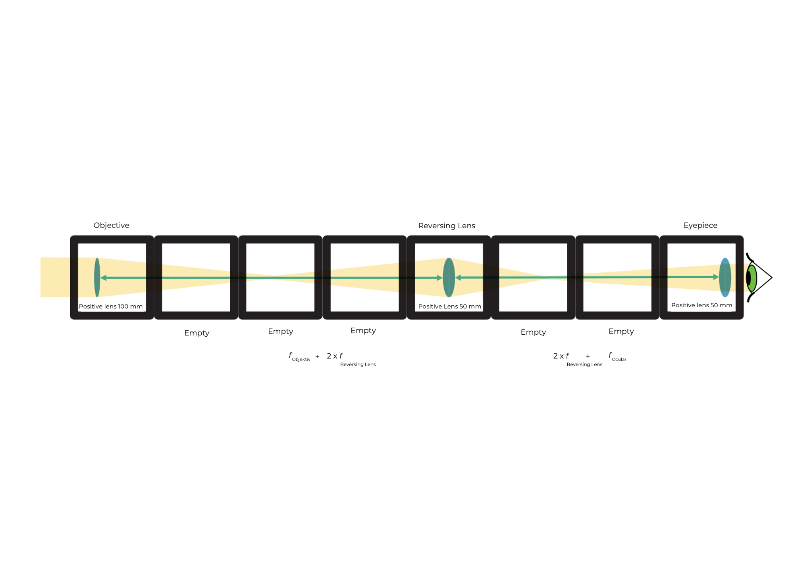
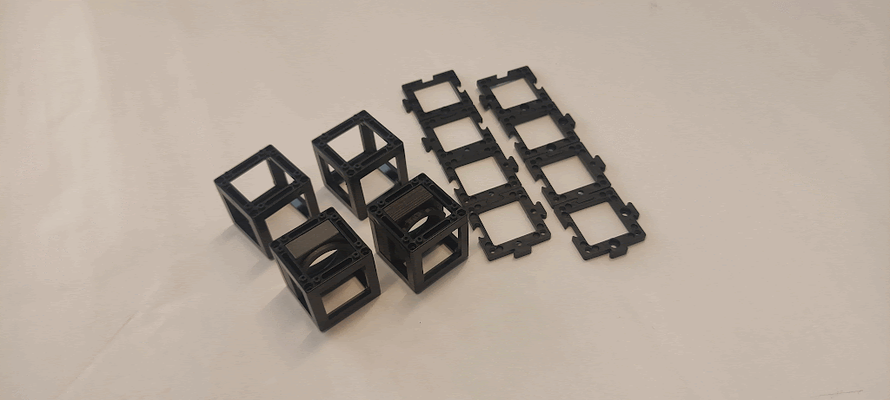
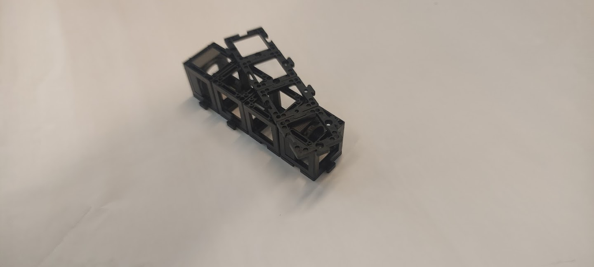

---

id: CoreTelescopeFR
title: Télescope

---

## Qu'est-ce qu'un télescope de Galilée ?
Durée : 10

Placez les cubes de lentilles sur la feuille comme indiqué dans le schéma, puis regardez au loin à travers le télescope.

À quoi ressemble l'image ?
Comment est l'image orientée ?

 

En regardant à travers le télescope, ajustez les distances entre les composants pour voir une image nette !

 

## Voici un télescope de Galilée

Un télescope est un instrument optique qui rend les objets éloignés beaucoup plus proches ou plus grands.

La lentille du côté objet est appelée lentille objective.

La lentille face à l'œil est appelée oculaire.
Le télescope de Galilée est également utilisé dans les jumelles d'opéra.

## Voici comment fonctionne le télescope de Galilée

Quelle est l'augmentation de ce télescope de Galilée ?

Formule pour calculer l'agrandissement

Il n'est pas possible d'obtenir un grossissement très élevé avec ce télescope. Mais il est très compact.

L'image est toujours

* Agrandie avec le grossissement de la formule ci-dessus
* Droite
* À l'endroit

Le champ de vision est petit.

 

## Tutoriel : télescope de Galilée

### Matériaux nécessaires :
- Quatre plaques de base
- Lentille positive de 100 mm (dans un cube)
- Lentille négative de -50 mm (dans un cube)

### Schéma (vue latérale) :

### Instructions pour assembler le télescope de Galilée :

**Étape 1 : Placez les plaques de base en haut**

Placez une plaque de base en haut de chaque cube de lentille.

**Étape 2 : Placez les plaques de base en bas**

Placez une plaque de base en bas de chaque cube de lentille.

**Étape 3 : Assemblez les cubes**

Assemblez les deux cubes de manière à ce que la distance entre les surfaces des lentilles soit la plus longue possible.

**Étape 4 : Ajustez la distance des lentilles**

Ajustez la distance entre la lentille négative et la lentille positive au maximum possible.

**Étape 5 : Utilisez le télescope !**

Cherchez un objet au loin et utilisez le télescope de Galilée pour le regarder.

## Qu'est-ce qu'un télescope de Kepler ?

Placez les lentilles dans les positions correctes comme indiqué dans le schéma. Ensuite, regardez au loin à travers le télescope.

À quoi ressemble l'image ?
Comment est l'image orientée ?

 

En regardant à travers le télescope, variez les distances entre les composants pour voir une image nette !

 

## Voici un télescope de Kepler

Ce type de télescope est souvent utilisé en astronomie.

## Voici comment fonctionne le télescope de Kepler

Quelle est l'augmentation de ce télescope de Kepler ?

Formule pour calculer l'agrandissement

Ce télescope peut atteindre un grossissement plus élevé que le télescope de Galilée. Mais il crée une image inversée. Cependant, ce n'est pas un problème pour observer les étoiles.

L'image est toujours

* Agrandie par le grossissement de la formule ci-dessus
* Inversée
* Côtés inversés

Le champ de vision est plus grand qu'avec le télescope de Galilée.

 

## Tutoriel : télescope de Kepler

### Matériaux nécessaires :
- Huit plaques de base
- Lentille positive de 100 mm (dans un cube)
- Lentille positive de 50 mm (dans un cube)
- Deux cubes vides

### Schéma (vue latérale) :

### Instructions pour assembler le télescope de Kepler :

**Étape 1 : Alignez les cubes**

Alignez les cubes de sorte que les deux lentilles soient aux extrémités et les deux cubes vides au milieu.

**Étape 2 : Fixez les cubes avec des plaques de base**

Fixez les cubes avec les plaques de base en les plaçant en haut et en bas.

**Étape 3 : Ajustez la distance**

Ajustez la distance entre les lentilles comme montré dans l'image.

**Étape 4 : Utilisez le télescope de Kepler**

Cherchez un objet au loin et utilisez le télescope de Kepler pour le regarder.

## Qu'est-ce qu'une longue-vue ?

La longue-vue est longue, donc le schéma n'est pas à la même taille.
Placez les lentilles dans les positions correctes comme indiqué dans le schéma et regardez au loin à travers le télescope.

ce qui donne

Comment l'image ici se compare-t-elle au télescope de Kepler ?

 

En regardant à travers le télescope, ajustez les distances entre les composants pour voir une image nette !

 

## Voici comment fonctionne la longue-vue

Le grossissement est comme celui du télescope de Kepler. La lentille redressante ne change que l'orientation (l'image est inversée), pas le grossissement.

Une image droite est nécessaire pour les observations terrestres. Les véritables télescopes terrestres utilisent des systèmes de prismes pour tourner l'image et la garder compacte.

L'image est

* Agrandie au même grossissement que le télescope de Kepler
* Droite
* Miroir

 
