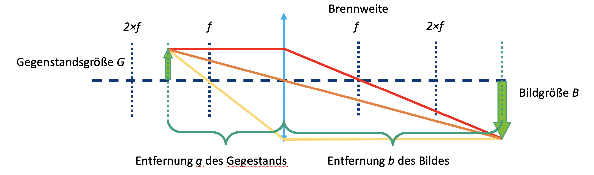
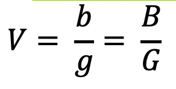

## Lenti

Nell'ottica geometrica, la luce è rappresentata come un fascio di raggi (frecce), il che semplifica le proprietà fisiche della luce. Un raggio ha una direzione e quindi è disegnato con una freccia. Una lente "rifrange" il fascio, cambiando la sua direzione.

La **lunghezza focale** di una lente corrisponde alla distanza dalla lente al piano focale su cui giace il punto focale. È data in millimetri (f = mm).

### Lenti convergenti (positive) e divergenti (negative)

Le lenti convergenti rifrangono i raggi di luce che viaggiano paralleli all'asse ottico in un punto chiamato punto focale.

Le lenti divergenti rifrangono i raggi di luce che viaggiano paralleli all'asse ottico come se provenissero da un punto chiamato fuoco "virtuale".

## Le lenti "rifrangono" i raggi di luce

Puoi trovare la lunghezza focale della lente come numero stampato sul supporto della lente. La MiniBOX riceve una lente convergente da 100mm, due lenti convergenti da 40mm e una lente negativa da -50mm. I numeri indicano la lunghezza focale.

La lente convergente è anche chiamata lente positiva o convessa. La parte centrale della lente è sempre più spessa del bordo.

La lente convergente ingrandisce l'immagine. L'ingrandimento è diverso per la lente da 40mm e la lente da 100mm. L'immagine può essere dritta o invertita.

 

La lente negativa (lente divergente) è talvolta chiamata anche lente negativa o concava. La parte centrale della lente è sempre più sottile del bordo.

Con la lente negativa (qui: lente da -50 mm) l'immagine è sempre ridotta e sempre dritta

 

Assumiamo che le nostre lenti siano cosiddette "lenti sottili". Questo significa che possiamo considerarle come un piano e non preoccuparci del loro spessore. Questo rende le spiegazioni e i calcoli molto più semplici.

Le risposte hanno sollevato altre domande? Allora indaga per scoprire esattamente come funzionano le lenti...

 

## Immagine della lente

Ora prendi i cubi delle lenti. Con la lente giusta, prova a decifrare le informazioni della lunghezza focale nei cubi mostrati. Muovi la lente sulla scrittura finché non è della stessa dimensione del testo "UC2".

Riesci a vedere il testo della stessa dimensione e orientamento di "UC2"? Cosa succede quando cambi la distanza tra la lente e l'immagine?

 

Cosa succede se usi una lente con la lunghezza focale sbagliata?

 

## Immagine di un oggetto attraverso una lente positiva

Prendiamo la lente convergente come esempio. Iniziamo con un oggetto (freccia verde) e vediamo cosa succede ai raggi che partono dalla cima. Ci sono infiniti raggi in tutte le direzioni, ma per disegnare la figura i seguenti tre raggi saranno sufficienti:

1. Il **raggio centrale** (arancione) passa indisturbato attraverso il centro della lente.
2. Il **raggio focale** (giallo) parte anche dalla punta della freccia, ma passa attraverso il fuoco lato oggetto alla lunghezza focale f. Dopo la lente, continua alla stessa altezza, ma ora parallelo all'asse ottico.
3. Il **raggio parallelo** (rosso) inizialmente corre parallelo all'asse ottico, ma viene poi rifratto alla lente in modo che passi attraverso il punto focale sul lato immagine alla lunghezza focale f.

L'immagine si forma dove tutti i raggi si intersecano. Il principio è usato per tutti i punti o i raggi di un oggetto che emanano da essi. A seconda di quale lente viene usata e a seconda della posizione dell'oggetto, le proprietà dell'immagine cambiano, come dimensione, orientamento e posizione.

## Immagine di un oggetto attraverso una lente negativa

Nel caso della lente negativa, usiamo lo stesso metodo per immaginare il percorso del raggio. A differenza del caso della lente convergente, l'immagine è sempre ridotta e virtuale. L'ingrandimento dipende dalla posizione dell'oggetto davanti alla lente. A differenza della lente convergente, l'immagine viene creata sul lato oggetto ed è quindi chiamata immagine virtuale. Puoi vederla direttamente con i tuoi occhi ma non proiettarla su uno schermo.

Il modo in cui una lente crea un'immagine è prevedibile conoscendo la lunghezza focale di quella lente. Pertanto, una certa distanza deve essere mantenuta in modo che tu possa vedere la scrittura con la lente specificata nel foglio precedente.

 

L'ingrandimento e la posizione dove l'immagine si forma dipendono dalla lunghezza focale della lente e dalla distanza tra la lente e l'oggetto.

 

Con la lente divergente (f = -50 mm) vedi sempre un'immagine virtuale ridotta. Un'immagine virtuale può essere vista solo con l'occhio. Finora abbiamo visto solo immagini virtuali.

 

## La lente convergente come lente d'ingrandimento

Prendi il cubo lente UC2 con lunghezza focale f=40mm e usalo come lente d'ingrandimento.

Riesci a leggere le piccole lettere attraverso la lente convergente? Cosa c'è scritto?

 

Una lente in azione può essere trovata qui:

  <iframe 
    style={{position: 'absolute', top: 0, left: 0, width: '100%', height: '100%'}}
    src="https://www.youtube.com/embed/rCtZjRKU8" 
    title="Lettore video YouTube" 
    frameBorder="0" 
    allow="accelerometer; autoplay; clipboard-write; encrypted-media; gyroscope; picture-in-picture" 
    allowFullScreen
  />

## Ecco cosa fanno le lenti convergenti

Con le lenti convergenti, l'immagine e l'ingrandimento dipendono dalla posizione dell'oggetto.

Se la distanza tra l'oggetto e la lente è più di due volte la lunghezza focale della lente, allora l'immagine è...
- Invertita
- Scambiata di lato
- Ridotta
- Reale

Se la distanza tra l'oggetto e la lente è esattamente due volte la lunghezza focale della lente, allora l'immagine è...
- Invertita
- Scambiata di lato
- Stessa dimensione
- Reale

Se la distanza tra l'oggetto e la lente è più della lunghezza focale e meno di due volte la lunghezza focale della lente, allora l'immagine è...
- Invertita
- Scambiata di lato
- Ingrandita
- Reale

### Distanza oggetto (g)
La distanza tra l'oggetto e il piano della lente è chiamata g.

### Larghezza immagine (b)
La distanza tra il piano della lente e l'immagine formata dalla lente è denotata come b.

La lente convergente può produrre un'immagine reale. L'immagine reale può quindi essere vista su uno schermo.

## Ecco perché la lente d'ingrandimento ingrandisce

### Effetto lente d'ingrandimento!

Se la distanza tra l'oggetto e la lente è inferiore alla lunghezza focale della lente, allora l'immagine è...
- dritta
- diritta
- Ingrandita
- Virtuale

La lente d'ingrandimento è la più semplice di tutti i dispositivi ottici, poiché consiste solo di una semplice lente convergente con una lunghezza focale adatta. Perché il cubo con i 50 𝑚𝑚 ingrandisce il piccolo testo? Se l'oggetto è davanti alla lunghezza focale della lente - cioè meno di 50 𝑚𝑚 davanti alla lente - la lente crea un'immagine virtuale che è dietro l'oggetto reale. L'occhio la percepisce ingrandita. Guarda il diagramma sopra.

 

Calcola l'ingrandimento della lente d'ingrandimento usando la seguente formula:

250 𝑚𝑚 è la distanza di visione chiara - cioè la distanza tra l'oggetto e l'occhio alla quale la maggior parte delle persone può leggere bene. Di più su questo più tardi nell'"accomodazione" dell'occhio.

## Come funziona un proiettore cinematografico?

Prendi il cubo lente UC2 con lunghezza focale 𝑒 =40 𝑚𝑚 e posizionalo dietro il cubo portacampioni. La distanza tra l'oggetto e la lente (cioè la distanza dell'oggetto g) dovrebbe essere di circa 50 mm. Se ora illumini l'oggetto con la torcia, lo vedrai nitidamente a una distanza di circa 200 mm sul muro. Un proiettore cinematografico ha una pellicola invece dell'oggetto e ovviamente una sorgente luminosa molto più forte.

Usa una torcia (ad es. dal tuo cellulare) come sorgente luminosa e tienila davanti all'oggetto

 

Usa l'immagine o il testo sul vetrino del microscopio come oggetto

 

Come è orientata l'immagine?
Fai scorrere la lente avanti e indietro nel cubo e vedi quando l'immagine è a fuoco. Trova l'immagine per g = 50mm, 60mm, 65mm e misura la distanza tra la lente e l'immagine.

 

## Come funziona un proiettore cinematografico?

### Dov'è l'immagine?
Quando un oggetto viene immaginato attraverso una lente convergente, la posizione e la dimensione dell'immagine dipendono dalla distanza (g) dell'oggetto dalla lente e dalla sua lunghezza focale (f).
L'equazione della lente descrive la relazione tra distanza dell'immagine (b) e distanza dell'oggetto (g):

### Quanto è grande l'immagine?
L'ingrandimento dell'oggetto sullo schermo può essere facilmente calcolato usando la seguente formula:

## Come funziona il proiettore

Controlla se la tua osservazione è d'accordo con il calcolo

Calcola l'ingrandimento del proiettore per i diversi valori di g e b.

La nostra lente ha una lunghezza focale di f= 40 mm.

Per g = 50mm → b = 200mm

Per g = 60 mm → b = 120 mm\

Per g = 65 mm → b = 104 mm\

 

Il proiettore produce sempre un'immagine ingrandita, invertita (rovesciata).
La posizione dell'immagine e il suo ingrandimento dipendono dalla posizione e dimensione dell'oggetto.

 

## Tutorial: Determinare la Distanza Focale di una Lente Positiva

### Materiali necessari:
- Sorgente luminosa (ad es., illuminazione della stanza)
- Lente positiva
- Schermo (ad es. tavolo, pezzo di carta, ecc.)

### Istruzioni:
1. Posiziona la lente positiva in modo che sia rivolta verso la sorgente luminosa. Allinea uno schermo parallelo al piano focale della lente.
2. Modifica la distanza tra la lente e lo schermo.
3. Osserva attentamente e registra la posizione alla quale la sorgente luminosa forma un'immagine chiara sulla superficie dello schermo.

