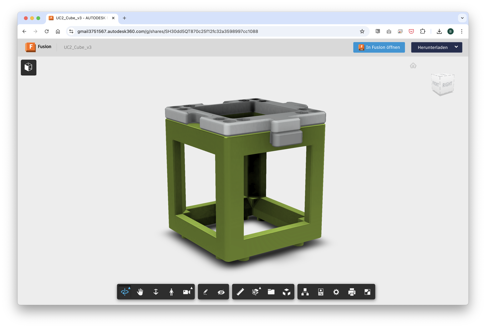

# v3 Modules

Please refer to [github.com/openUC2/UC2-Module-Template](https://github.com/openUC2/UC2-Module-Template) for:
- Autodesk Inventor 2022 design files
- OpenSCAD design files
- Technical drawings
- STP and STL files

## Fusion360 Design Files

### Cube and Base

This is a close-to-the-injection-molding design. The press-fit can vary. It's optimized for 3D printing.

You can find the latest Inventor Design files in the Fusion360 cloud: https://a360.co/3ZwHhl7

You can download and export this in multiple CAD formats.

### Insert

This serves as a template for your optics. Fill it with whatever you have and model it in your 3D CAD software: https://a360.co/3MYo0RX

