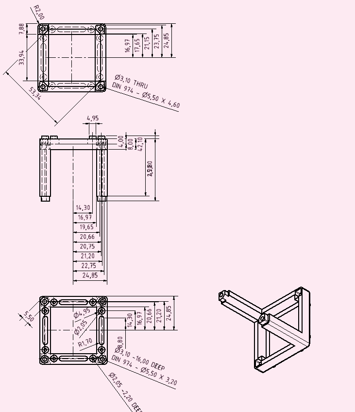

# v3 Modules

## Fusion360 Design Files

### Cube and Base

This is a close-to-the-injection-molding design. The press-fit can vary. It's optimized for 3D printing.

You can find the latest Inventor Design files in the Fusion360 cloud: https://a360.co/3ZwHhl7


You can download and export this in multiple CAD formats.

### Insert

This serves as a template for your optics. Fill it with whatever you have and model it in your 3D CAD software: https://a360.co/3MYo0RX


## UC2 Cube Inserts

The cube inserts can be fully customized to adapt any optical element to the cubes. So far a perpendicular and diagonal version exists. The design files for Autodesk Inventor and OpenSCAD are available. Once you have a customized version, please share it so that the open-aspect of the system reaches its full potential :)


A Youtube tutorial showing you how to create your own insert can be found [here](https://youtu.be/CUzuymscB5k)

Since the cube is point symmetric around the origin, the inserts can be rotated in all directions and bridges external components to the modules by acting as an open-standard.

When you create a new insert, you have to make sure it follows the following design criteria (e.g. dimensions):


For the baseplate you must follow these dimensions:


The CAD templates for Autodesk Inventor 2022 (```.ipt```) and ```STL/STEP```-standard can be found in the [INVENTOR](./INVENTOR)-folder and  [STL](./STL)/ [STP](./STP)-folder .


### Autodesk Inventor 2022 Design files

All files can be found in the folder [INVENTOR](./INVENTOR).

***Steps to work on the files:***

1. Open Autodesk Inventor 2022
2. Create a new project
3. Open the Assembly file: `Assembly_Cube_Template_v3.iam`
4. Get yourself familiar with the:
- Cube
- Baseplate
- Insert
5. Try modifying the file `20_Cube_Insert_Template_v3.ipt` so that you can mount your individual files

### Video Tutorial

We have a dedicated video tutorial to show how you can create your own insert.
**Video Tutorial on How to design a Cube Insert (Perpendicular to the optical axis)**  
**The tutorial shows a v2 insert - the principle is the same but the dimensions differ!**

[](https://www.youtube.com/watch?v=q2DNw-Q1KEo&t=2s)

### OpenSCAD Design files

All files can be found in the folder [OPENSCAD](./OPENSCAD).

*Alternatively* you can also find the files in the Thingiverse Universe that allows you to modify certain parameters in the file without installing openSCAD. You can find it here [Thingiverse](https://www.thingiverse.com/openuc2/designs).

***Steps to work on the files:***

1. Open OpenSCAD
2. Open the file `UC2_Lens_insert_v2.scad`
3. Try to understand what each parameter modifies in the geometry of the cube insert
4. Render and export as STL

## Technical Drawings

You can find additional information about the cube in the folder [CAD](./CAD).

### CAD file for the cube (injection molded / IM)


