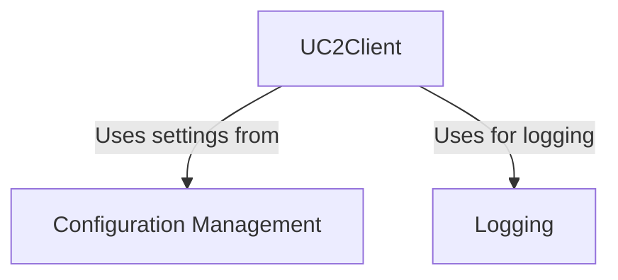

# Tutorial: UC2-REST

This project provides a **Python client** (`UC2Client`) to interact with a *UC2 REST API*.
Think of it as a software tool that lets you *programmatically control* or access the UC2 service over the network.
It uses a **Configuration Management** system to handle settings like the service address and credentials, and includes a basic **Logging** mechanism to record its activities, especially errors.

**Source Repository:** [None](None)

## Chapters

1. [UC2Client
](01_uc2client_.md)
2. [Configuration Management
](02_configuration_management_.md)
3. [Logging
](03_logging_.md)

---

Generated by [AI Codebase Knowledge Builder](https://github.com/The-Pocket/Tutorial-Codebase-Knowledge)