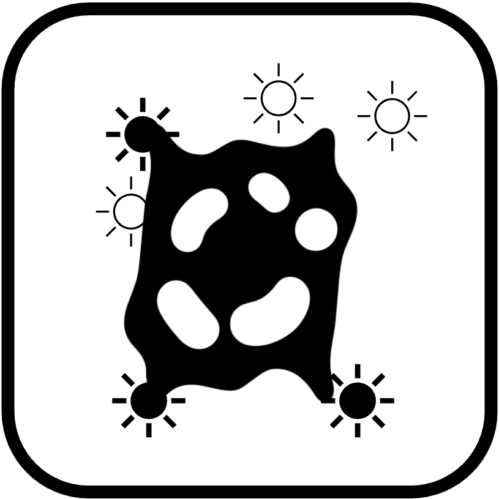

# openUC2 Documentation

Here you can find all information to enhance, repair, improve, use, communicate,.... our optical toolbox openUC2. Did not find what you were looking for? No problem. Send us a mail or write an issue in our github repository https://github.com/openUC2/UC2-GIT/issues.

|   |  Topic |Description |
|---|---|---|
|   | Geometrical Optics [[EN](./01_Toolboxes/01_DiscoveryCore/ENGLISH/01_core_intro.md), [DE](./01_Toolboxes/01_DiscoveryCore/GERMAN/01_core_intro.md)] ||
|   | Wave Optics [[EN](./01_Toolboxes/03_DiscoveryInterferometer/01_interferometer_intro.md)]||
|   |  Microsocpy [[EN](./01_Toolboxes/01_DiscoveryCore/ENGLISH/04_core_microscope.md)]  ||
|| Telescope ||
|| Electronics||
|| ImSwitch||
|| Light-Sheet Microscopy ||
|| STORM Microscopy | |
| | openUC2 FiveD ||
|| Workshops ||
|| Production ||
