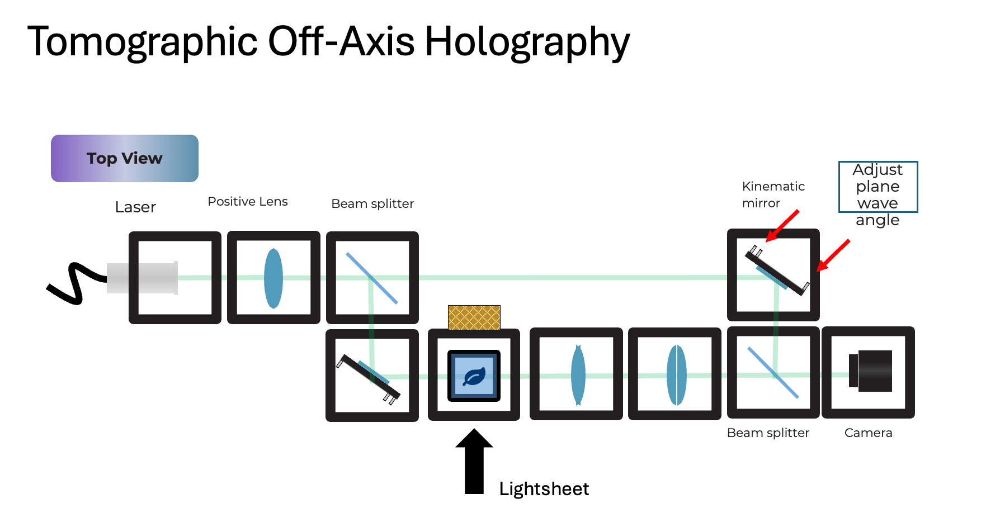
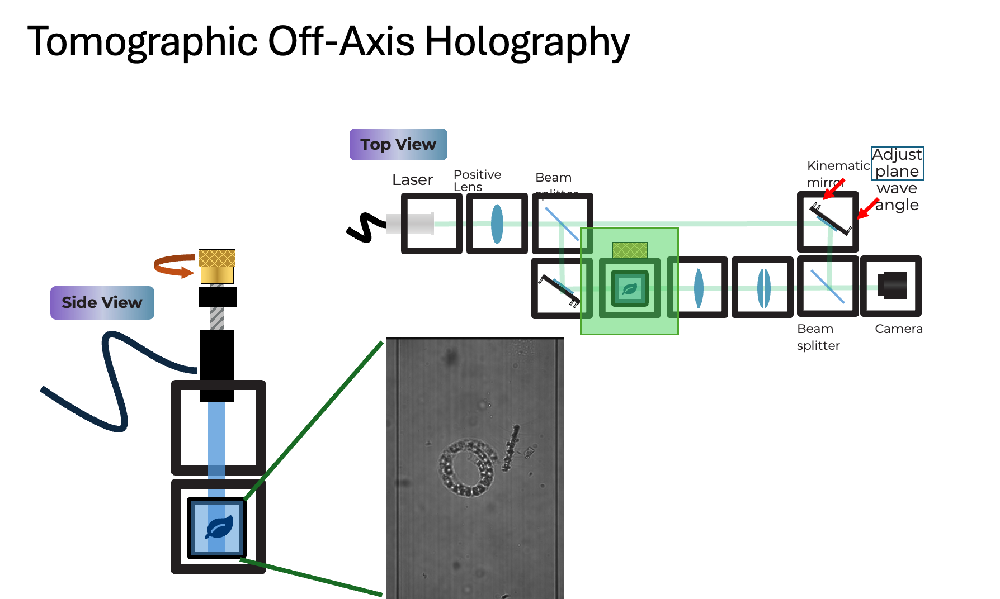
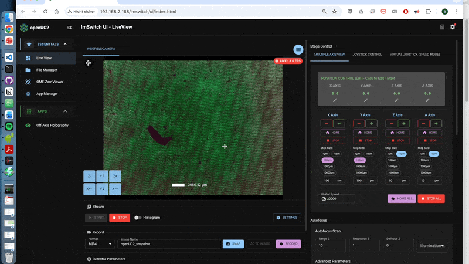
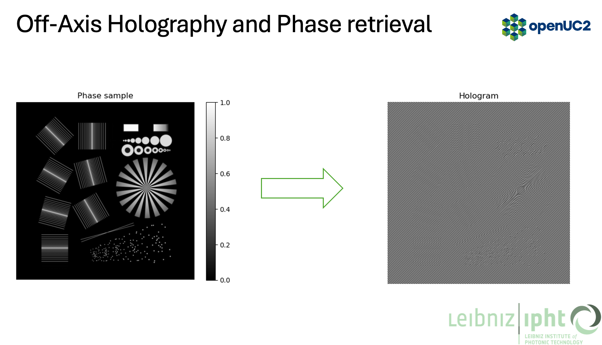
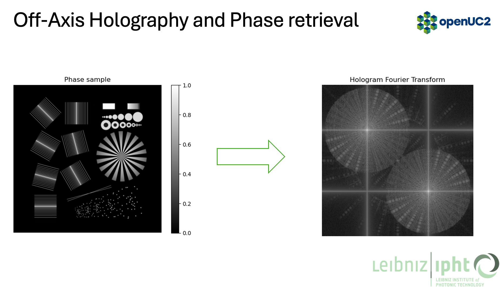
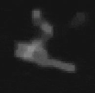
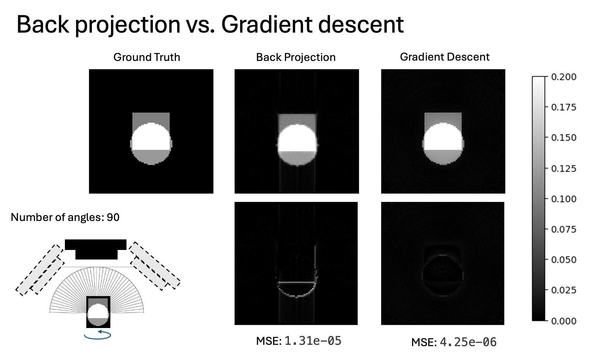

:::tip
You can find the latest preprint of the Chromatix paper here: https://www.biorxiv.org/content/10.1101/2025.04.29.651152v1
The toolbox itself can be found here:
https://github.com/chromatix-team/chromatix

The below tutorial is a work in progress. We will update it with more details, code, and example data in the coming weeks. If you want to get started right away, check out the Chromatix docs and examples, which cover the core forward model and reconstruction techniques used here. It was the result of the Chromatix Hackathon in April 2024 at the HHMI Janelia campus, where we explored how to integrate Chromatix with openUC2 for computational microscopy applications. The work was mostly done by Aaron Sanchez. 

A big thanks goes to Diptodip Deb, Gert-Jan Both and Srinivas C. Turaga for their help and support into getting this tutorial together! :)
:::

This tutorial shows how to integrate the Chromatix wave-optics simulator into an openUC2 cube-based off-axis holographic tomography setup (Mach-Zehnder style). The workflow covers:

- building and aligning the cube layout
- acquiring holograms over multiple rotation angles (FEP tube sample)
- simulating holograms in Chromatix (forward model)
- off-axis phase reconstruction (Fourier filtering + background compensation)
- 3D reconstruction and the missing-cone intuition
- optional inverse reconstruction (gradient-based) using the same forward model


## 1. System concept

### 1.1 Optical layout (Mach-Zehnder, off-axis)

Goal: interfere a tilted reference plane wave with the sample wave to encode the complex field into an intensity hologram (off-axis carrier).
This is typically done using an off-axis or Mach-Zehnder style interferometer, where the reference and sample arms are completely separate before recombination. This allows for greater flexibility in sample insertion (FEP tube) and better control over the reference tilt compared to a Michelson design. The sample part has an infinity-based microscope with an objective lens and a tube lens that images the sample on the camera. The reference arm has a kinematic mirror cube that allows fine adjustment of the reference wave tilt, which controls the fringe frequency and direction in the hologram. By rotating the sample (FEP tube) and acquiring holograms at multiple angles, we can perform tomographic reconstruction to recover the 3D refractive index distribution of the sample.




**Source Arm:**
  - laser -> collimation/expansion (positive lens)
  - first beam splitter cube splits into:
    - reference arm (kept clean, no sample)
    - sample arm (passes through rotating sample)

**Reference arm:**
  - kinematic mirror cube for fine adjustment of the reference wave tilt (controls fringe frequency and direction)

**Sample arm:**
  - sample mounted in an FEP tube
  - tube is rotated to acquire multiple angles (CT-like acquisition, but with diffraction)
  - relay optics depending on magnification and camera size to image the sample onto the camera like a normal microscope

**Recombination:**
  - second beam splitter combines sample and reference
  - camera records the off-axis hologram

Practical rule: choose the off-axis tilt such that the first diffraction order in the hologram Fourier transform is clearly separated from DC and the twin image.




### 1.2 openUC2 integration points

- acquisition is handled by ImSwitch (to control the camera, stage, and rotator you can use the ImSwitchClient available here: https://github.com/openuc2/imswitchclient)
  - rotate angle -> settle -> snap hologram -> (optional) snap background/reference
  - store per-angle frames as TIFF
  - store metadata (angle, exposure, wavelength, pixel size, optics)
- reconstruction is a Python pipeline that takes the iamges and processes them using Chromatix 


**TODO:** Recommended data layout:

```
    data/
      YYYYMMDD_experiment/
        meta.json
        angles.csv
        angle_000/
          holo.tif
          bg.tif
        angle_001/
          holo.tif
          bg.tif
        ...
```

## 2. Installation

### 2.1 Python environment

Chromatix uses JAX. On CPU this works out of the box; on GPU install the matching JAX build for your CUDA version.

Minimal (CPU) install:

```
    pip install chromatix jax jaxlib
```

Recommended extras:

```
    pip install tifffile imageio matplotlib scipy
```

### 2.2 Docker option (openUC2 style)

Use ImSwitch in Docker on a raspberry pi and operate the microscope. More information here: https://github.com/openUC2/os-rpi 


## 3. Acquisition checklist (hardware)

### 3.1 Align the interferometer

*More information with a step-by-step alignment tutorial coming soon*

1) align the sample arm first (brightfield style)
- ensure the camera sees the sample without fringes
- keep intensity within dynamic range (no saturation)

2) align the reference arm
- block sample arm, bring reference onto camera
- adjust kinematic mirror to center and collimate reference

3) create off-axis fringes
- unblock sample arm
- introduce a small tilt in reference (kinematic mirror)
- tune tilt until fringes are:
  - high contrast
  - well sampled (several pixels per fringe)
  - first order is separated in FFT (use the off-axis-holo app to visualize it)

A walk-through can be found here using the [off-axis holography app](https://github.com/openUC2/ImSwitch/blob/master/imswitch/imcontrol/controller/controllers/OffAxisHoloController.py): 




### 3.2 What is happening behind the scences?

1. Taking the image (stripes)



2. Take its Fourier transform (FFT)


3. Crop out the cross-correlation term (filtering) and compensate for background phase


4. Inverse FFT to get the complex field, then take the phase


### 3.3 Capture set per angle

For each angle:
- holo.tif: sample + reference interference
- bg.tif: reference-only (block sample arm) OR sample-only (block reference arm)

For background phase compensation (recommended):
- use reference-only bg.tif at the same exposure and reference tilt

## 4. Simulation in Chromatix (forward model)

This section matches the pipeline in the figures: phase object -> hologram -> FFT -> filtered spectrum -> phase reconstruction.

### 4.1 Core idea

- generate a reference field (tilted plane wave)
- generate a sample field (plane wave passing through a phase/delay object)
- interfere them at the sensor
- take intensity to produce a hologram

### 4.2 Simulation code (scalar, thick sample via multislice)

Create a file: scripts/chromatix_offaxis_tomography/01_simulate_hologram.py

```py
    import jax
    import jax.numpy as jnp
    import chromatix.functional as cf

    def generate_hologram(sample_delay, sample_absorption,
                          *, shape=(2048, 2048), dx=0.325,
                          wavelength=0.532, n_medium=1.33,
                          thickness=200.0,
                          kx=0.12, ky=0.00,
                          power=1.0):
        # reference plane wave with tilt (off-axis carrier)
        ref_field = cf.plane_wave(
            shape=shape,
            dx=dx,
            spectrum=wavelength,
            spectral_density=1.0,
            power=power,
            kykx=(kx, ky),
        )

        # sample illumination (untilted)
        sample_field = cf.plane_wave(
            shape=shape,
            dx=dx,
            spectrum=wavelength,
            spectral_density=1.0,
            power=power,
        )

        # propagate through a thick sample (multi-slice model)
        # sample_delay and sample_absorption are 3D arrays (z, y, x) or a stack of slices
        # thickness is in microns
        sample_field = cf.multislice_thick_sample(
            sample_field,
            sample_absorption,
            sample_delay,
            n_medium,
            thickness,
            N_pad=0,
        )

        # interfere at sensor, then intensity
        field = ref_field + sample_field
        hologram = field.intensity
        return hologram, ref_field, sample_field

    if __name__ == "__main__":
        # toy example: one phase disk as a single slice
        H, W = 1024, 1024
        z = 16
        yy, xx = jnp.mgrid[:H, :W]
        rr = jnp.sqrt((xx - W/2)**2 + (yy - H/2)**2)
        disk = (rr < 120).astype(jnp.float32)

        # delay in radians (per slice), absorption in [0..1]
        sample_delay = jnp.stack([0.8 * disk] * z, axis=0)
        sample_absorption = jnp.stack([0.02 * disk] * z, axis=0)

        holo, *_ = generate_hologram(sample_delay, sample_absorption, shape=(H, W))
        print(holo.shape, holo.min(), holo.max())
```

Notes:
- the carrier tilt is controlled by kx, ky (dimensionless normalized spatial frequency in Chromatix)
- use shape and dx to match your camera pixel size and field of view
- use wavelength in microns (0.532 for 532 nm)

## 5. Off-axis phase reconstruction (Fourier filtering)

### 5.1 Steps

1) FFT of hologram intensity
2) find the first order lobe (sideband)
3) apply a circular or Gaussian filter around that lobe
4) shift filtered lobe to the spectrum center
5) inverse FFT -> complex field estimate
6) remove background phase using a reference measurement

### 5.2 Reconstruction code

Create a file: scripts/chromatix_offaxis_tomography/02_offaxis_reconstruct.py

```py
    import numpy as np

    def fft2c(x):
        return np.fft.fftshift(np.fft.fft2(np.fft.ifftshift(x)))

    def ifft2c(X):
        return np.fft.fftshift(np.fft.ifft2(np.fft.ifftshift(X)))

    def circular_mask(shape, center, radius):
        H, W = shape
        yy, xx = np.ogrid[:H, :W]
        cy, cx = center
        return ((yy - cy)**2 + (xx - cx)**2) <= radius**2

    def offaxis_reconstruct(holo, bg_holo=None, *,
                            lobe_center=(0, 0), radius=80):
        # 1) hologram spectrum
        H = fft2c(holo)

        # 2) isolate sideband
        mask = circular_mask(H.shape, lobe_center, radius)
        Hf = H * mask

        # 3) shift sideband to center
        cy, cx = lobe_center
        Hs = np.roll(np.roll(Hf, H.shape[0]//2 - cy, axis=0),
                     H.shape[1]//2 - cx, axis=1)

        # 4) complex field
        field = ifft2c(Hs)

        if bg_holo is not None:
            Hb = fft2c(bg_holo)
            Hbf = Hb * mask
            Hbs = np.roll(np.roll(Hbf, H.shape[0]//2 - cy, axis=0),
                          H.shape[1]//2 - cx, axis=1)
            bg_field = ifft2c(Hbs)

            # background phase compensation (matches the slide)
            bg_processed = np.exp(1j * np.angle(np.conj(bg_field)))
            field = bg_processed * field

        amp = np.abs(field)
        phase = np.angle(field)
        return amp, phase, field
```

Practical tips:
- use your FFT image (Figure 04) to pick lobe_center and radius
- choose radius large enough to include object bandwidth, small enough to exclude DC/twin
- if the fringe carrier drifts with time, estimate lobe_center per frame automatically (peak find)

## 5.3 Example reconstruction

*More real-world samples are coming soon*




## 6. From phase to 3D: tomography

Two common paths:

### 6.1 Diffraction tomography (Fourier-domain intuition)

With a complex field per angle, each view fills a curved patch in 3D Fourier space (Ewald sphere). Limited NA means you miss some frequencies along the optical axis: the missing cone. This appears as axial blur and elongation in the reconstruction.

A practical openUC2 workflow:
- reconstruct complex field at each angle (Section 5)
- map each field into 3D k-space using your geometry
- grid onto a 3D volume
- inverse FFT to get a 3D refractive index contrast estimate
- apply regularization or deconvolution if needed

### 6.2 Inverse reconstruction (Chromatix + gradient descent)

Instead of backprojecting, treat the 3D sample as unknown and optimize it so that the forward model matches the measured holograms across all angles.

High-level loop:

```
    for iter:
        pred_holo = forward(sample_volume, angles)
        loss = mse(pred_holo, measured_holo) + regularizer(sample_volume)
        update(sample_volume)
```
This is where Chromatix is strong: the forward model is differentiable.

Create a file: scripts/chromatix_offaxis_tomography/03_inverse_reconstruct.py

```py
    import jax
    import jax.numpy as jnp
    import optax
    import chromatix.functional as cf

    def forward_one_angle(sample_delay, sample_absorption, angle_rad, params):
        # rotate volume around the tube axis (simplified placeholder)
        # implement rotation with jax.scipy.ndimage.map_coordinates or your own sampler
        # sample_delay_rot = rotate(sample_delay, angle_rad)
        # sample_absorption_rot = rotate(sample_absorption, angle_rad)
        sample_delay_rot = sample_delay
        sample_absorption_rot = sample_absorption

        ref = cf.plane_wave(
            shape=params["shape"], dx=params["dx"], spectrum=params["wavelength"],
            spectral_density=1.0, power=1.0, kykx=params["kykx"]
        )
        samp = cf.plane_wave(
            shape=params["shape"], dx=params["dx"], spectrum=params["wavelength"],
            spectral_density=1.0, power=1.0
        )
        samp = cf.multislice_thick_sample(
            samp, sample_absorption_rot, sample_delay_rot,
            params["n_medium"], params["thickness"], N_pad=0
        )
        holo = (ref + samp).intensity
        return holo

    @jax.jit
    def loss_fn(sample_delay, sample_absorption, angles, measured, params):
        pred = jax.vmap(lambda a: forward_one_angle(sample_delay, sample_absorption, a, params))(angles)
        data_loss = jnp.mean((pred - measured)**2)
        # simple TV-like proxy (use a better one in practice)
        reg = 1e-4 * (jnp.mean(jnp.abs(jnp.diff(sample_delay, axis=-1))) + jnp.mean(jnp.abs(jnp.diff(sample_delay, axis=-2))))
        return data_loss + reg

    def run_optimization(measured, angles, params, iters=200):
        key = jax.random.PRNGKey(0)
        z = params["z_slices"]
        H, W = params["shape"]
        sample_delay = jnp.zeros((z, H, W), dtype=jnp.float32)
        sample_abs = jnp.zeros((z, H, W), dtype=jnp.float32)

        opt = optax.adam(1e-2)
        opt_state = opt.init((sample_delay, sample_abs))

        @jax.jit
        def step(state, opt_state):
            sd, sa = state
            loss, grads = jax.value_and_grad(loss_fn, argnums=(0, 1))(sd, sa, angles, measured, params)
            updates, opt_state2 = opt.update(grads, opt_state, state)
            state2 = optax.apply_updates(state, updates)
            return state2, opt_state2, loss

        state = (sample_delay, sample_abs)
        for _ in range(iters):
            state, opt_state, loss = step(state, opt_state)
        return state, loss
```

Notes:
- you need a volume rotation implementation for real tomography
- start with low resolution volumes to validate the pipeline
- optimize delay first, then add absorption if needed

## 7. Updating older Chromatix scripts (Flax-style -> current API)

If you have older code using:

- model.init(...)
- model.apply(params, ...)

Chromatix examples now use Equinox-style modules and direct function composition. For system simulations, it is often easiest to switch to the functional API (plane waves, lenses, phase_change, multislice), as done in Sections 4 to 6.

If you still want the high-level Microscope wrapper, start from the current "Holoscope" example in the Chromatix docs and port your parameters accordingly.

## 8. openUC2 tutorial integration

The files can be found here:
- [Simulation](./scripts/chromatix_offaxis_tomography/01_simulate_hologram.py)
- [Reconstruction](./scripts/chromatix_offaxis_tomography/02_offaxis_reconstruct.py)
- [Inverse reconstruction](./scripts/chromatix_offaxis_tomography/03_inverse_reconstruct.py)

## 9. Troubleshooting quick list

- FFT sideband overlaps DC: increase reference tilt
- fringe aliasing (too fine): decrease tilt or increase magnification to get more pixels per fringe
- phase wraps too hard: unwrap (skimage) or reduce thickness / delay scaling
- strong multiple scattering: prefer inverse reconstruction vs simple backprojection
- drifting carrier: estimate lobe_center per frame (peak finding in FFT)



