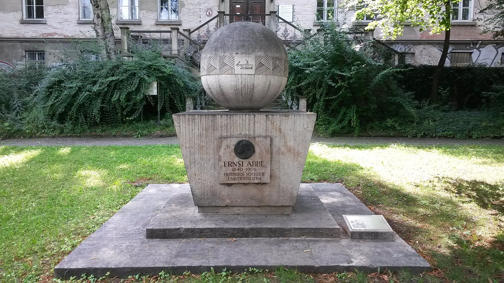
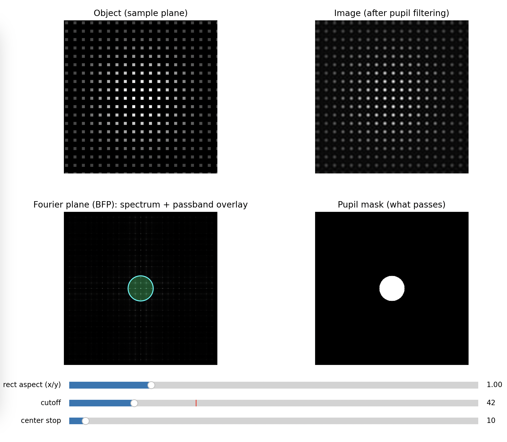
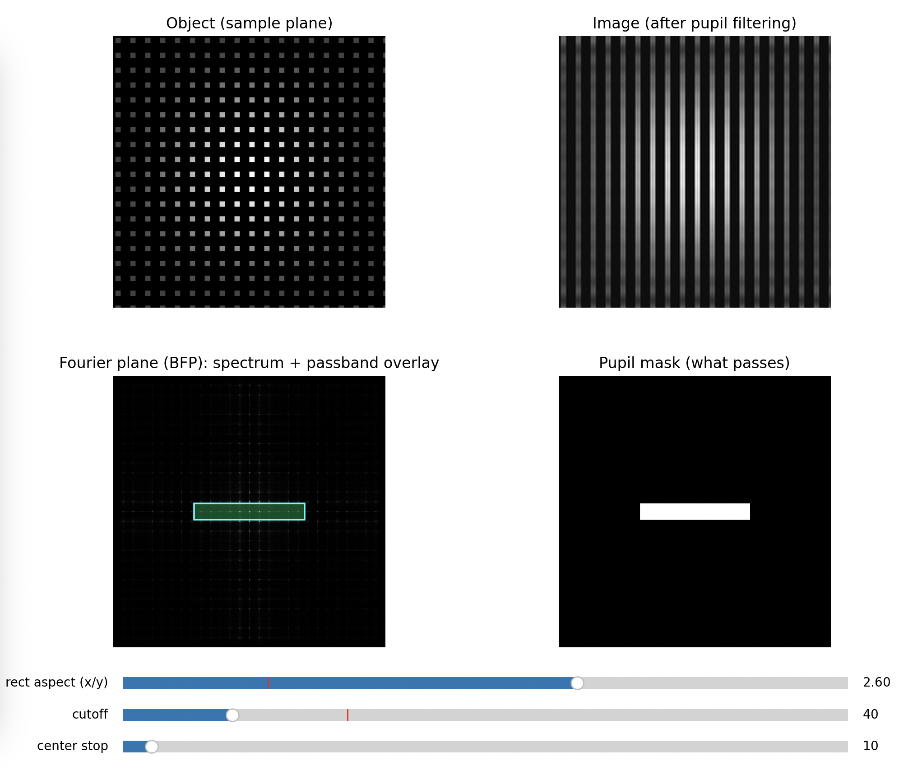
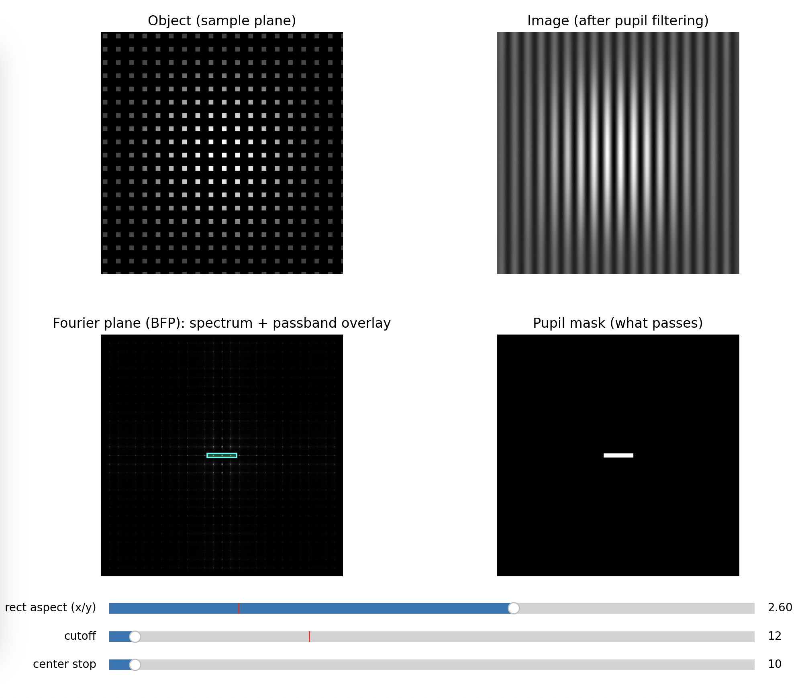
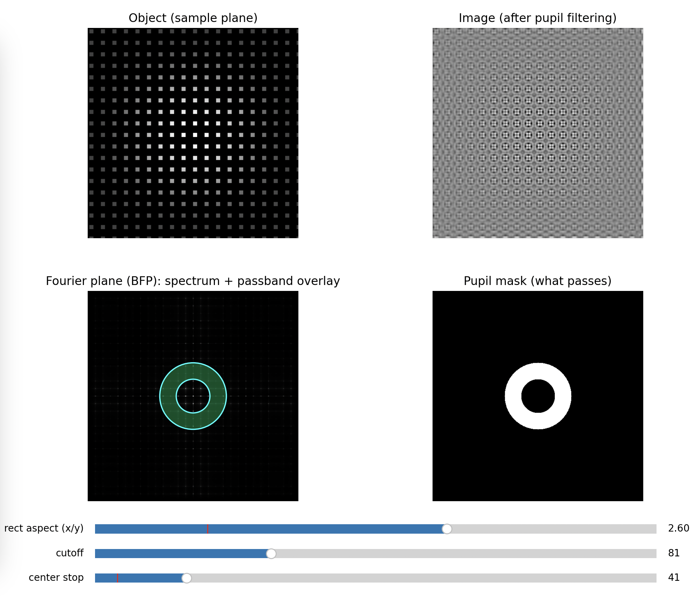

## UC2 Abbe Diffraction Experiment (Infinity Optics)

### Idea in one sentence

Let's talk about the question(s): *Why does a microscope not resolve better than half the (detection) wavelength? And why Abbe knew it already >150 years ago. And yet, why Jena?!*


*Abbe Monument in Jena, Fürstengraben [SRC](https://de.wikipedia.org/wiki/Datei:Ernst-Abbe-Denkmal_Jena_F%C3%BCrstengraben_-_20140802_125646%280%29.jpg)*

### Historical context: why this is a Jena story

That microscopy became “big” in Jena was not an accident. It was a feedback loop between biology, optics, glass chemistry, and manufacturing. **Ernst Abbe** put imaging on a predictive, physics-based foundation, **Carl Zeiss** turned that into manufacturable instruments, and **Otto Schott** enabled the needed glass quality and dispersion control. A fourth driver was biology: **Ernst Haeckel** produced countless detailed sketches of plankton and micro-structures, pushing demand for better resolving power and better contrast - obviously microscopic images were the base for all of that! 

Abbe’s key shift was to stop treating microscopes as “trial and error magnifiers” and instead treat them as systems with a finite bandwidth. In his diffraction experiments (classically demonstrated with diatoms and gratings), he showed that the “image” is not a direct copy of the object, but a reconstruction from diffracted light. Blocking selected spatial frequencies in the objective’s back focal plane changes what you see in the image. That is the core of Fourier optics, and it is still the logic behind spatial filtering, phase contrast, darkfield, and even illumination engineering in semiconductor lithography.

It is all summarized in his big article from 1873, published in the *Zeitschrift für Mikroskopie und Anatomie*: "Gesammelte Abhandlungen: Erster Band: Abhandlungenuber die Theorie des Mikroskops". 


*If you are curious to read the full piece, you can do so. It's German, but fully "open-source"..at least under CC-BY license available [here](https://archive.org/details/gesammelteabhan01abbgoog) :-)*


### What you build with UC2

You build an infinity-corrected imaging system that gives you access to two conjugate planes at the same time:

* **Primary image plane (PIP)** in the main arm, observed with a camera
* **Back focal plane (BFP)** of the objective (Fourier plane), relayed into a side arm via a beamsplitter and two lenses

With the UC2 cubes you can physically insert apertures or blockers into the BFP and directly see how the image changes.

You can access this model through the [openuc2 configurator](https://youseetoo.github.io/configurator?data=eyJtIjpbeyJpIjoibGVkLTQ3MG5tIiwicCI6WzEsMywwXSwiciI6MTgwfSx7ImkiOiJsZW5zLXBvcy0xeDEiLCJwIjpbNCwzLDBdLCJyIjowfSx7ImkiOiJsZW5zLXBvcy0xeDEiLCJwIjpbNiwzLDBdLCJyIjowfSx7ImkiOiJpcmlzLTF4MSIsInAiOls3LDMsMF0sInIiOjB9LHsiaSI6ImJlYW1zcGxpdHRlci0xeDEiLCJwIjpbOCwzLDBdLCJyIjoxODB9LHsiaSI6ImlyaXMtMXgxIiwicCI6WzMsMywwXSwiciI6MH0seyJpIjoiY3ViZS1yYXNwaWNhbS0yeDEiLCJwIjpbMTEsMywwXSwiciI6MH0seyJpIjoiY3ViZS1yYXNwaWNhbS0yeDEiLCJwIjpbOCw1LDBdLCJyIjowfSx7ImkiOiJsZW5zLXBvcy0xeDEiLCJwIjpbOCw0LDBdLCJyIjo5MH0seyJpIjoibGVucy1wb3MtMXgxIiwicCI6WzksMywwXSwiciI6MH0seyJpIjoiY3ViZS0xeDEiLCJwIjpbMTAsMywwXSwiciI6MH0seyJpIjoibGVucy1wb3MtMXgxIiwicCI6WzIsMywwXSwiciI6MTgwfSx7ImkiOiJzYW1wbGVob2xkZXItMXgxIiwicCI6WzUsMywwXSwiciI6MH1dLCJhIjpbXSwibWV0YSI6eyJuYW1lIjoiQWJiZSBFeHBlcmltZW50IiwiYXV0aG9yIjoiQmVuZWRpY3QiLCJnaXRodWJBY2NvdW50IjoiYmVuaXJvcXVhaSIsImRlc2NyaXB0aW9uIjoiVGhpcyBpcyBhIHNpbXBsZSBkZW1vbnN0cmF0aW9uIG9mIGhvdyBvdXIgZ2Fsdm8tYmFzZWQgaW1hZ2luZyBzeXN0ZW0gbG9va3MgbGlrZSIsImNhdGVnb3J5IjoiTWljcm9zY29weSIsInNjcmVlbnNob3QiOiIiLCJ1YzJfdmVyaWZpZWQiOmZhbHNlLCJ2ZXJzaW9uIjoiMS4wLjAiLCJjcmVhdGVkQXQiOiIyMDI1LTA5LTI0VDExOjQxOjQwLjI3MloiLCJjb2xsZWN0aW9uIjpbIkdlbmVyYWwiXSwibm90aWZpY2F0aW9uIjoiIn19) (ensure you activate the raytracing)


### Optical principle in a compact form

#### 1) Infinity-corrected imaging

If the sample is in the front focal plane of the objective lens, the outgoing rays are (approximately) collimated. A tube lens converts these parallel bundles back into a real image in its focal plane.

Magnification of an infinite conjugate system:
$$
M = -\frac{f_{\text{tube}}}{f_{\text{obj}}}
$$

With $f_{\text{obj}}=50\,\text{mm}$ and $f_{\text{tube}}=100\,\text{mm}$:

$$
M=-2
$$

#### 2) Numerical aperture sets the bandwidth

The objective only collects diffracted light up to a maximum angle (\alpha). The **numerical aperture** is
$NA = n\sin(\alpha)$ in air ($n\approx 1$). For a lens of diameter $d$ and focal length $f$:
$$
\tan(\alpha)\approx \frac{d/2}{f}
$$

This sets the highest spatial frequencies that can pass the pupil.

A commonly used resolution estimate (Rayleigh, circular aperture) is:
$$
R \approx 0.61\frac{\lambda}{NA}
$$
Using the values from the CourseBOX documentation example
$NA\approx 0.25$, $\lambda\approx 550\,\text{nm}$:
$$
R \approx 0.61\cdot\frac{0.55\,\mu\text{m}}{0.25} \approx 1.34\,\mu\text{m}
$$

#### 3) Why the BFP is the “Fourier plane”

A periodic object (fish net, tea bag mesh, grating, diatome) diffracts light into discrete orders. For a 1D grating with pitch (p) under normal illumination:
$$
\sin\theta_m = m\frac{\lambda}{p}
$$
Those angles map to positions in the objective's BFP:
$$
r_m \approx f_{\text{obj}}\tan\theta_m \approx f_{\text{obj}}\cdot m\frac{\lambda}{p} \quad (\text{small angles})
$$
So the BFP literally displays the object’s spatial frequency content as spots or peaks. Your BFP aperture is a physical low-pass (or directional) filter in spatial frequency space.

#### 4) Coherent vs incoherent: why “2x” can appear

With coherent illumination (laser), the system’s passband is smaller in spatial-frequency terms than with fully incoherent illumination. In Fourier-optics language:

* coherent imaging: cut-off spatial frequency roughly $f_c \sim NA/\lambda$
* incoherent imaging: cut-off extends to about $2NA/\lambda$

This is why the illumination model matters: the same optics can behave as if they had a different “information bandwidth” depending on coherence. Your UC2 setup makes this tangible because you can see and edit the frequency content directly in the BFP.

More on that over at the resources from [Zeiss](https://micro.magnet.fsu.edu/primer/anatomy/image.html)


### Hardware and cube layout (Abbe experiment)

Prerequisite: the imaging path and the side arm are aligned well enough that you can focus both PIP and BFP on a screen/camera.

**Illumination (laser, coherent):**

* Laser cube with pointer or incoherent LED lightsource (point source from HoloBOX with lens)
* One lens cube (typically $f=50\,\text{mm}$) for collimation 
* Optional: One lens cube that acts as a collector and reimages the lightsource into the aperture of the illumination side

**Object and imaging path (main arm):**

* Sample cube with a fine mesh (fish net), tea bag mesh, or a diffraction grating
* Objective lens cube: plano-convex ($f=50\,\text{mm}$)
* Tube lens cube: plano-convex ($f=100\,\text{mm}$)
* Camera at the **PIP** (in the tube lens focal plane)

**Fourier access (side arm):**

* Beamsplitter cube to pick off part of the beam
* Relay lens 1: $f=100\,\text{mm}$
* Relay lens 2: $f=100\,\text{mm}$
* Camera or screen at the relay image plane of the **BFP**

**Where you insert filters for the experiment:**

* The **BFP** is between objective and tube lens. Insert:

  * circular aperture (iris)
  * rectangular aperture (independent X/Y doors) or cut cardboard
  * an opaque dot (blocks the center orders)
  * a thin line object (blocks the center line of orders in one axis)


### Alignment checkpoints that matter for this experiment

* **Collimated illumination:** after the beam-expanding lens, the beam diameter should stay roughly constant over distance. If it expands or shrinks strongly, adjust lens position relative to the laser.
* **PIP focus:** focus the camera so the mesh/grating looks sharp. With periodic samples you can run into Talbot self-imaging; if focus seems “ambiguous”, reduce stray light and add a visible reference (for example partially stop the illuminated area) so you know you are focusing a true image plane, not a Talbot plane.
* **BFP focus:** in the side arm, adjust relay lens 2 or the camera position until diffraction orders are sharp points/peaks rather than smeared blobs.

**Laser safety:** keep the beam on-table, block any outgoing beam, never scan at eye height.


### What to do (procedure) and what you should see

#### Step 1: Baseline (no aperture in the BFP)

* Record PIP image (mesh pattern, or simply a sample, paper something like that)
* Record BFP image (diffraction orders)

**Expected**

* PIP: clear periodic structure
* BFP: symmetric spots/peaks (for a 2D mesh you see a 2D lattice of orders)

Interpretation: the image exists because multiple orders interfere to reconstruct structure.

Some simulations with different aperture settings:


#### Step 2: Circular aperture (radial low-pass)

Close the iris gradually while keeping the 0th order centered.

**Expected**

* In BFP: higher orders disappear first as the pupil shrinks
* In PIP: edges soften, fine detail vanishes, contrast changes, the pattern turns into a blur

Key message: removing high spatial frequencies removes fine detail.


*Fully open*


*Half open*


*Closed*


#### Step 3: Rectangular aperture (directional filtering)

Close only in X (leave Y open), then swap.

**Expected**

* If you pass mainly the orders aligned with Y, the image becomes dominated by features varying in that direction, often turning a grid into stripes
* Rotating which orders you keep rotates which structure survives

Key message: spatial frequency filtering is anisotropic. You can erase information in one direction only.


*Minimal Blocking of higher frequencies along x*


*Medium Blocking of higher frequencies along x*


*Full  Blocking of higher frequencies along x*


#### Step 4: Block the 0th order with a dot (darkfield behavior)

Place a small opaque dot in the BFP centered on the 0th order.

**Expected**

* Background becomes dark
* Only scattered/diffracted contributions form the image
* Edges and defects stand out strongly

Key message: you are suppressing the “DC” term and forcing the image to be built from higher orders only.


*Minimal Stop in the center*


*Bandpass of higher frequencies*


*Bandpass of lower frequencies*


*High-pass filter*


#### Optional Step: Oblique Illumination

Block onyl one direction. You will see a phase gradient. 

### A simple quantitative add-on (fast, worth doing)

Measure or estimate the mesh pitch $p$ (microscope ruler, known mesh spec, or a printed calibration target). Then predict order spacing in the BFP:
$$
\Delta r \approx f_{\text{obj}}\frac{\lambda}{p}
$$
Compare predicted spacing to what you measure on the BFP camera (in pixels). This turns the BFP camera into a spatial-frequency ruler and makes the “Fourier plane” claim concrete.

### Python Simulation to get the images above

You can replace the apertures if you like to visualize the gradient effect:

```py
"""
Abbe demo: object (imaging plane) + Fourier plane with interactive pupil cutoff.
No contour objects, so it works across matplotlib versions.

pip install numpy matplotlib
python abbe_planes_demo.py
"""

import numpy as np
import matplotlib.pyplot as plt
from matplotlib.widgets import Slider, RadioButtons
from matplotlib.patches import Circle, Rectangle


# -----------------------------
# Sample object (mesh / grating)
# -----------------------------
def make_mesh(N=512, pitch_px=28, duty=0.35, rotate_deg=0.0):
    y, x = np.mgrid[0:N, 0:N].astype(np.float32)
    x -= N / 2
    y -= N / 2

    th = np.deg2rad(rotate_deg)
    xr = x * np.cos(th) - y * np.sin(th)
    yr = x * np.sin(th) + y * np.cos(th)

    gx = (np.mod(xr / pitch_px, 1.0) < duty).astype(np.float32)
    gy = (np.mod(yr / pitch_px, 1.0) < duty).astype(np.float32)
    obj = gx * gy

    w = np.hanning(N).astype(np.float32)
    obj *= (0.25 + 0.75 * np.outer(w, w))

    obj -= obj.min()
    obj /= (obj.max() + 1e-9)
    return obj


# -----------------------------
# Fourier helpers
# -----------------------------
def fft2c(a):
    return np.fft.fftshift(np.fft.fft2(a))


def ifft2c(A):
    return np.fft.ifft2(np.fft.ifftshift(A))


def make_frequency_grid(N):
    u = np.arange(N) - N / 2
    U, V = np.meshgrid(u, u)
    R = np.sqrt(U**2 + V**2)
    return U, V, R


# -----------------------------
# Pupil masks
# -----------------------------
def mask_circular(R, cutoff):
    return (R <= cutoff).astype(np.float32)


def mask_rectangular(U, V, cutoff, aspect=1.0):
    aspect = max(1e-3, float(aspect))
    wx = cutoff * aspect
    wy = cutoff / aspect
    return ((np.abs(U) <= wx) & (np.abs(V) <= wy)).astype(np.float32)


def mask_darkfield(R, cutoff, stop):
    stop = min(stop, cutoff - 1e-6)
    return ((R <= cutoff) & (R >= stop)).astype(np.float32)


# -----------------------------
# Visualization scaling
# -----------------------------
def norm01(a):
    a = np.asarray(a)
    a = a - np.nanmin(a)
    return a / (np.nanmax(a) + 1e-12)


def logmag(A, eps=1e-9):
    return np.log10(np.abs(A) + eps)


def radial_profile_power(A, R):
    mag2 = np.abs(A) ** 2
    r = R.flatten()
    v = mag2.flatten()
    rmax = int(np.max(r))
    bins = np.arange(0, rmax + 2, 1)
    idx = np.digitize(r, bins) - 1

    prof = np.zeros(rmax + 1, dtype=np.float64)
    cnt = np.zeros(rmax + 1, dtype=np.float64)

    valid = (idx >= 0) & (idx <= rmax)
    np.add.at(prof, idx[valid], v[valid])
    np.add.at(cnt, idx[valid], 1.0)

    prof /= (cnt + 1e-12)
    prof = np.maximum(prof, 1e-30)
    return np.arange(rmax + 1), prof


def main():
    N = 512
    obj = make_mesh(N=N, pitch_px=28, duty=0.35, rotate_deg=0.0)

    U, V, R = make_frequency_grid(N)
    F = fft2c(obj)

    # Initial params
    cutoff0 = 80.0
    stop0 = 10.0
    aspect0 = 1.0
    mode0 = "circular"

    # Figure layout
    fig = plt.figure(figsize=(12, 7))
    gs = fig.add_gridspec(2, 3, height_ratios=[1, 1], width_ratios=[1, 1, 0.9])

    ax_obj = fig.add_subplot(gs[0, 0])
    ax_img = fig.add_subplot(gs[0, 1])
    ax_bfp = fig.add_subplot(gs[1, 0])
    ax_msk = fig.add_subplot(gs[1, 1])
    ax_prof = fig.add_subplot(gs[:, 2])

    plt.subplots_adjust(left=0.06, right=0.98, bottom=0.18, top=0.95, wspace=0.25, hspace=0.25)

    ax_obj.set_title("Object (sample plane)")
    ax_img.set_title("Image (after pupil filtering)")
    ax_bfp.set_title("Fourier plane (BFP): spectrum + passband overlay")
    ax_msk.set_title("Pupil mask (what passes)")

    ax_obj.imshow(obj, cmap="gray", vmin=0, vmax=1)
    ax_obj.axis("off")

    # Build initial mask
    def build_mask(mode, cutoff, stop, aspect):
        if mode == "circular":
            return mask_circular(R, cutoff)
        if mode == "rectangular":
            return mask_rectangular(U, V, cutoff, aspect=aspect)
        if mode == "darkfield":
            return mask_darkfield(R, cutoff, stop)
        return mask_circular(R, cutoff)

    mask = build_mask(mode0, cutoff0, stop0, aspect0)
    Ff = F * mask
    img = norm01(np.real(ifft2c(Ff)))

    im_img = ax_img.imshow(img, cmap="gray", vmin=0, vmax=1)
    ax_img.axis("off")

    # BFP: show original spectrum so orders remain visible, overlay passband
    im_bfp = ax_bfp.imshow(np.abs(F)**.5, cmap="gray")
    pass_overlay = np.ma.masked_where(mask < 0.5, mask)
    im_pass = ax_bfp.imshow(pass_overlay, cmap="winter", alpha=0.30, vmin=0, vmax=1)
    ax_bfp.axis("off")

    im_msk = ax_msk.imshow(mask, cmap="gray", vmin=0, vmax=1)
    ax_msk.axis("off")

    # Patch overlay (optional visual boundary) without contour
    cx = (N - 1) / 2
    cy = (N - 1) / 2

    patch_circ = Circle((cx, cy), radius=cutoff0, fill=False, linewidth=1.3, edgecolor="cyan")
    patch_rect = Rectangle((cx - cutoff0 * aspect0, cy - cutoff0 / aspect0),
                           2 * cutoff0 * aspect0, 2 * cutoff0 / aspect0,
                           fill=False, linewidth=1.3, edgecolor="cyan")
    patch_outer = Circle((cx, cy), radius=cutoff0, fill=False, linewidth=1.3, edgecolor="cyan")
    patch_inner = Circle((cx, cy), radius=stop0, fill=False, linewidth=1.3, edgecolor="cyan")

    for p in (patch_circ, patch_rect, patch_outer, patch_inner):
        ax_bfp.add_patch(p)

    patch_rect.set_visible(False)
    patch_outer.set_visible(False)
    patch_inner.set_visible(False)

    # Radial profile
    rr0, p0 = radial_profile_power(F, R)
    rr1, p1 = radial_profile_power(Ff, R)

    ax_prof.set_title("Fourier power vs radius")
    l0, = ax_prof.plot(rr0, p0, label="original")
    l1, = ax_prof.plot(rr1, p1, label="after mask")
    vline = ax_prof.axvline(cutoff0, linestyle="--")
    ax_prof.set_xlabel("radius in Fourier pixels")
    ax_prof.set_ylabel("mean |F|^2")
    ax_prof.set_yscale("log")
    ax_prof.legend(loc="upper right")

    # Controls
    ax_cut = fig.add_axes([0.10, 0.08, 0.55, 0.03])
    ax_stp = fig.add_axes([0.10, 0.04, 0.55, 0.03])
    ax_asp = fig.add_axes([0.10, 0.12, 0.55, 0.03])
    ax_rad = fig.add_axes([0.72, 0.04, 0.24, 0.12])

    s_cut = Slider(ax_cut, "cutoff", 2, N / 2 - 2, valinit=cutoff0, valstep=1)
    s_stp = Slider(ax_stp, "center stop", 0, N / 2 - 4, valinit=stop0, valstep=1)
    s_asp = Slider(ax_asp, "rect aspect (x/y)", 0.25, 4.0, valinit=aspect0)

    r_mode = RadioButtons(ax_rad, ("circular", "rectangular", "darkfield"), active=0)
    for t in r_mode.labels:
        t.set_fontsize(10)

    def update(_=None):
        nonlocal mask, Ff

        mode = r_mode.value_selected
        cutoff = float(s_cut.val)
        stop = float(s_stp.val)
        aspect = float(s_asp.val)

        if mode == "darkfield":
            stop = min(stop, cutoff - 1.0)
            stop = max(stop, 0.0)
            if abs(stop - s_stp.val) > 1e-6:
                s_stp.set_val(stop)
                return  # update will be called again

        mask = build_mask(mode, cutoff, stop, aspect)
        Ff = F * mask
        img = norm01(np.real(ifft2c(Ff)))

        im_img.set_data(img)
        im_msk.set_data(mask)

        pass_overlay = np.ma.masked_where(mask < 0.5, mask)
        im_pass.set_data(pass_overlay)

        # Boundary patches
        patch_circ.set_visible(mode == "circular")
        patch_rect.set_visible(mode == "rectangular")
        patch_outer.set_visible(mode == "darkfield")
        patch_inner.set_visible(mode == "darkfield")

        if mode == "circular":
            patch_circ.center = (cx, cy)
            patch_circ.radius = cutoff

        if mode == "rectangular":
            aspect = max(1e-3, aspect)
            wx = cutoff * aspect
            wy = cutoff / aspect
            patch_rect.set_xy((cx - wx, cy - wy))
            patch_rect.set_width(2 * wx)
            patch_rect.set_height(2 * wy)

        if mode == "darkfield":
            patch_outer.center = (cx, cy)
            patch_outer.radius = cutoff
            patch_inner.center = (cx, cy)
            patch_inner.radius = stop

        # Profile update
        rr0, p0 = radial_profile_power(F, R)
        rr1, p1 = radial_profile_power(Ff, R)
        l0.set_data(rr0, p0)
        l1.set_data(rr1, p1)
        vline.set_xdata([cutoff, cutoff])
        ax_prof.relim()
        ax_prof.autoscale_view()

        fig.canvas.draw_idle()

    s_cut.on_changed(update)
    s_stp.on_changed(update)
    s_asp.on_changed(update)
    r_mode.on_clicked(update)

    update()
    plt.show()


if __name__ == "__main__":
    main()
```

### Why this still matters today

This is not just a historical demonstration. Modern microscopy constantly uses the same levers:

* phase contrast and DIC manipulate phase and spatial frequencies
* darkfield and oblique illumination reshape which orders contribute
* structured illumination and lithography engineer illumination to move or weight spatial frequencies for better contrast at the cutoff

The UC2 Abbe experiment is the shortest path from “microscopes magnify” to “microscopes are bandwidth-limited wave systems”, with your hands literally editing the bandwidth in the BFP.


### TODO:

- Add images from actual experiment
