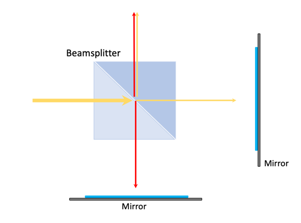
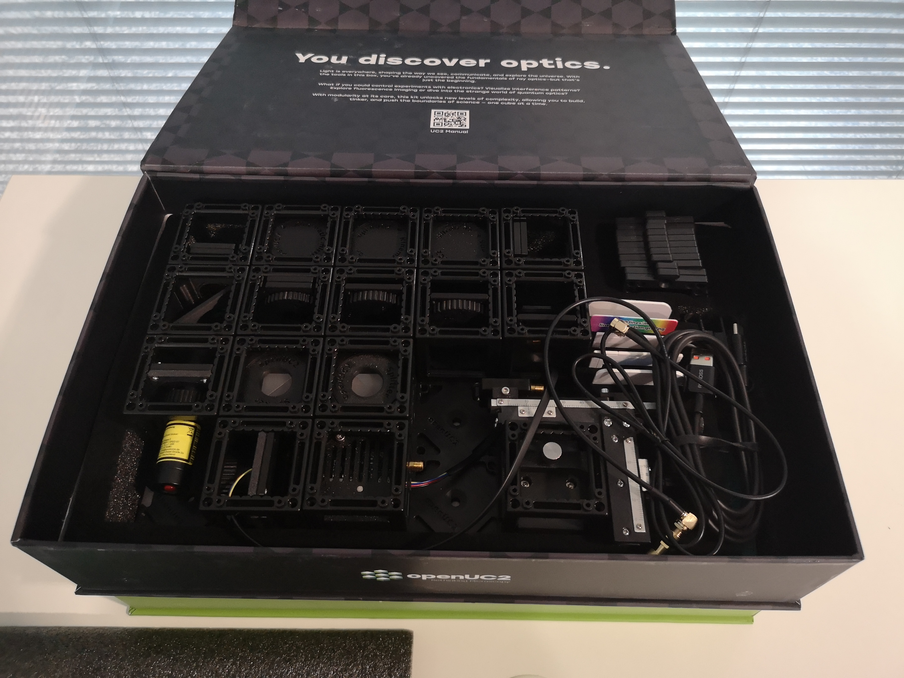
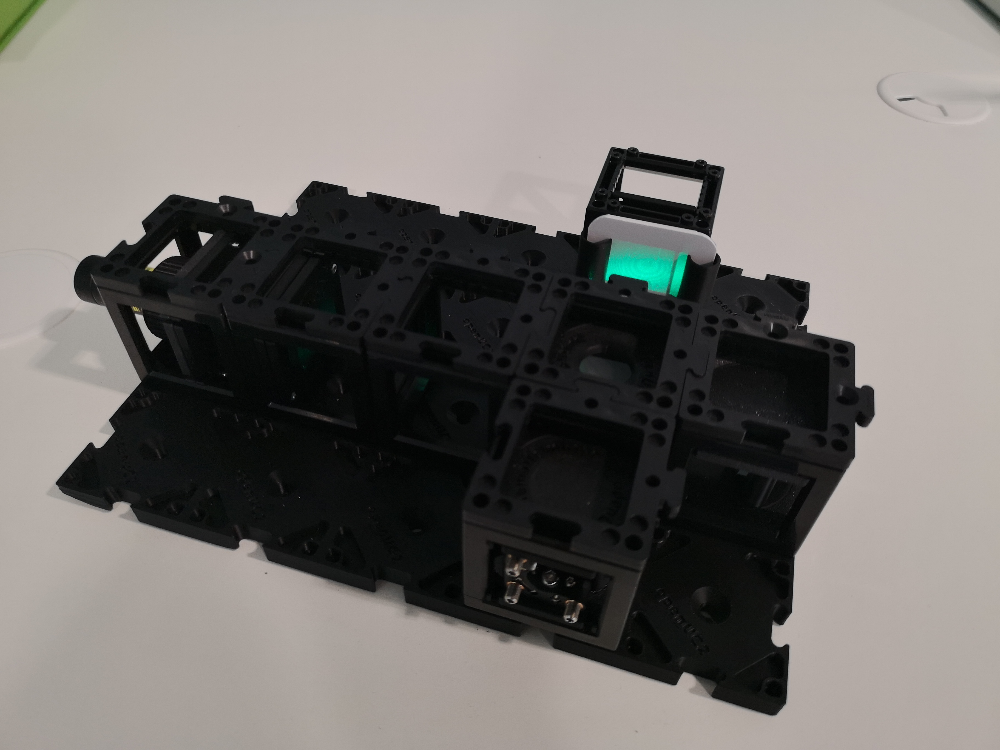
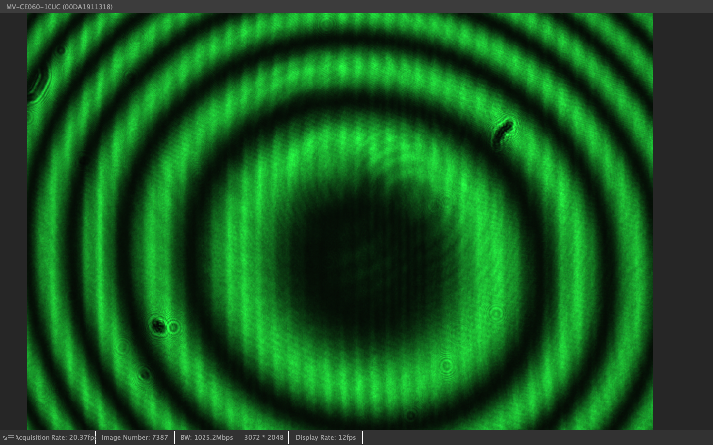

# Tutorial: Building a Michelson Interferometer

In this workshop, we will construct a Michelson Interferometer using the UC2 modular microscope toolbox. The Michelson Interferometer is a device that measures the interference properties of light and has been fundamental in advancing our understanding of the nature of light and space-time. We will treat light as a wave with very high frequency and use it to perform fascinating experiments that demonstrate wave optics principles.

### Materials Needed

**Optical Components:**

1. Green Laser Pointer (532 nm, minimum coherence length >10 cm)
2. Collimating lens (f = 100 mm) for beam conditioning
3. 50:50 Beam splitter cube with anti-reflection coating
4. Three kinematic mirrors with precision adjustment screws
5. Pinhole aperture (10-50 μm diameter) for spatial filtering
6. Neutral density filters (optional, for power adjustment)

**Detection Equipment: (optional)**

7. HIKrobot Camera (MV-CE060-10UC) with USB cable for quantitative measurements
8. Screen for visual alignment and pattern observation
9. Computer with MVS camera software installed

**Mechanical Components:**

10. UC2 Modular Microscope Toolbox including:
    - 8+ optical cubes with threaded inserts
    - Base plates for rigid mounting
    - Puzzle pieces for component attachment
11. Precision screwdriver set (1.5mm hex key) for alignment
12. Optical table or stable surface (vibration isolation recommended)

**TODO**: Specify exact part numbers and suppliers for all optical components, add vibration isolation requirements for optimal performance

### Diagram

*Black and white box diagram showing the Michelson Interferometer layout with components labeled for easier understanding*

### Theory of Operation

A Michelson Interferometer splits a laser beam into two equal parts using a beam splitter. The two beams are then reflected by mirrors and recombined to interfere with each other. When the paths of the two beams are equal, they constructively interfere, resulting in a bright output. However, if one path is shifted by 1/4 of the wavelength, the beams destructively interfere, resulting in a dark output.

The Michelson Interferometer operates as a two-beam interference device where coherent light is divided into reference and sample arms. The beam splitter acts as both a divider and combiner, sending half the light to each arm and then recombining the reflected beams. The interference pattern depends on the optical path difference between the two arms, making it extremely sensitive to small distance changes.

In ray optics, light is represented as a bundle of rays (arrows), which entails a simplification pf the physical properties of light. The arrow indicates the direction of the beam direction/light. The beam splitter divides the light in to two different directions in t terms of magnitude. Here i is important how the beam splitter is built into the cube.

if we extend the beam splitter by to mirrors the split light is reflected back to them. the consequence that the two parts of the light unite again and form a new wave. This is called Interference.

----

### Theoretical Background

**Interference Principles**

Interference is a phenomenon that occurs when two or more waves overlap in space and combine their amplitudes. When waves are in-phase (their crests and troughs align), they constructively interfere, resulting in a larger amplitude. When they are out of phase (their crests and troughs are misaligned), they destructively interfere, resulting in a smaller or zero amplitude. Interference is a fundamental concept in wave physics and plays a crucial role in understanding the behavior of light.

**Wave Superposition and Path Difference**

The fundamental principle underlying interferometry is the superposition of electromagnetic waves. When two coherent light beams recombine, the resulting intensity follows:

$$
I = I_1 + I_2 + 2\sqrt{I_1 I_2}\cos(\Delta\varphi)
$$

Where $$\Delta\varphi = \frac{2\pi}{\lambda}\Delta L$$ is the phase difference corresponding to path difference $$\Delta L$$.

**Sensitivity and Measurement Principles**

The key principle behind the Michelson Interferometer is wave superposition. When two coherent light waves with the same frequency but different phases combine, the resulting intensity depends on their phase relationship:
- Constructive interference (bright fringes): Path difference $$= n\lambda$$ (where n is an integer)
- Destructive interference (dark fringes): Path difference $$= (n + 1/2)\lambda$$

**Coherence Requirements**

For stable interference patterns, the light source must exhibit both spatial and temporal coherence:
- **Temporal coherence**: The wave trains must maintain phase relationships over time scales relevant to the path difference
- **Spatial coherence**: The wavefronts must be sufficiently uniform across the beam cross-section
- **Coherence length**: Lc = λ²/Δλ, where Δλ is the spectral width of the source

---

### Historical Context and Significance

The Michelson Interferometer was invented by Albert Michelson in 1881 and played a crucial role in:
- **Michelson-Morley experiment (1887)**: Disproved the existence of luminiferous aether, paving the way for Einstein's special relativity
- **Precision measurement of the speed of light**: Earning Michelson the 1907 Nobel Prize in Physics
- **Definition of the meter**: Originally defined in terms of wavelengths of krypton-86 radiation using interferometric measurements

**Modern Applications**

The Michelson Interferometer remains an essential tool in modern optics and has found applications in diverse fields:
- **LIGO (Laser Interferometer Gravitational-Wave Observatory)**: Uses kilometer-scale Michelson interferometers to detect gravitational waves
- **Precision metrology**: Measuring distances with nanometer accuracy
- **Spectroscopy**: Fourier Transform Infrared (FTIR) spectroscopy
- **Surface profiling**: Measuring surface roughness and topography
- **Optical coherence tomography (OCT)**: Medical imaging applications

---
## Assembly Tutorial: Michelson Interferometer

*This is the content of the Quantum Box*

*Take out the necessary components for the interferometer*

*Start with the laser and place it on the plate at this very location (don't turn it on yet)*

*We will expand the beam with the lens by focussing the beam and then letting it converge towards the beamsplitter. (actually the orientation in the image is wrong by 90° :D)*

*Ensure the kinematic beamsplitter is oriented such that it's in the 0/90° position*

*Place the static and kinematic beamsplitters next to the cube. this is already forming the interferomter*

*Add the screen*

*Turn on the laser and align the screws of the kinamtic mirrors such that the two beams are exactly on top of each other* **extended tutorial below**

*Once you are very close to the interfernce pattern, you will start seeing the fringes and then rings*

---
### Extended Tutorial: Aligning the Michelson Interferometer

#### 1: Align and Observe the Interference

After the complete Assembly, remove the lens and turn the laser on. You will now see two beam spots, one from each mirror. Adjust the movable mirror angles with the screwdriver so that the two beamspots overlap as much as possible.

#### 2. Observe the Interference Pattern

Reinsert the lens. You will see two extended beams. Adjust the reference mirror screws to overlap the beams perfectly. You will see the interference pattern emerging. Then try to center the pattern on the screen. Turn the laser off.
For problems look at the **troubleshooting guide** on the end of this page.

---
### Optional Tutorial: Camera setup

#### 1. Set up the Camera

remove the screen and place the camera behind the beam splitter and fix it with the base plates. Connect it to the computer and open the MV Software. To check the MVS tutorial click [here](https://docs.openuc2.com/docs/Electronics/HIKCamera/SoftwareTutorial).

*Picture of older setup with camera*

#### 2 Adjust the Camera Exposure

Adjust the exposure time of the camera. You should see a fringe pattern. Try to adjust the reference mirror screws finely to bring the center of the interference pattern to the center of the camera.

---
---

## Experiment 1: Basic Interference Pattern Observation

### 1.1: Observe Static Interference

Turn on the laser and observe the interference pattern on the screen or camera. Document the circular fringe pattern (Newton's rings) that results from the interference of two slightly divergent beams.

*Picture of older setup with camera - Fully assembled UC2 interferometer with green laser diode, camera, beamsplitter, kinematic mirror and translatable mirror*

### 1.2: Record the Pattern

Using the camera, capture images of the interference pattern. Note the bright and dark fringes and their spacing.

*Picture of older setup with camera - Newton rings interference pattern showing circular fringes from two overlapping spherical wavefronts*

## Experiment 2: Path Difference Measurement (for camera-setup only)

### 2.1: Translate the Mirror

Carefully move the variable mirror using the fine adjustment screws. Observe how the fringe pattern changes as you alter the path difference.

### 2.2: Count Fringe Shifts

Count the number of bright fringes that pass a fixed point as you move the mirror. Each fringe corresponds to a path difference change of one wavelength (λ ≈ 532 nm for green light).

*Picture of older setup with camera - Quantitative measurement using ESP32 camera to track beam motion and measure distances*

### 2.3: Calculate Distance Moved

Use the relationship:
$$
\text{Distance moved} = \frac{\text{Number of fringes} \times \lambda}{2}
$$
The factor of 2 accounts for the double pass through the moving arm.

## Experiment 3: Coherence Length Measurement (for camera-setup only)

### 3.1: Find Visibility Limits

Gradually increase the path difference between the two arms until the fringe visibility decreases significantly.

### 3.2: Measure Coherence Length

The coherence length is approximately equal to the path difference at which the fringe visibility drops to 1/e of its maximum value.

### 3.3: Calculate Spectral Width

Use the relationship:
$$
\text{Coherence length} = \frac{\lambda^2}{\Delta\lambda}
$$
to estimate the spectral width of your laser.

---

## Troubleshooting Guide

### Common Problems and Solutions

#### Problem: No Interference Pattern Visible
**Possible Causes:**
- Misaligned beam paths
- Poor beam overlap
- Insufficient temporal or spatial coherence
- Laser power too low

**Solutions:**
1. Check beam alignment using screen at various positions
2. Ensure both beams are hitting the detector
3. Adjust mirror orientations for optimal overlap
4. Verify laser stability and coherence specifications

#### Problem: Low Fringe Visibility
**Possible Causes:**
- Unequal beam intensities
- Poor spatial beam quality
- Excessive path difference
- Vibrations affecting setup

**Solutions:**
1. Balance beam intensities using neutral density filters
2. Improve spatial filtering with smaller pinhole
3. Reduce path difference between arms
4. Isolate setup from vibrations

#### Problem: Unstable Fringe Pattern
**Possible Causes:**
- Environmental vibrations
- Air currents affecting beam paths
- Temperature fluctuations
- Loose optical mounts

**Solutions:**
1. Use vibration isolation table or heavy, stable surface
2. Enclose optical path to minimize air currents
3. Allow thermal equilibration time
4. Secure all mechanical connections

#### Problem: Difficulty in Mirror Alignment
**Possible Causes:**
- Incorrect mirror mount orientation
- Excessive adjustment sensitivity
- Poor initial beam direction

**Solutions:**
1. Start with coarse alignment using visible beam spots
2. Use systematic adjustment procedure (one axis at a time)
3. Make small, incremental adjustments
4. Use alignment aids like irises or beam viewers

**TODO**: Add specific troubleshooting procedures for electronic components and automated systems

---
---

## Understanding Check

1. **Conceptual Understanding:**
   - Explain why the Michelson Interferometer is more sensitive to path changes than direct distance measurement
   - Describe the relationship between coherence length and spectral width
   - How does the visibility of fringes relate to the degree of coherence?

2. **Practical Applications:**
   - Why is spatial filtering important in interferometry?
   - How would you modify the setup to measure very small displacements?
   - What are the advantages and disadvantages compared to the Mach-Zehnder configuration?

3. **Quantitative Analysis:**
   - Calculate the theoretical sensitivity (minimum detectable path change)
   - Estimate the maximum useful path difference for your laser
   - Determine the required mechanical stability for nanometer-scale measurements

### Extension Projects

1. **Advanced Measurements:**
   - Implement computer-controlled phase stepping
   - Measure refractive index of transparent materials
   - Study temperature-dependent optical path changes

2. **Modern Applications:**
   - Research LIGO gravitational wave detection principles
   - Investigate optical coherence tomography techniques
   - Explore applications in precision manufacturing
