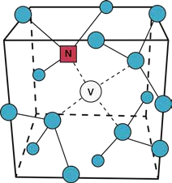
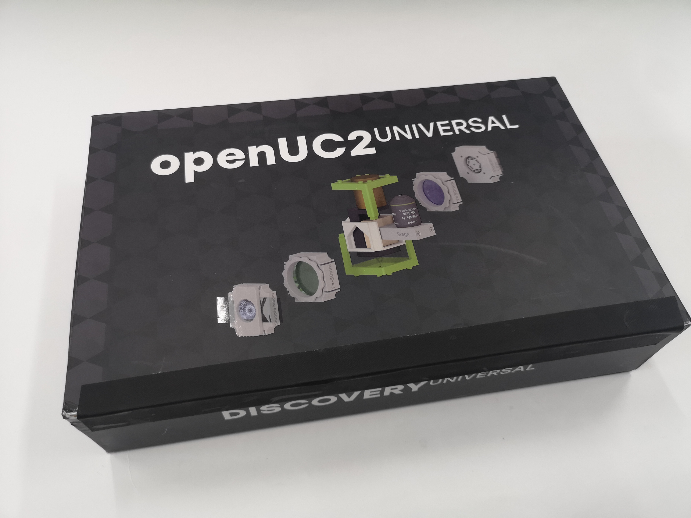
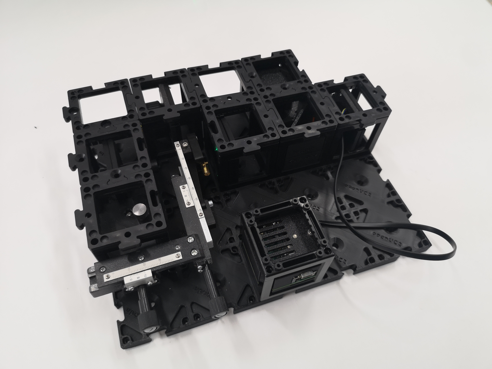
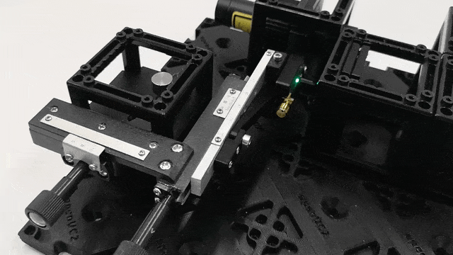
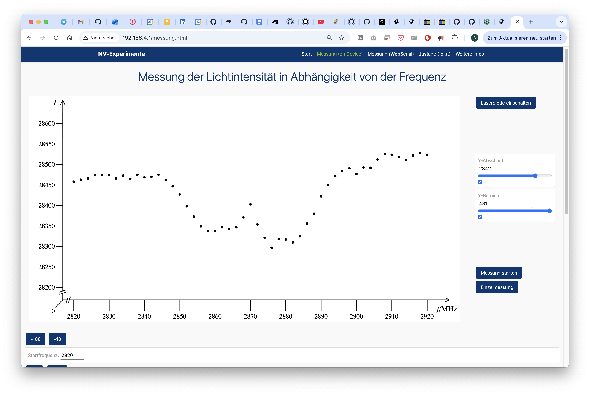

# Anleitung: Aufbau eines ODMR‑Setups (Optisch Detektierte Magnetresonanz)

In diesem Workshop bauen wir ein ODMR‑System (Optisch Detektierte Magnetresonanz) mit dem UC2‑modularen Mikroskop‑Werkzeugkasten und NV‑Diamanten auf. ODMR ist eine Quantensensorik-Technik, mit der wir Magnetfelder messen, indem wir Änderungen der Fluoreszenz von Quantensystemen beobachten. Dieses Experiment führt Studierende in Quantenmechanik, Spin‑Physik und moderne Sensortechniken bei Raumtemperatur ein.

*3ODMR‑Setup*

**Was wir messen und lernen**

Durch dieses Experiment lernen die Schüler:
* Wie Quantensysteme optisch manipuliert und gemessen werden können
* Die Beziehung zwischen Magnetfeldern und Quantenspinzuständen  
* Wie Mikrowellenstrahlung Elektronenübergänge beeinflussen kann
* Die Prinzipien hinter der konfokalen Mikroskopie und Fluoreszenzdetektion
* Reale Anwendungen der Quantensensorik

**Technische Details des ODMR-Verfahrens**

Das Ziel des ODMR-Aufbaus ist es, zu verstehen, wie wir Magnetfelder optisch messen können, indem wir die Fluoreszenz im Resonanzfall reduzieren, wenn Mikrowellen mit einem Diamanten interagieren. Dieser Effekt ist interessant, um Magnetfelder indirekt durch optische Auslesung präzise zu messen.

Was wir konkret messen, ist die Resonanz der Defektstelle in einem Diamanten mit NV-Zentren. Wir haben kleine Diamanten mit einem Durchmesser von etwa 100 Nanometern und mehreren NV-Stellen auf einer Leiterplatte, die als Antenne dient. Diese regen wir mit Laserlicht einer bestimmten Wellenlänge an. Auch ohne angelegte Mikrowellen können wir die Fluoreszenz des Diamanten messen. Das bedeutet, dass wir den Diamanten mit grünem Licht (532 Nanometer) anregen und die Emissionen im roten Spektrum (über 600 Nanometer) messen können.

Die Kernidee besteht darin, dass wir bei Anwendung von Mikrowellen den Zeeman-Effekt beobachten können, indem wir den Spin-Flip in negative und positive Komponenten aufspalten, wobei sich die Verringerung der Fluoreszenz symmetrisch zu den jeweiligen negativen und positiven Teilen verschiebt.

## Diagramm

*Schema des ODMR‑Aufbaus mit beschrifteten Komponenten*

## Benötigte Materialien

1. Grundplatte zur Montage
2. Grüner Laserdiode (532 nm) zur NV‑Anregung
3. Zwei 45°‑Spiegel zur Strahllenkung
4. Strahlteiler mit Filter für Anregung und Fluoreszenz
5. Konvexlinse zum Fokussieren des Lasers
6. Lichtsensor (Photodiode) zur Fluoreszenzdetektion
7. Elektronik‑Steuerbox mit Mikrowellengenerator
8. XY‑Stage mit NV‑Diamantprobe
9. Schirm für erste Justage
10. Farbfilter (rot) zur Fluoreszenzisolation
11. Magnet zur Erzeugung des externen Magnetfelds
12. Mikrowellenantenne zur Spinmanipulation

*Alle Komponenten im Kit*

## Funktionsprinzip

Das ODMR‑Setup funktioniert, indem Laserlicht verwendet wird, um Stickstoff‑Vakanzen (NV‑Zentren) in Diamantkristallen anzuregen und deren Fluoreszenz zu detektieren. Wenn Mikrowellen bei der Resonanzfrequenz (ca. 2,87 GHz) angelegt werden, bewirken sie Übergänge zwischen quantenmechanischen Spin‑Zuständen, was zu einer messbaren Abnahme der Fluoreszenzintensität führt. Dieser Effekt bildet die Grundlage für hochsensible Magnetfeldmessungen.

Das System arbeitet als Quantenmagnetometer, indem es die Fluoreszenz bei variierenden Mikrowellenfrequenzen überwacht. In der Resonanz werden weniger Photonen emittiert, da Spin‑Übergänge stattfinden, was charakteristische Dips im Fluoreszenzsignal erzeugt. Externe Magnetfelder verschieben diese Resonanzfrequenzen, was eine präzise Bestimmung der Magnetfeldstärke ermöglicht.

### Theoretischer Hintergrund

**Quanten‑Spin und NV‑Zentren**
Stickstoff‑Vakanzen (NV‑Zentren) sind Punktdefekte in Diamant, bestehend aus einem Stickstoffatom neben einer leeren Gitterstelle. Diese Quantensysteme weisen einzigartige Eigenschaften auf, die sie ideal für Sensorik machen:

**Elektronische Struktur und Spin‑Zustände**

* NV‑Zentren besitzen einen Spin‑1‑Grundzustand mit drei Projektionen: mₛ = –1, 0, +1
* Der mₛ = 0‑Zustand ist um ca. 2,87 GHz von den mₛ = ±1‑Zuständen getrennt
* Anregungs‑ und Relaxationszyklen sind spinabhängig

**Prinzip der Optisch Detektierten Magnetresonanz**

1. **Optisches Pumpen**: Grünes Laserlicht (532 nm) initialisiert NV‑Zentren bevorzugt in den mₛ = 0‑Zustand
2. **Mikrowellenmanipulation**: Resonante Mikrowellen treiben Übergänge zwischen den Spin‑Zuständen
3. **Optische Auslese**: Die Intensität der roten Fluoreszenz hängt von der Spin‑Zustandsverteilung ab
4. **Magnetempfindlichkeit**: Externe Magnetfelder verschieben Resonanzfrequenzen über den Zeeman‑Effekt

*NV‑Zentrum im Diamantgitter*

**Zeeman‑Effekt und Magnetfeldmessung**
Bei Anlegen eines externen Magnetfelds spalten sich die Energie­niveaus gemäß:
E = D + γ mₛ B\_z (wobei D ≈ 2,87 GHz, γ das gyromagnetische Verhältnis und B\_z das Magnetfeld ist)
Diese Aufspaltung erzeugt zwei Resonanzpeaks, getrennt um 2γB\_z. Die Frequenzdifferenz liefert direkt die Magnetfeldstärke.

**Quantenkohärenz und Empfindlichkeit**
NV‑Zentren behalten Quantenkohärenz bei Raumtemperatur, was ermöglicht:

* **Einzelspin‑Empfindlichkeit**: Optische Adressierung einzelner NV‑Zentren
* **Lange Kohärenzzeiten**: Zustände bleiben Mikrosekunden stabil
* **Hohe räumliche Auflösung**: Magnetfeldkartierung im Nanobereich
* **Breiter Temperaturbereich**: Betrieb von Kryo‑ bis erhöhten Temperaturen

**Konfokales Mikroskopie‑Setup**
Die Optik folgt konfokalen Prinzipien:

* **Anregungsweg**: Laserstrahl wird mit einer Konvexlinse auf NV‑Zentren fokussiert
* **Detektionsweg**: Fluoreszenz wird durch die gleiche Linse gesammelt (konfokale Anordnung)
* **Spektrale Trennung**: Dichroitischer Strahlteiler trennt Anregungs‑ und Fluoreszenzwellenlängen
* **Optische Detektion**: Ein Fokus‑Objektiv leitet das Licht auf eine Photodiode (Adafruit) zur Signal­auslese

**Moderne Anwendungen und Bedeutung**
ODMR mit NV‑Zentren ist eine führende Quantensensorik‑Technologie mit Anwendungen in:

* **Biomedizinischer Bildgebung**: Magnetfeldmapping in lebenden Zellen und Geweben
* **Materialwissenschaft**: Untersuchung magnetischer Domänen und Spin‑Transport
* **Fundamentaler Physik**: Tests der Quantenmechanik und Messung physikalischer Konstanten
* **Quanteninformation**: Bausteine für Quantencomputer und -netzwerke

### Diamanten sind des Physikers bester Freund

NV steht für Nitrogen‑Vacancy, d. h. ein Diamant mit einem spezifischen „Verunreinigungs“-Defekt, oft sichtbar als rosa Färbung.

**Wie entstehen NV‑Diamanten?**
Diamanten bestehen aus einem Kohlenstoffgitter. In einem NV‑Diamanten fehlt ein Kohlenstoffatom und wird durch ein Stickstoffatom ersetzt. Dabei entsteht eine benachbarte Vakanz – das NV‑Zentrum.

**Was macht NV‑Diamanten besonders?**

* Spin‑Zustände sind mit Laserlicht, Magnetfeldern und Mikrowellen manipulierbar und auslesbar
* NV‑Zentren sind stabile Quantensysteme bei Raumtemperatur, geeignet für Quantencomputer
* Außerordentliche Empfindlichkeit gegenüber Magnetfeldern, elektrischen Feldern und Temperatur
* Einzelne NV‑Zentren sind optisch adressierbar und steuerbar

# Anleitung: ODMR‑Aufbau

### SICHERHEITSHINWEISE

**⚠️ Achtung!**

**Lasersicherheit:**

* Laser nur einschalten, wenn er fest montiert ist.
* Vor jedem Umbau ausschalten.
* Strahlrichtung prüfen – immer parallel zur Tischoberfläche.
* Reflektierende Schmuckstücke entfernen.
* Reflektierende Objekte vom Tisch entfernen.
* NICHT IN DEN LASER BLICKEN! AUGENSCHÄDEN!
* NIEMALS LASER UNBEABSICHTIGT EINSCHALTEN.
* STRAHL MUSS VON SICH WEG FÜHREN – IMMER!

**Magnetsicherheit:**

* Personen mit Implantaten informieren.
* Elektronische Geräte (Handys, Karten) fernhalten.
* Lose Magnete nicht verschlucken – sofort Lehrperson informieren.

## Schritt 1: Zusammenbau der optischen Komponenten

## 1.1 Einrichtung des ODMR-Aufbaus mit Bildern
Bauen Sie den Aufbau wie auf den Fotos gezeigt auf. Dadurch entsteht eine für ODMR-Messungen optimierte konfokale Mikroskopiekonfiguration. Dies ist die Grundkonfiguration, bei der der Laser auf den Diamanten fokussiert wird und das Fluoreszenzsignal dann zum Detektor zurückkehrt.

Dies ist eine empfohlene Schritt-für-Schritt-Anleitung zum Aufbau des ODMR-Setups. Sie können es nach Belieben gestalten. Elemente wie der XY-Tisch und die Grundplatte können in Ihrer Version verbessert werden. Dies hat keinen Einfluss auf die Funktion oder das Ergebnis.

*Die Box in ihrer vollständigen Form*

*Öffnen Sie die Box*

*Alle Komponenten für Experimente wie Interferometer, Polarisation usw.*

*Beginnen wir damit, den 532-nm-Laser so auf das Gitter zu setzen, dass der Laser nach rechts zeigt. Schalten Sie ihn noch nicht ein.*

*Fügen Sie die 45°-Kinematikspiegelhalterung hinzu – falls sie 90° beträgt, können Sie sie die Halterung öffnen und ihre Ausrichtung ändern.*

*Fügen Sie die dichroitische Spiegelhalterung hinzu, damit der reflektierende grünliche Filter das Licht nach links reflektiert.*

*Sie können die Einrichtung testen, indem Sie den Laser einschalten – SCHAUEN SIE NICHT IN DEN LASER*

*Fügen Sie die Linse f=44.5 mm hinzu und beobachten Sie, wo sie das Licht fokussiert*

*Sie können den Fokus mit der weißen Karte verfolgen*

*Fügen Sie die XYZ-Stage mit dem daran befestigten Diamanten hinzu. Stellen Sie ihn so ein, dass der schwarze Punkt, auch bekannt als Diamant, ungefähr im Fokus des Lasers platziert ist. Auf dem Bild ist der Magnet bereits hinter den Diamanten platziert. Sie können dies tun, müssen ihn aber später wieder entfernen, sodass Sie diesen Schritt vorerst auch überspringen können.*

*Fügen Sie die Fotodiode hinter dem dichroitischen Spiegel ein. Achten Sie darauf, dass die Linse zum rote Emissionsfilter zeigt, der das Anregungslicht blockiert.*

*Verbinden Sie das I2C-Kabel (Stemma) mit der ODMR-Platine, die die zur Anregung des Diamanten erforderliche Hochfrequenzschwingung erzeugt.*

*Fügen Sie eine Puzzle-Schicht hinzu, um alles zu fixieren*

*Passen Sie die Diamanten in Bezug auf den Laserfokus in X/Y/Z an, um sicherzustellen, dass wir den Diamanten im Fokus des grünen Laserlichts treffen. Dies erfordert einige Tests und Übung. Passen Sie die XYZ-Bühne an, um den Diamanten im Fokus der Linse zu platzieren. Der Diamant sollte durch den Rotfilter betrachtet hell leuchten, was auf eine effiziente Anregung der NV-Zentren hinweist. Der Fleck auf dem Diamanten sollte möglichst klein sein. Dies wird erreicht, wenn der Abstand zwischen der Linse und der Diamant-Leiterplatte der Brennweite der Linse (44.5 mm) entspricht.*

*Identifizieren Sie das Fluoreszenzsignal mit dem roten Zusatzfilter*

*Stellen Sie den Diamanten in Y ein (dieser Mechanismus kann sich in Ihrer Version geändert haben)*

*Nahaufnahme: Identifizieren Sie das Fluoreszenzsignal mit dem roten Zusatzfilter*

*Bewegen Sie den Diamanten und beobachten Sie das Fluoreszenzsignal, bis die Helligkeit maximiert ist, während Sie den Diamanten in X/Y/Z bewegen*

## Schritt 2: Elektronik

### 2.1: Elektronik anschließen

*Elektronik‑Setup: Photodiode an ESP32S3 via I2C, Antenne an Steuerbox via SMA*

* Laserdiode mit eigenem Akku, Schalter an Rückseite verwenden
* Photodiode an I2C‑Port der ODMR-Platine anschließen
* Mikrowellenantenne an ODMR-Platine anschließen
* XY‑Stage‑Motoren verbinden (falls verfügbar)
* ESP32 per USB‑C an PC anschließen (nicht im Bild abgebildet)

### 2.2: ESP32‑Firmware flashen

1. Verbinden Sie den ESP32 auf der ODMR-Platine über das USB-C-Kabel mit Ihrem Computer.

2. Stellen Sie sicher, dass Ihr ESP32-Board über die neueste Firmware verfügt. Sie können die Firmware über die offizielle [openUC2-Website](https://youseetoo.github.io/) im **Chrome**-Browser herunterladen und flashen, indem Sie Ihre Version auswählen (höchstwahrscheinlich **ESP32C3 ODMR Quantum Mini Labs)**) und dann auf die Schaltfläche „Verbinden“ klicken.

  Den Quellcode finden Sie [hier](https://github.com/openUC2/TechnicalDocs-openUC2-QBox/tree/main/Production_Files/Software/ODMR_Server).

3. In Ihrem Chrome-Browser werden Sie in einem Dialogfeld aufgefordert, den COM-Port für Ihren ESP32 auszuwählen, der als „CP2102 USB to UART Bridge Controller“ oder ähnlich angezeigt werden sollte. Sobald die Verbindung hergestellt ist, können Sie die neueste Firmware installieren, indem Sie einfach auf die Schaltfläche „Installieren“ klicken.

4. Warten Sie, bis die Firmware erfolgreich geflasht wurde.

  <iframe
    style={{position: 'absolute', top: 0, left: 0, width: '100%', height: '100%'}}
    src="https://www.youtube.com/embed/rGLcOb0IWbg?si=rmYORgaFhbwyFtMG"
    title="YouTube video player"
    frameBorder="0"
    allow="accelerometer; autoplay; clipboard-write; encrypted-media; gyroscope; picture-in-picture"
    allowFullScreen
  />

### 2.3: Web‑Interface verbinden

Nach dem Flashen der Firmware ziehen Sie den Stecker des ESP ab und stecken Sie ihn wieder ein. Rufen Sie dann https://youseetoo.github.io/odmr auf und verbinden Sie sich über Web Serial mit dem Board (auf der Website gehen Sie zu „Messung (Webserial)”).

Alternativ können Sie warten, bis das Gerät sein eigenes WLAN-Netzwerk erstellt.
Klicken Sie auf das WLAN-/Netzwerksymbol in der unteren rechten Ecke Ihres Bildschirms (wo Sie normalerweise Ihr WLAN auswählen).
- Nach einigen Sekunden sollte ein neues Netzwerk mit einem Namen wie „ODMR-XXXX“ in der Liste erscheinen.
- Wählen Sie dieses Netzwerk aus, um eine Verbindung zum Gerät herzustellen.
- Sobald die Verbindung hergestellt ist, öffnen Sie Ihren Browser und gehen Sie zu http://192.168.4.1
- Auf der Website gehen Sie zu „Messung(Device)“.

### 2.4: Test im Web‑Interface
1. Steuern Sie die verschiedenen Komponenten über die Webschnittstelle:

   - Überwachen Sie die Signalpegel der Fotodioden.
   - Testen Sie die Mikrowellenleistung (Frequenzdurchläufe).

Wenn Sie eine Erfassung starten, sollten Sie sehen, wie die Frequenz schrittweise die Minimal-/Maximalwerte durchläuft. Das Diagramm zeigt die Intensität des roten Lichts als Funktion der Frequenz. Die Minima zeigen Spin-Flips an.

*ODMR Electronik: Fluoreszentantwort mit Spin-Flips*

## Schritt 3: Optimieren Sie die ODMR-Einrichtung
Nachdem die Elektronik nun funktioniert, können Sie Ihre Einrichtung für ein maximales Fluoreszenzsignal und ein optimales Signal-Rausch-Verhältnis feinabstimmen, indem Sie Folgendes anpassen:
- Laserfokus auf den Diamanten
- Sammeleffizienz der Fluoreszenz
- Mikrowellenkopplung an die NV-Zentren

Stellen Sie sicher, dass der Laserstrahl auf die optische Achse des „konfokalen” Mikroskops ausgerichtet ist. Der Laser sollte auf die Diamantoberfläche fokussiert sein und einen kleinen, hellen Punkt erzeugen. **Verwenden Sie den im folgenden Video beschriebenen Smartphone-Trick.**

  <iframe
    style={{position: 'absolute', top: 0, left: 0, width: '100%', height: '100%'}}
    src="https://www.youtube.com/embed/8tJhlHfuvL0?si=ohXf12IAvCqg6zOh"
    title="YouTube video player"
    frameBorder="0"
    allow="accelerometer; autoplay; clipboard-write; encrypted-media; gyroscope; picture-in-picture"
    allowFullScreen
  />

---
## Experiment 1: Grundlegende ODMR-Signalerfassung

### 1.1: Festlegen der Basis-Fluoreszenz

Schalten Sie den Laser ein und messen Sie das Basis-Fluoreszenzsignal der NV-Zentren ohne Mikrowellenanregung. Zeichnen Sie den Signalpegel und die Stabilität auf.

### 1.2: Anwenden von Mikrowellenstrahlung

Schalten Sie die Mikrowellenquelle ein und durchlaufen Sie Frequenzen um 2,87 GHz, während Sie die Fluoreszenzintensität überwachen.

### 1.3: ODMR-Dip beobachten

Achten Sie auf den charakteristischen Dip in der Fluoreszenz bei der Resonanzfrequenz. Dieser weist auf eine erfolgreiche Spinmanipulation der NV-Zentren hin.

---

## Experiment 2: Magnetfeldmessung

### 2.1: Nullfeldmessung

Zeichnen Sie das ODMR-Spektrum ohne den externen Magneten auf, um die Nullfeldaufspaltung zu ermitteln.

### 2.2: Anlegen eines externen Magnetfelds

Installieren Sie den Magnetwürfel in der Anordnung. Der Magnet erzeugt ein externes Magnetfeld, das die ODMR-Resonanzlinien aufspaltet.  

### 2.3: Analyse der Zeeman-Aufspaltung

Beobachten Sie etwaige Intensitätsänderungen, wenn Sie die Position des Magneten verändern. Dies demonstriert die Magnetfeldabhängigkeit der NV-Zentrum-Fluoreszenz.

 Je höher das b-Feld, desto besser ist die Aufspaltung sichtbar. Der folgende Screenshot zeigt das System ohne Magnet – es scheint jedoch bereits eine gewisse Aufspaltung zu geben. Dies kann auf die „schlechte” Qualität (d. h. Ausrichtung/Spannung im Inneren) des Diamanten zurückzuführen sein. Wir verstehen diesen Effekt noch nicht vollständig.

 Positionieren Sie den Magneten in verschiedenen Abständen zum Diamanten und zeichnen Sie auf, wie sich das ODMR-Spektrum verändert.

*Bild ohne Magnet*

Sobald Sie den Magneten einfügen, können Sie sehen, dass die beiden Niveaus weiter voneinander entfernt sind:

*Bild mit Magnet*

---

## Experiment 3: Fortgeschrittene ODMR-Techniken

### 3.1: Gepulste ODMR-Messungen (in Kürze als Coherent Control verfügbar)

### 3.2: Räumliche Kartierung (in Kürze verfügbar)

### 3.3: Temperaturabhängigkeit (in Kürze verfügbar)

---

**QuantumMiniLabs‑Projekt**
Ein Open‑Source‑Ökosystem für kostengünstige, modulare Quantenexperimente. Ziel: 100 Bildungsstandorte in Deutschland ausstatten.

QuantumMiniLabs bieten die erste erschwingliche DIY‑Plattform für Experimente mit Quantensystemen der zweiten Generation. NV‑Diamanten ermöglichen stabile Experimente bei Raumtemperatur.
