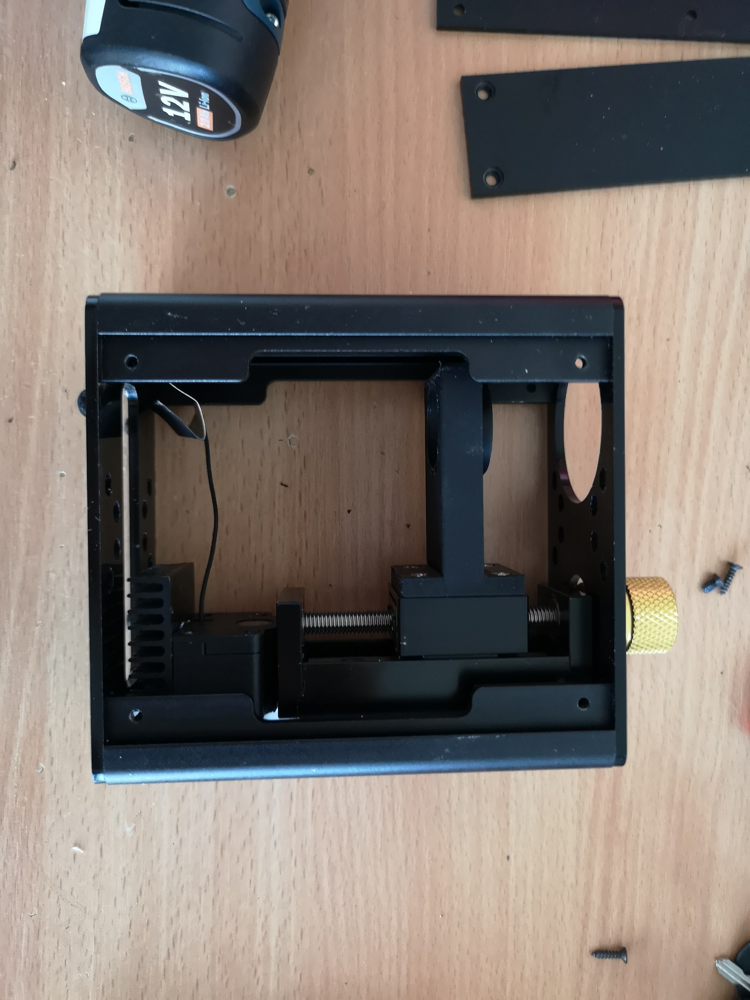
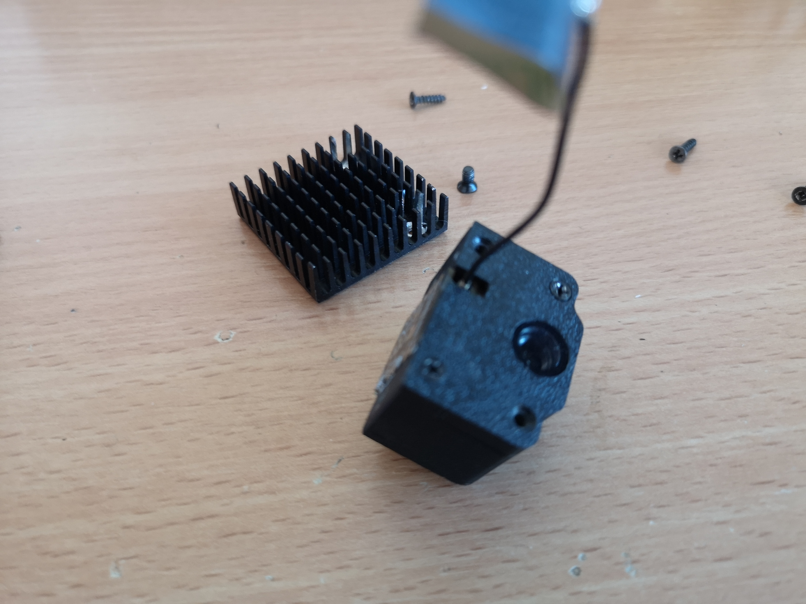
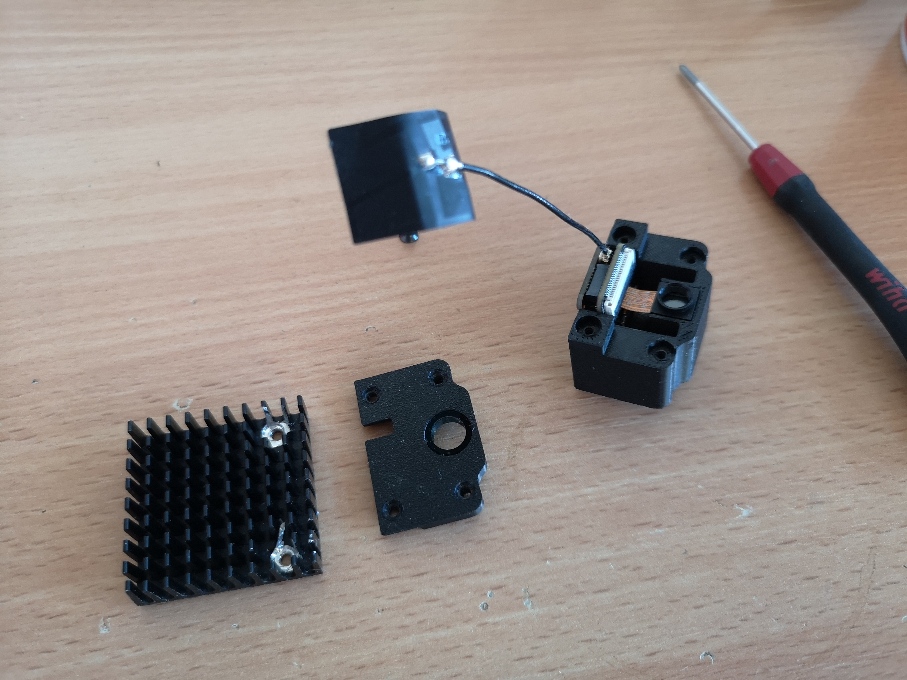
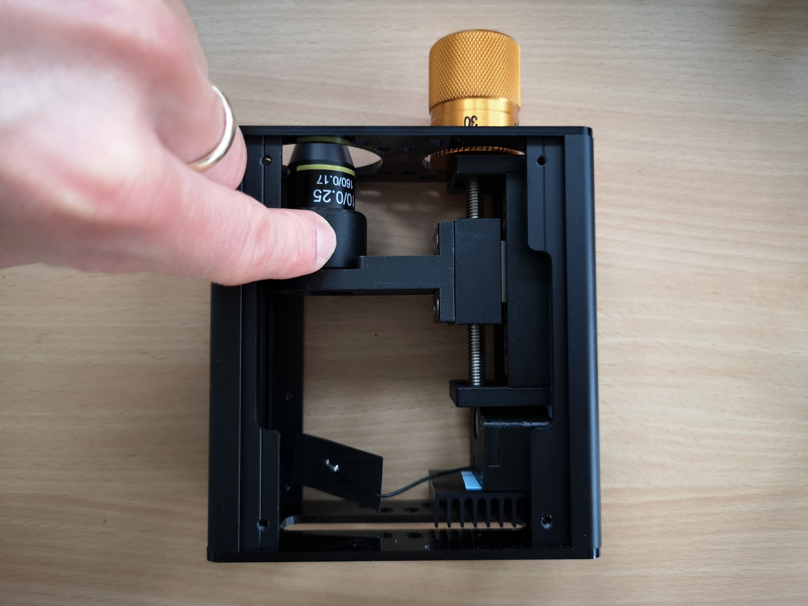
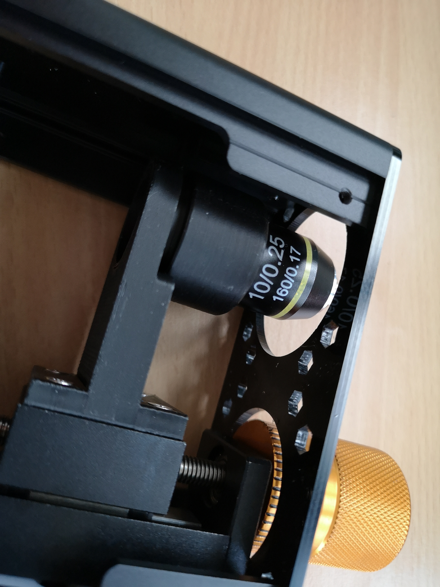
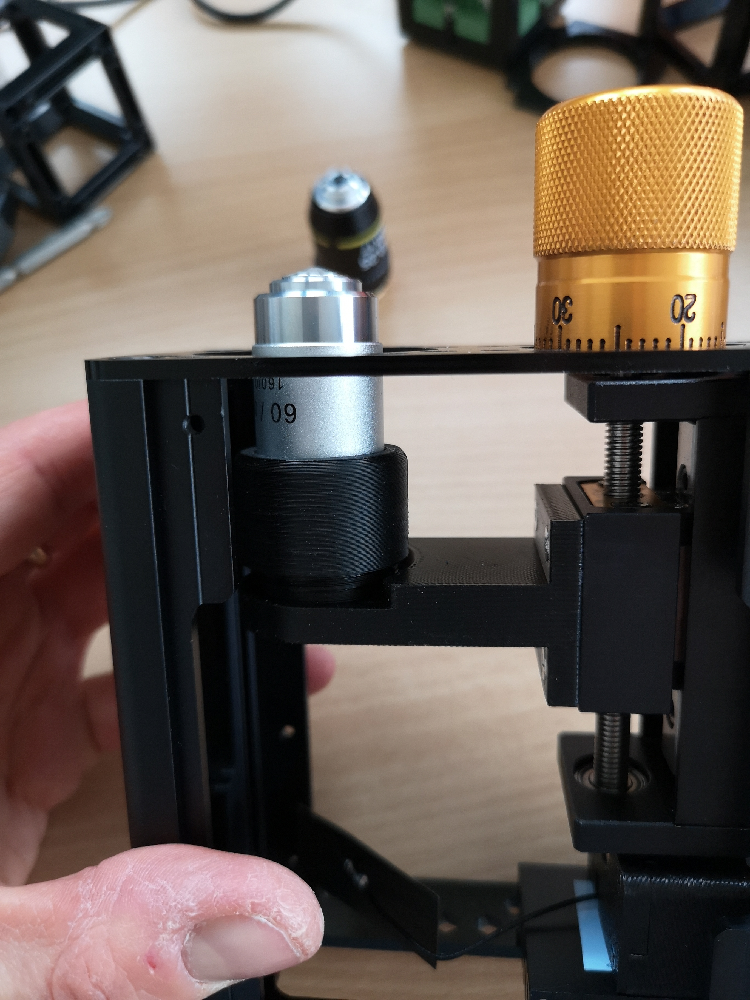
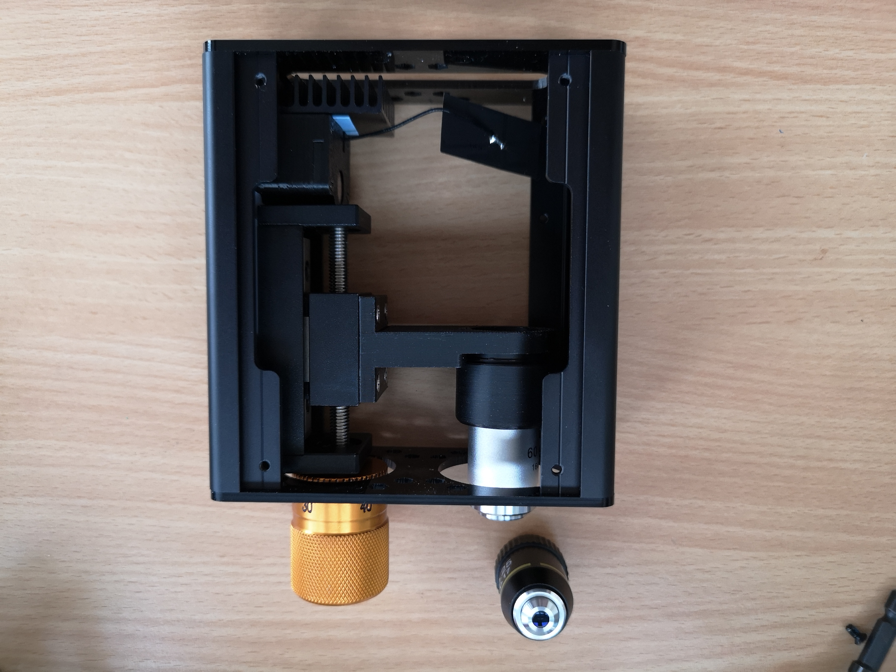

# openUC2 Xiao AI Microscope Troubleshooting )

## Flashing the ESP32S3 in case the bootloader is not responding

Sometimes - with a wrong firmware, one can not simply flash a new firmware. One has to press the boot/reset buttons to bring the ESP32S3 xiao into boot mode. It's a bit unfortunate that there is no workaround to do that via Software. So we would need to access the tiny buttons of the MCU. For this we have to open the device. Don't worry, it's doable and worth it! According to seeed studio, there is no way to determine when the firmware can easily be flashed or needs a manual enter into the bootloader.

:::danger
We found out that you can bypass the reset/boot-button holding sequence in case the firmware has bricked the device by erasing the flash and then uploading a new firmware via our online tool. You can visit the ESP Flash Tool here: https://espressif.github.io/esptool-js/ and follow the following steps:
1. connect the board to your computer via USB
2. select your port
3. select erase flash and hit start

This removes everything from the device's flash. Then proceed to flash your favourite firmware from e.g. from our repo: https://matchboxscope.github.io/firmware/FLASH.html

:::

*Open the device by unscrewing all panels using philips screwdrivers*

*remove the lens (optional)*

*all panels removed*

*unscrew the side where the z-stage remains*

*this is the camera module, remove the z-stage*

*we need to access these two philips screws and remove the camera module from the backplate*

*this is the camera module, remove the cooling body*

*remove the cooling body with these two screws*

*carefully remove the cooling body and access the xia. Now you can flash it according the manual in the [Xiao Tutorial](./04_1_seeedmicroscope.md)

**Ensure the firmware runs, then put everything back together again. If you have questions visit our forum: https://openuc2.discourse.group

## Changing the Objective Lens

The device has a finite corrected microscope lens with an RMS thread. The design of the z-stage offers to change the lens. The mechanism has a little cap that holds the lens in place. This has to be unthreaded. Unfortunatley this is not very easy to accomplish with a closed enclosure. You simply need to remove the side plates and unscrew the cap to free the lens. The images below will help you to do so:

*Remove screws on both sides*

*remove the panels*

*unscrew this little plastic ring*

*fully unscrew it and remove the lens*

*be careful not to touch it*

*add a new lens and tighten the cap by screwing it again*

*almost done: add the panels*

## Improving the Wifi Strengths

According to SeeedStudio, the wifi strength (and hence the stream quality/speed) can be improved by folding the Wifi Antenna like so:

