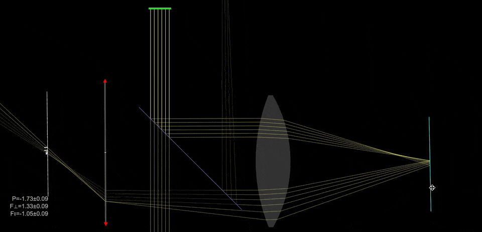
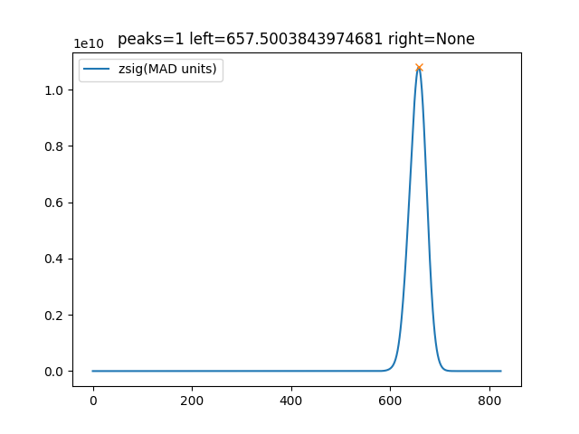

# IR laser focus-lock module

Our microscope platform includes an optional **focus-lock** module that can be added to the FRAME at any time. The goal is to keep the sample in focus automatically during long experiments (e.g. STORM acquisitions, time-lapse imaging, incubator workflows) and to enable fast “return to focus” moves when scanning many XY positions (e.g. well plates).

## Principle of operation

The below simulation from [Ray-Optics](https://phydemo.app/ray-optics/simulator) shows the core idea:

1. **Infrared laser injection**

   * A collimated **infrared (IR) laser beam** is routed into the microscope and aligned into the **back focal plane (BFP)** of the objective.
   * Injecting the beam into the BFP ensures the beam exits the objective at a defined angle and probes the sample plane in a repeatable way.

2. **Reflection at the coverslip**

   * At the sample, a small fraction of the IR light is reflected (typically at the **coverslip/sample interface**).
   * The reflected beam travels back through the objective.

3. **Separation and detection**

   * A dichroic / beamsplitter designed for IR separates the returning beam from the illumination path and directs it onto a **dedicated monochrome camera** (the “focus camera”).

4. **Focus signal from spot motion**

   * As the sample moves along **Z (focus direction)**, the detected spot position shifts on the focus camera (typically along **X**).
   * This provides a continuous measurement that can be used as a **feedback signal**.

## Two operating modes

### 1) Continuous focus lock (feedback mode)

* The system continuously measures the IR spot position and converts it into a focus error signal.
* This is most useful for **long recordings** where drift is expected (thermal drift, incubator drift, mechanical relaxation).

### 2) One-shot focus correction (positioning mode)

* The system measures the current focus offset once and performs a single Z correction.
* Typical use: **multi-position experiments** (well plates / mosaics), where each XY position gets an automatic focus adjustment before imaging.

## Video demonstration

The following video shows the focus-lock in action during a long time-lapse experiment with deliberate temperature changes. The focus-lock keeps the sample in focus despite significant drift.

<iframe width="560" height="315" src="https://www.youtube.com/embed/gEKC-YENQOc?si=RC0tx-a-M1H6VfEU" title="YouTube video player" frameborder="0" allow="accelerometer; autoplay; clipboard-write; encrypted-media; gyroscope; picture-in-picture; web-share" referrerpolicy="strict-origin-when-cross-origin" allowfullscreen></iframe>

## Calibration: spot position → defocus in µm

To convert “spot position” into an actual defocus value (µm), we run a short calibration:

1. The system performs a controlled **Z sweep** over a defined range.
2. For each Z position, the software measures the **spot position** on the focus camera.
3. The result is a mapping curve (ideally close to **linear** over the working range).
4. We fit a curve and accept the calibration only if the fit quality (e.g. **R²**) exceeds a threshold.
5. Once calibrated, the focus-lock can report defocus in **micrometer steps** and apply accurate Z corrections.

## Practical considerations and tuning

A few parameters strongly affect robustness:

* **Camera exposure time**: must be long enough for a clean signal, short enough for responsive feedback.
* **Camera gain**: should avoid saturation while keeping sufficient SNR for stable peak/spot detection.
* **Peak/spot detection settings**: tuned so the software reliably tracks the correct reflection spot.

The web interface exposes these settings and visualizes:

* Live focus camera images (optional polling)
* Continuous focus signal over time (time graph)
* One-shot correction triggers in the experiment view

## Alignment and setup

For first-time setup or when switching objectives, the laser path may need adjustment.

* We provide a compact **XY adjustment stage** mechanically linked to the FRAME.
* This stage moves the focus-lock module in an intermediate plane so the IR beam is aligned to hit the objective’s BFP correctly.
* Best practice for calibration: use a **reflective sample** or a clean coverslip interface so the reflection spot is clear.

### Two reflections (two spots)

Sometimes you may see **two reflection spots**, typically from the two coverslip surfaces.

* That’s normal.
* We aim to make the two spots **well separated** so the software can track the correct one reliably.
* Separation can often be improved by slightly shifting the module along the objective’s X direction (geometry dependent).

This image shows one distinct peak:

## Hardware notes and roadmap

* Current implementation uses an **IR laser (≈850 nm)** and a **monochrome camera** integrated into the Raspberry Pi-based FRAME system.
* The focus camera is read automatically, and the focus value is computed in software.
* The module is designed to be **compact and cost-effective**, enabling advanced experiments even in constrained environments (e.g. incubators).
* We are currently in an extended testing phase before full release.

Long-term, we plan to offer **different add-ons and variants** optimized for different imaging channels and experimental needs.

## Feedback welcome

This focus-lock module is actively evolving. If you test it in your workflows, we’d love to hear:

* which objectives you use
* the typical drift you see (per hour)
* your calibration quality and usable linear range
* edge cases (two spots, weak reflections, high background)
