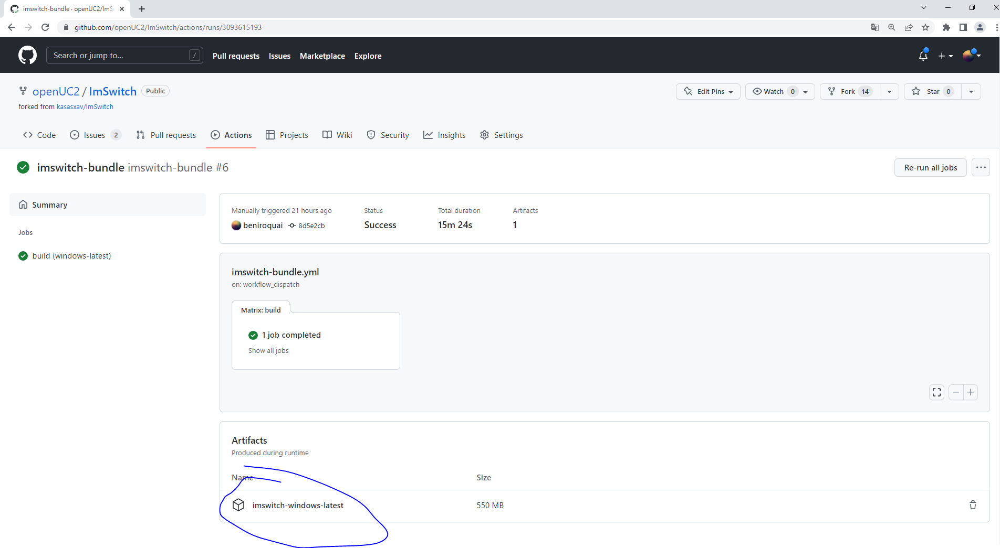
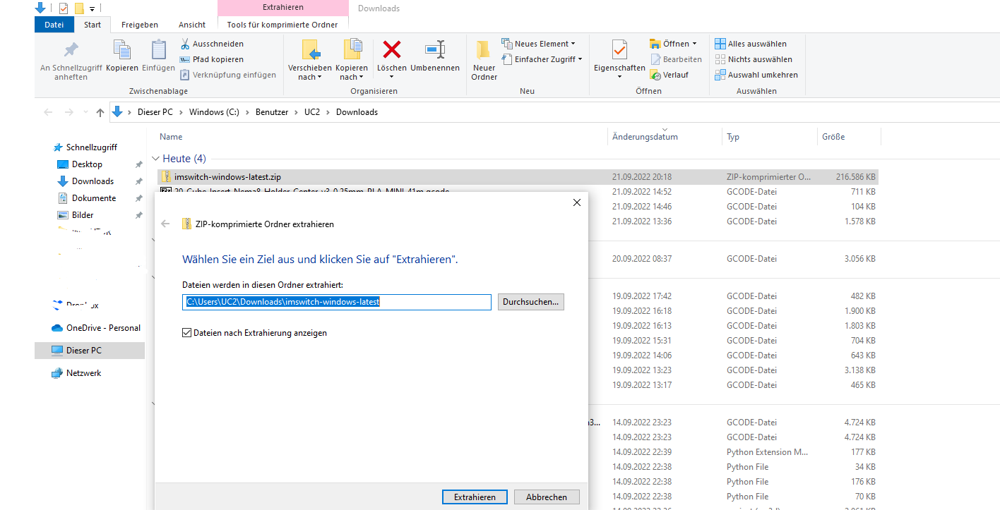
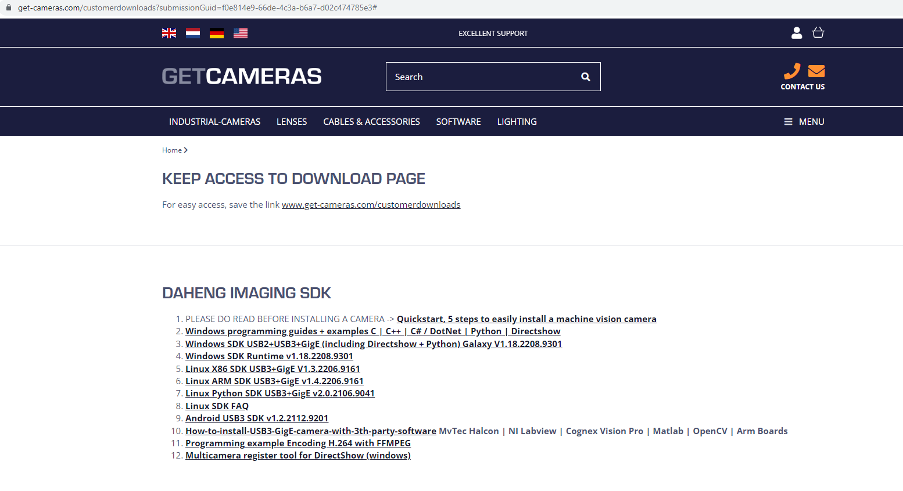
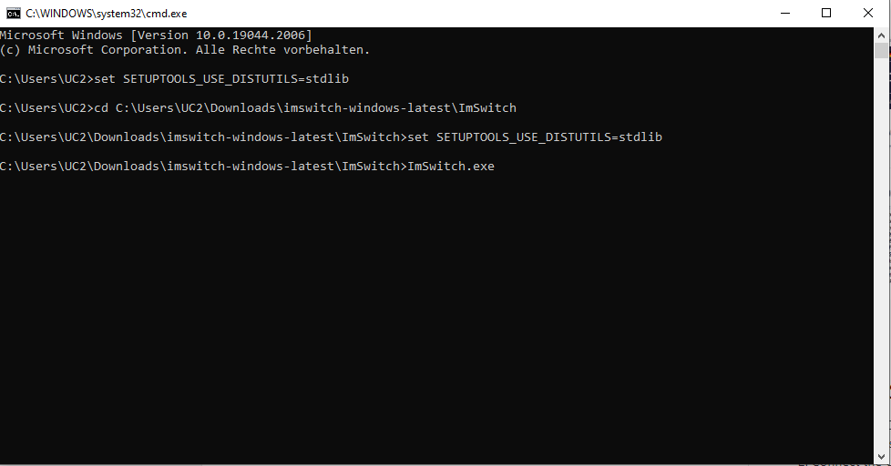

summary: A guide to install the UC2 ImSwitch Software
id: uc2-tutorial-imswitch-eng
Categories: ImSwitch
tags: imswitch
Status: Published
authors: Benedict
Feedback Link: https://youseetoo.org


<span style="color:#85B918"> __YOU\.__ </span> <span style="color:#000000"> </span>
<span style="color:#1F9C7C"> __SEE\.__ </span> <span style="color:#000000"> </span>
<span style="color:#023773"> __TOO\.__ </span>

<p align="left">

</p>


# ImSwitch for UC2 Installation Guide
<!----------------------------------------->
### What will you learn?
- How to install the main GUI software to control the Optics components
- How to intsall the drivers

<!----------------------------------------->
## Download the software
Duration: 1

Please go to our ImSwitch Repository and download the latest Build-artefact:

[GitHub Actions -> "bundle"](https://github.com/openUC2/ImSwitch/actions/runs/3093615193)

<p align="center">

</p>


<!----------------------------------------->
## Extract the ZIP folder
Duration: 2

Right click on the downloaded ZIP folder and select "extract all". This may take a while.

<p align="center">

</p>


<!----------------------------------------->
## Download and Install the drivers for the Camera/UC2 Electronics board

**Electronics Board (CH340)**

For the CH340 driver, please follow [these instructions](https://sparks.gogo.co.nz/ch340.html)

The driver is available [here](https://sparks.gogo.co.nz/assets/IMSWITCH/_site_/downloads/CH34x_Install_Windows_v3_4.zip)

```
Download the Windows CH340 Driver
Unzip the file
Run the installer which you unzipped
In the Device Manager when the CH340 is connected you will see a COM Port in the Tools > Serial Port menu, the COM number for your device may vary depending on your system.
```

**Electronics Board (CP210x)**

The driver for the CP210x is available [here](https://www.silabs.com/developers/usb-to-uart-bridge-vcp-drivers)

```
Download the Windows CP210x Driver
Unzip the file
Run the installer which you unzipped
In the Device Manager when the CP210x is connected you will see a COM Port in the Tools > Serial Port menu, the COM number for your device may vary depending on your system.
```


**Daheng Imaging Cameras**

Download the *Windows SDK USB2+USB3+GigE (including Directshow + Python) Galaxy V1.18.2208.9301* for the Daheng USB3 Cameras from the [Get-Cameras Website](https://www.get-cameras.com/requestdownload)

<p align="center">

</p>

Install the packages on your computer.

<!----------------------------------------->
Duration: 2

## Prepare ImSwitch

1. Connect the Camera with your computer (optionally test its proper functioning using Daheng Galaxy Viewer(x64)) using the USB3 cable
2. Connect the UC2 electronics with the computer (USB micro) and hook up the 12V power supply with the power connection
3. Check if you can see the USB COM Port in your device manager:

<p align="center">

</p>

<!----------------------------------------->
Duration: 2
## Install the UC2 ImSwitch Configurations

In order to use the UC2 Hardware and the Daheng USB Camera, you need the UC2 config files. Please go to https://github.com/openUC2/ImSwitchConfig/tree/stable and download the Repository as a zip file following this [link](https://github.com/openUC2/ImSwitchConfig/archive/refs/heads/stable.zip).

Once it has been downloaded, unzip it to `C:\Users\YOURUSERNAME\Documents\ImSwitchConfig`

It should look like this:

<p align="center">

</p>


<!----------------------------------------->
Duration: 2
## Start ImSwitch

1. Open a Windows Terminal by typing `WIN+R`, then type `CMD` and hit enter.

<p align="center">

</p>


2. in the Windows Terminal navigate to the folder where you downloaded the softare - e.g. `cd C:\Users\UC2\Downloads\imswitch-windows-latest\ImSwitch` and hit enter
3. start the executable **BUT** we need to add one comment in advance:`set SETUPTOOLS_USE_DISTUTILS=stdlib`
3. Type `ImSwitch.exe` and hit enter, the executable will open the ImSwitch GUI

<p align="center">

</p>

If everything has been configured correctly, the GUI should open and look like this. Additional information on its functionality can be found in the Read-The-Docs:  https://imswitch.readthedocs.io/en/stable/
<p align="center">

</p>

If you have any additional questions or issues, please post them in the [ISSUE section here](https://github.com/openUC2/ImSwitch/issues).


<!----------------------------------------->
## Explanatory Video on how to get started with ImSwitch
Duration: 3


