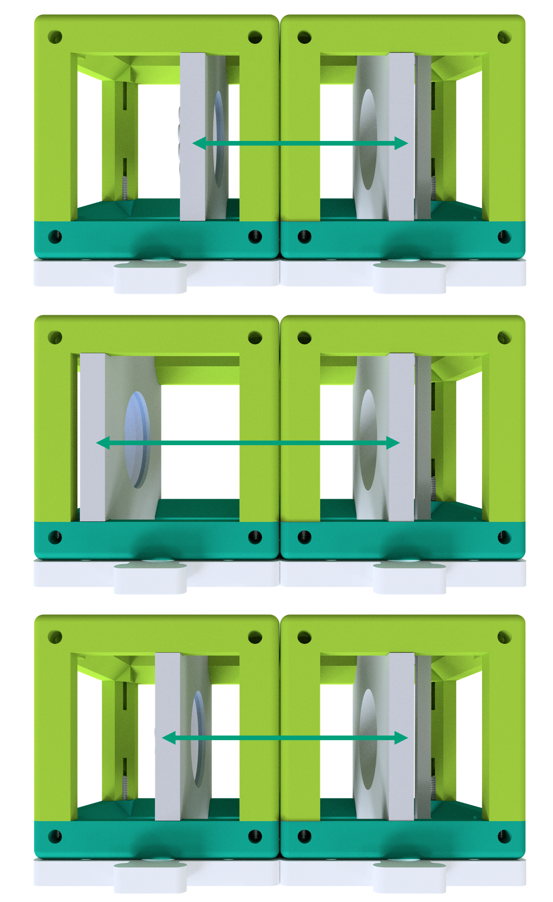

summary: UC2 Anleitung für die miniBOX
id: uc2-tutorial-minibox2
categories: miniBOX part II
tags: minibox
status: Published
authors: Benedict
Feedback Link: https://youseetoo.org

 __YOU\.__     
 __SEE\.__     
 __TOO\.__ 

# UC2 Anleitung für die miniBOX

<!-- ------------------------ -->
### Wa wirst du lernen?
- how to set the amount of time each slide will take to finish
- how to include code snippets
- how to hyperlink items
- how to include images
- other stuff

<!-- ------------------------ -->
## Was ist in der MiniBOX?
Duration: 1

**Probenhalter:** hält ein Objekt fest in einem Würfel\
**Linse:** beeinflusst die Weise wie das Licht propagiert (ausgebreitet) wird\
**Spiegel:** Reflektiert das Licht\
**Mikroskopobjektiv:** ein spezielles Linsensystem, welches ein Objekt vergrößert

<!-- ------------------------ -->
## Was ist UC2?
Duration: 2

Das Kernelement des UC2-Projekts ist ein einfacher Würfel.
Der Würfel besteht aus zwei Hälften und beherbergt einen verschiebbaren Einsatz.
Der Einsatz kann verschiedene optische Komponenten (z.B. Linsen, Spiegel) halten, womit sich mit jedem Würfel unterschiedliche Funktionen realisieren lassen.

### Würfeltyp 1: Spritzguss mit Steckverbindung

**Grundplatte**

**Grundplatte**

Der Würfel lässt sich auf eine Grundplatte montieren. Die Grundplattenmodule lassen sich wie Puzzle zusammenstecken.

<!-- ------------------------ -->
## UC2 zum Selberdrucken
Duration: 3

Der UC2-Würfel lässt sich auch 3D-drucken. Er sieht genauso aus wie das Spritzgussmodell, besteht hier aber aus einem Würfel-Deckel und dem Würfel-Körper, die mit Schrauben zusammengehalten werden. Die Schrauben eignen sich super dafür, auf die magnetischen Platte gesteckt zu werden. Durch Kombination verschiedener Würfelmodule lassen sich ganz einfach verschiedene optische Aufbauten zusammenbauen. Mit jedem Würfel kann eine neue Funktion hinzugefügt werden. Deiner Kreativität sind keine Grenzen gesetzt.

### Würfeltyp 2: 3D gedruckt mit Magnetverbindung

**Würfel**

**Grundplatte mit Magneten**

In der 3D gedruckten Grundplatte sind kleine Kugelmagnete auf die die Würfel gesteckt werden.

Willst du mehr Würfel haben? Dann kannst du sie selbst bauen. Du findest alles [hier](github.com/openUC2/UC2-GIT)

<!-- ------------------------ -->
## So passen die Würfel zusammen
Duration: 1

Achte darauf, dass die Würfel richtig auf der Platte stecken und nicht verkippt sind. Am Ende ist es wichtig, dass die Einsätze an der richtigen Stelle sitzen.

Wenn du kein scharfes Bild siehst, verschiebe die Einsätze (z.B. Linse) so lange, bis du es klar siehst. Der grüne Pfeil im Bild zeigt dir, wie das geht.

<!-- ------------------------ -->
## Was bedeuten die Symbole?
Duration: 2

|||
|----|-----|
||Experiment Wenn du diesen Block siehst, gibt es etwas zu experimentieren! Auf diesen Block kannst du einen UC2 Würfel legen. |
||**Erklärungen**: Wenn du dieses Symbol siehst, gibt es etwas zu lernen! |
||**Rechnungen:** Hier gibt es was zu Rechnen. Nimm einen Stift und ein Papier und knobel los. |
||**Vorsicht:** Berühre die Glasoberflächen nicht mit den Fingern! |
||**Reinigung der Linsen:** Wenn du die Linse berit berührt hat, kannst du sie mit einem Brillentuch reinigen. |

<!-- ------------------------ -->
## Was kann eine Linse?
Duration: 2

Nimm einen oder mehrere der Würfel in denen eine Linse steckt und schaue dir das hier abgebildet UC2 Symbol dadurch an. Halte den Würfel dabei in der Hand und verändere den Abstand zwischen der Linse und dem Bild.  

<!-- ------------------------ -->
## Linsen
Duration: 2

In der Strahlenoptik wird das Licht als Strahlenbündel (Pfeile) dargestellt, was eine Vereinfachung der physikalischen Eigenschaften von Licht mit sich bringt.  Ein Strahl hat eine Richtung und wird daher mit einem Pfeil gezeichnet. Eine Linse „bricht“ denn Strahl und ändert so seine Richtung.

Die **Brennweite** einer Linse entspricht hier der Distanz von der Linse zur Brennebene, auf der der Brennpunkt liegt. Sie wird in Millimeter angegeben (f = mm).

### Sammellinsen

Sammellinsen brechen die Lichtstrahlen, die parallel zur optische Achse laufen, in einem Punkt, der Brennpunkt gennant wird.

### Zerstreuungslinsen

Die Zerstreuungslinsen brechen die Lichtstrahlen, die parallel zur optische Achse laufen, als würden einem Punkt entspringen, der „virtuellen“ Brennpunkt gennant wird.

<!-- ------------------------ -->
## Linsen „brechen“ die Lichtstrahlen

Duration: 2

[comment]: <> (Page 10)

Die Brennweite der Linse findest du als eine gedruckte Nummer auf den Linsenhaltern. Bie MiniBOX erhält eine 100-mm-Sammellinse, zwei 40-mm-Sammellinse und eine -50-mm-Zersteruungslinse. Die Zahlen geben die Brennweite an.

Die Sammellinse heißt auch positive oder konvexe Linse. Der mittlere Teil der Linse ist immer dicker als der Rand.

Mit der Sammellinse wird das Bild vergrößert. Die Vergrößerung ist für die 40-mm-Linse und die 100-mm-Linse unterschiedlich.  Das Bild kann aufrecht oder umgekehrt sein.

 

Die Zerstreuungslinse (Streulinse) heißt manchmal auch negative oder konkave Linse. Der mittlere Teil der Linse ist immer dünner als der Rand.

Mit der Zerstreuungslinse (hier: -50-mm-Linse) ist das Bild immer verkleinert und immer aufrecht

 

Wir gehen davon aus, dass unsere Linsen so genannte "dünne Linsen" sind. Das bedeutet, dass wir sie als eine Ebene betrachten können und uns nicht um ihre Dicke kümmern. Das macht Erklärungen und Berechnungen viel einfacher.

Haben die Antworten noch mehr Fragen aufgeworfen? Dann fahre, um herauszufinden, wie genau Linsen funktionieren…

 

<!-- ------------------------ -->
## Linsen- Abbildung

Duration: 2

[comment]: <> (Page 11)

Nimm jetzt die Linsen-Würfel zur Hand. Versuche, mit der passenden Linse die jeweilige Angabe über Brennweite in den abgebildeten Würfeln zu entziffern. Bewege die Linse über der Schrift bis sie die gleiche Größe hat wie der Text "UC2".

Kannst du den Text in der gleichen Größe und Ausrichtung wie das "UC2" sehen? Was passiert, wenn du den Abstand zwischen der Linse und dem Bild veränderst?

 

Was passiert, wenn du eine Linse mit der falschen Brennweite verwendest?

 

<!-- ------------------------ -->
## Abbildung eines Gegenstandes durch eine positive Linse

Duration: 2

[comment]: <> (Page 12)

Als Beispiel nehmen wir die Sammellinse. Wir starten mit einem Gegenstand (grüner Pfeil) und schauen, was mit den Strahlen passiert, die von der Spitze aus starten. Es gibt unendlich viele Strahlen in alle Richtung, für das Zeichnen der Abbildung reichen uns aber die drei folgenden Strahlen:

1. Der **Mittelpunktstrahl** (orange) geht ungestört durch das Zentrum der Linse.
2. Der **Brennpunktstrahl** (gelb) startet auch von der Spitze des Pfeils, geht aber durch den objektseitigen Brennpunkt in der Brennweite f. Nach der Linse verläuft er auf gleicher Höhe weiter, aber nun parallel zur optischen Achse.
3. Der **Parallelstrahl** (rot) läuft zunächst parallel zur optischen Achse, wird dann aber an der Linse so gebrochen, dass er durch den bildseitigen Brennpunkt in der Brennweite f verläuft.

Das Bild entsteht dort, wo sich alle Strahlen schneiden. Das Prinzip macht man für alle Punkte bzw. die davon ausgehenden Strahlen eines Objekts. Je nach dem, welche Linse benutzt wird und je nach Position des Objekts verändern sich die Eigenschaften des Bildes, die Große, Orientierung und Position.

<!-- ------------------------ -->
## Abbildung eines Gegenstandes durch eine negative Linse

Duration: 2

[comment]: <> (Page 13)

Im Fall der Zerstreuungslinse benutzen wir die gleiche Methode, um den Strahlengang abzubilden. Anders als im Fall der Sammellinse ist das Bild immer verkleinert und virtuell. Die Vergrößerung ist von der Position des Gegenstands vor der Linse abhängig. Anders als bei der Sammellinse entsteht das Bild auf der Objektseite und heißt damit virtuelles Bild. Du kannst es direkt mit deinen Augen sehen aber nicht auf einen Bildschirm projizieren.

  

Die Art und Weise, wie eine Linse ein Bild erzeugt, ist vorhersehbar, wenn man die Brennweite dieser Linse kennt. Deshalb muss ein bestimter Abstand eingehalten werden, damit du die Schrift mit derangegebenen Linse auf dem vorhergehenden Blatt erkennst.

 

Die Vergrößerung und der Ort, an dem das Bild entsteht, hängen von der Brennweite der Linse und vom Abstand zwischen Linse und Objekt ab.

 

Mit der Zerstreuungslinse (f = -50 mm) siehst du  immer ein verkleinertes virtuelles Bild. Ein virtuelles Bild kann nur mit dem Auge betrachtet werden. Bislang haben wir nur virtuelle
Bilder gesehen.

 

<!-- ------------------------ -->
## Die Sammellinse als Lupe

Duration: 2

[comment]: <> (Page 14)

Nimm den UC2 Linsen-Würfel mit der Brennweite f = 40 mm und benutze ihn als eine Lupe.

Kannst du durch die Sammellinse die kleine Buchstaben lesen? Was steht dort geschrieben?  

 

<!-- ------------------------ -->
## Das machen Sammellinsen

Duration: 2

Mit die Sammellinsen hängt die Abbildung und die Vergrößerung von der Position des Gegenstands ab.

[comment]: <> (Page 15)

Wenn der Abstand zwischen Objekt und Linse mehr als dem doppelten der Brennweite der Linse entspricht, dann ist das Bild …
- Umgekehrt
- Seitenvertauscht
- Verkleinert
- Reell

Wenn der Abstand zwischen Objekt und Linse genau der doppelten der Brennweite der Linse entspricht, dann ist das Bild…
- Umgekehrt
- Seitenvertauscht
- Gleichgroß
- Reell

Wenn der Abstand zwischen Objekt und Linse mehr als die Brennweite und weniger als dem doppelten der Brennweite der Linse entspricht, dann ist das Bild ist…
- Umgekehrt
- Seitenvertauscht
- Vergrößert
- Reell

## Gegenstandsweite (g)
Der Abstand zwischen dem Objekt und der Linsenebene wird als g bezeichnet.

## Bildweite (b)
Der Abstand zwischen der Linsenebene und dem von der Linse erzeugten Bild wird als b bezeichnet.

Die Sammellinse kann ein reelles Bild erzeugen. Das reelle Bild sieht man dann auf einem Bildschirm.

<!-- ------------------------ -->
## Was kann eine Linse?
Duration: 2

<!-- ------------------------ -->
## Was kann eine Linse?
Duration: 2

<!-- ------------------------ -->
## Wie funktioniert ein Kinoprojektor?
Duration: 10

Nimm dir den UC2-Linsenwürfel mit der Brennweite 𝑓=40𝑚𝑚 und platziere ihn hinter den Probenhalterwürfel. Der Abstand zwischen dem Objekt und der Linse (also die Gegenstandsweite g) sollte ca. 50 mm entsprechen. Wenn du nun mit der Taschenlampe das Objekt beleuchtest, wirst du es in einem Abstand von ca. 200 mm auf der Wand scharf sehen. Ein Kinoprojektor hat statt des Objekts einen Filmstreifen und natürlich eine viel stärkere Lichtquelle.

<!-- ------------------------ -->
## Was kann eine Linse?
Duration: 2

<!-- ------------------------ -->
## Was kann eine Linse?
Duration: 2

<!-- ------------------------ -->
## Was kann eine Linse?
Duration: 2

<!-- ------------------------ -->
## Was kann eine Linse?
Duration: 2

<!-- ------------------------ -->
## Was kann eine Linse?
Duration: 2

<!-- ------------------------ -->
## Was kann eine Linse?
Duration: 2

<!-- ------------------------ -->
## Was kann eine Linse?
Duration: 2

<!-- ------------------------ -->
## Was kann eine Linse?
Duration: 2

<!-- ------------------------ -->
## Was kann eine Linse?
Duration: 2

<!-- ------------------------ -->
## Was kann eine Linse?
Duration: 2

<!-- ------------------------ -->
## Was kann eine Linse?
Duration: 2

<!-- ------------------------ -->
## Other Stuff
Duration: 1

Checkout the official documentation here: [Codelab Formatting Guide](https://github.com/googlecodelabs/tools/blob/master/FORMAT-GUIDE.md)
