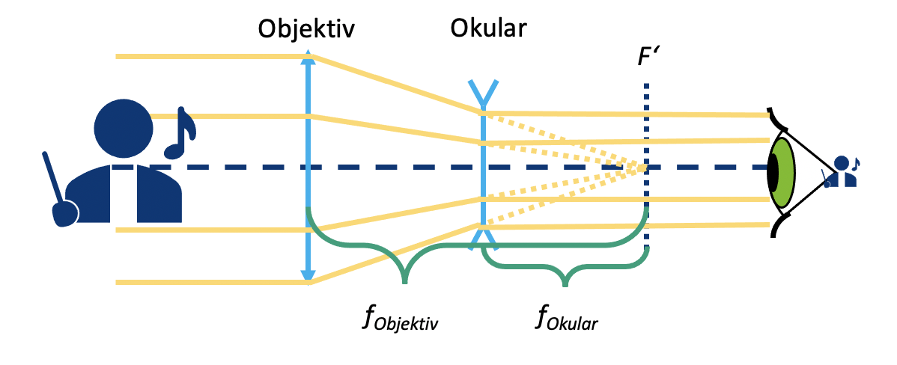
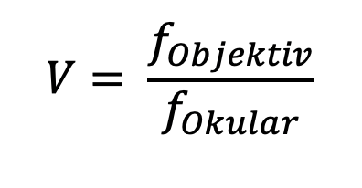
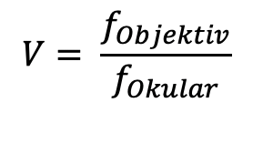
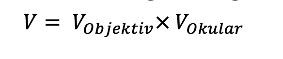
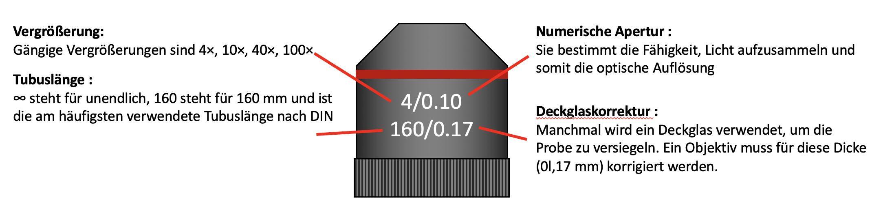

### Wa wirst du lernen?
- how to set the amount of time each slide will take to finish
- how to include code snippets
- how to hyperlink items
- how to include images
- other stuff

## Was ist in der MiniBOX?
Duration: 1

**Probenhalter:** hält ein Objekt fest in einem Würfel\
**Linse:** beeinflusst die Weise wie das Licht propagiert (ausgebreitet) wird\
**Spiegel:** Reflektiert das Licht\
**Mikroskopobjektiv:** ein spezielles Linsensystem, welches ein Objekt vergrößert

## Was ist UC2?
Duration: 2

Das Kernelement des UC2-Projekts ist ein einfacher Würfel.
Der Würfel besteht aus zwei Hälften und beherbergt einen verschiebbaren Einsatz.
Der Einsatz kann verschiedene optische Komponenten (z.B. Linsen, Spiegel) halten, womit sich mit jedem Würfel unterschiedliche Funktionen realisieren lassen.

### Würfeltyp 1: Spritzguss mit Steckverbindung

**Grundplatte**

**Grundplatte**

Der Würfel lässt sich auf eine Grundplatte montieren. Die Grundplattenmodule lassen sich wie Puzzle zusammenstecken.

## UC2 zum Selberdrucken
Duration: 3

Der UC2-Würfel lässt sich auch 3D-drucken. Er sieht genauso aus wie das Spritzgussmodell, besteht hier aber aus einem Würfel-Deckel und dem Würfel-Körper, die mit Schrauben zusammengehalten werden. Die Schrauben eignen sich super dafür, auf die magnetischen Platte gesteckt zu werden. Durch Kombination verschiedener Würfelmodule lassen sich ganz einfach verschiedene optische Aufbauten zusammenbauen. Mit jedem Würfel kann eine neue Funktion hinzugefügt werden. Deiner Kreativität sind keine Grenzen gesetzt.

### Würfeltyp 2: 3D gedruckt mit Magnetverbindung

**Würfel**

**Grundplatte mit Magneten**

In der 3D gedruckten Grundplatte sind kleine Kugelmagnete auf die die Würfel gesteckt werden.

Willst du mehr Würfel haben? Dann kannst du sie selbst bauen. Du findest alles [hier](https://github.com/openUC2/UC2-GIT)

## So passen die Würfel zusammen
Duration: 1

Achte darauf, dass die Würfel richtig auf der Platte stecken und nicht verkippt sind. Am Ende ist es wichtig, dass die Einsätze an der richtigen Stelle sitzen.

Wenn du kein scharfes Bild siehst, verschiebe die Einsätze (z.B. Linse) so lange, bis du es klar siehst. Der grüne Pfeil im Bild zeigt dir, wie das geht.

## Was bedeuten die Symbole?
Duration: 2

|||
|----|-----|
||Experiment Wenn du diesen Block siehst, gibt es etwas zu experimentieren! Auf diesen Block kannst du einen UC2 Würfel legen. |
||**Erklärungen**: Wenn du dieses Symbol siehst, gibt es etwas zu lernen! |
||**Rechnungen:** Hier gibt es was zu Rechnen. Nimm einen Stift und ein Papier und knobel los. |
||**Vorsicht:** Berühre die Glasoberflächen nicht mit den Fingern! |
||**Reinigung der Linsen:** Wenn du die Linse berit berührt hat, kannst du sie mit einem Brillentuch reinigen. |

## Was kann eine Linse?
Duration: 2

Nimm einen oder mehrere der Würfel in denen eine Linse steckt und schaue dir das hier abgebildet UC2 Symbol dadurch an. Halte den Würfel dabei in der Hand und verändere den Abstand zwischen der Linse und dem Bild.  

## Linsen
Duration: 2

In der Strahlenoptik wird das Licht als Strahlenbündel (Pfeile) dargestellt, was eine Vereinfachung der physikalischen Eigenschaften von Licht mit sich bringt.  Ein Strahl hat eine Richtung und wird daher mit einem Pfeil gezeichnet. Eine Linse „bricht“ denn Strahl und ändert so seine Richtung.

Die **Brennweite** einer Linse entspricht hier der Distanz von der Linse zur Brennebene, auf der der Brennpunkt liegt. Sie wird in Millimeter angegeben (f = mm).

### Sammellinsen

Sammellinsen brechen die Lichtstrahlen, die parallel zur optische Achse laufen, in einem Punkt, der Brennpunkt gennant wird.

### Zerstreuungslinsen

Die Zerstreuungslinsen brechen die Lichtstrahlen, die parallel zur optische Achse laufen, als würden einem Punkt entspringen, der „virtuellen“ Brennpunkt gennant wird.

## Linsen „brechen“ die Lichtstrahlen

Die Brennweite der Linse findest du als eine gedruckte Nummer auf den Linsenhaltern. Bie MiniBOX erhält eine 100-mm-Sammellinse, zwei 40-mm-Sammellinse und eine -50-mm-Zersteruungslinse. Die Zahlen geben die Brennweite an.

Die Sammellinse heißt auch positive oder konvexe Linse. Der mittlere Teil der Linse ist immer dicker als der Rand.

Mit der Sammellinse wird das Bild vergrößert. Die Vergrößerung ist für die 40-mm-Linse und die 100-mm-Linse unterschiedlich.  Das Bild kann aufrecht oder umgekehrt sein.

 

Die Zerstreuungslinse (Streulinse) heißt manchmal auch negative oder konkave Linse. Der mittlere Teil der Linse ist immer dünner als der Rand.

Mit der Zerstreuungslinse (hier: -50-mm-Linse) ist das Bild immer verkleinert und immer aufrecht

 

Wir gehen davon aus, dass unsere Linsen so genannte "dünne Linsen" sind. Das bedeutet, dass wir sie als eine Ebene betrachten können und uns nicht um ihre Dicke kümmern. Das macht Erklärungen und Berechnungen viel einfacher.

Haben die Antworten noch mehr Fragen aufgeworfen? Dann fahre, um herauszufinden, wie genau Linsen funktionieren…

 

## Linsen- Abbildung

Nimm jetzt die Linsen-Würfel zur Hand. Versuche, mit der passenden Linse die jeweilige Angabe über Brennweite in den abgebildeten Würfeln zu entziffern. Bewege die Linse über der Schrift bis sie die gleiche Größe hat wie der Text "UC2".

Kannst du den Text in der gleichen Größe und Ausrichtung wie das "UC2" sehen? Was passiert, wenn du den Abstand zwischen der Linse und dem Bild veränderst?

 

Was passiert, wenn du eine Linse mit der falschen Brennweite verwendest?

 

## Abbildung eines Gegenstandes durch eine positive Linse

Als Beispiel nehmen wir die Sammellinse. Wir starten mit einem Gegenstand (grüner Pfeil) und schauen, was mit den Strahlen passiert, die von der Spitze aus starten. Es gibt unendlich viele Strahlen in alle Richtung, für das Zeichnen der Abbildung reichen uns aber die drei folgenden Strahlen:

1. Der **Mittelpunktstrahl** (orange) geht ungestört durch das Zentrum der Linse.
2. Der **Brennpunktstrahl** (gelb) startet auch von der Spitze des Pfeils, geht aber durch den objektseitigen Brennpunkt in der Brennweite f. Nach der Linse verläuft er auf gleicher Höhe weiter, aber nun parallel zur optischen Achse.
3. Der **Parallelstrahl** (rot) läuft zunächst parallel zur optischen Achse, wird dann aber an der Linse so gebrochen, dass er durch den bildseitigen Brennpunkt in der Brennweite f verläuft.

Das Bild entsteht dort, wo sich alle Strahlen schneiden. Das Prinzip macht man für alle Punkte bzw. die davon ausgehenden Strahlen eines Objekts. Je nach dem, welche Linse benutzt wird und je nach Position des Objekts verändern sich die Eigenschaften des Bildes, die Große, Orientierung und Position.

## Abbildung eines Gegenstandes durch eine negative Linse

Im Fall der Zerstreuungslinse benutzen wir die gleiche Methode, um den Strahlengang abzubilden. Anders als im Fall der Sammellinse ist das Bild immer verkleinert und virtuell. Die Vergrößerung ist von der Position des Gegenstands vor der Linse abhängig. Anders als bei der Sammellinse entsteht das Bild auf der Objektseite und heißt damit virtuelles Bild. Du kannst es direkt mit deinen Augen sehen aber nicht auf einen Bildschirm projizieren.

  

Die Art und Weise, wie eine Linse ein Bild erzeugt, ist vorhersehbar, wenn man die Brennweite dieser Linse kennt. Deshalb muss ein bestimter Abstand eingehalten werden, damit du die Schrift mit derangegebenen Linse auf dem vorhergehenden Blatt erkennst.

 

Die Vergrößerung und der Ort, an dem das Bild entsteht, hängen von der Brennweite der Linse und vom Abstand zwischen Linse und Objekt ab.

 

Mit der Zerstreuungslinse (f = -50 mm) siehst du  immer ein verkleinertes virtuelles Bild. Ein virtuelles Bild kann nur mit dem Auge betrachtet werden. Bislang haben wir nur virtuelle
Bilder gesehen.

 

## Die Sammellinse als Lupe

Nimm den UC2 Linsen-Würfel mit der Brennweite f = 40 mm und benutze ihn als eine Lupe.

Kannst du durch die Sammellinse die kleine Buchstaben lesen? Was steht dort geschrieben?  

 

## Das machen Sammellinsen

Mit die Sammellinsen hängt die Abbildung und die Vergrößerung von der Position des Gegenstands ab.

Wenn der Abstand zwischen Objekt und Linse mehr als dem doppelten der Brennweite der Linse entspricht, dann ist das Bild …
- Umgekehrt
- Seitenvertauscht
- Verkleinert
- Reell

Wenn der Abstand zwischen Objekt und Linse genau der doppelten der Brennweite der Linse entspricht, dann ist das Bild…
- Umgekehrt
- Seitenvertauscht
- Gleich groß
- Reell

Wenn der Abstand zwischen Objekt und Linse mehr als die Brennweite und weniger als dem doppelten der Brennweite der Linse entspricht, dann ist das Bild ist…
- Umgekehrt
- Seitenvertauscht
- Vergrößert
- Reell

### Gegenstandsweite (g)
Der Abstand zwischen dem Objekt und der Linsenebene wird als g bezeichnet.

### Bildweite (b)
Der Abstand zwischen der Linsenebene und dem von der Linse erzeugten Bild wird als b bezeichnet.

Die Sammellinse kann ein reelles Bild erzeugen. Das reelle Bild sieht man dann auf einem Bildschirm.

## Darum vergrößert die Lupe

### Lupeneffekt!

Wenn der Abstand zwischen Objekt und Linse weniger als der Brennweite der Linse entspricht, dann ist das Bild ist…
- Aufrecht
- Seitenrichtig
- Vergrößert
- Virtuell

Die Lupe ist das einfachste aller optischen Geräte, denn es bloß aus einer einfachen Sammellinse mit passender Brennweite besteht. Warum vergrößert der Würfel mit der 50𝑚𝑚 den kleinen Text? Befindet sich das Objekt vor der Brennweite der Linse – also weniger als 50 𝑚𝑚 vor der Linse – erzeugt die Linse ein virtuelles Bild, welches hinter dem eigentlichen Objekt liegt. Das Auge nimmt es vergrößert wahr. Schau dir dazu das Diagramm oben an.

 

Berechne die Vergrößerung der Lupe mit der folgenden Formel:

250 𝑚𝑚 ist die Entfernung der deutlichen Sehweite – also der Abstand zwischen Objekt und Auge bei dem die meisten Menschen gut lesen können. Mehr dazu später in der „Akkommodation“ des Auges.

## Wie funktioniert ein Kinoprojektor?
Duration: 2

Nimm dir den UC2-Linsenwürfel mit der Brennweite 𝑓=40𝑚𝑚 und platziere ihn hinter den Probenhalterwürfel. Der Abstand zwischen dem Objekt und der Linse (also die Gegenstandsweite g) sollte ca. 50 mm entsprechen. Wenn du nun mit der Taschenlampe das Objekt beleuchtest, wirst du es in einem Abstand von ca. 200 mm auf der Wand scharf sehen. Ein Kinoprojektor hat statt des Objekts einen Filmstreifen und natürlich eine viel stärkere Lichtquelle.

Benutz eine Taschenlampe (z.b. von deinem Handy) als Lichtquelle und halt es vor das Objekt

 

Benutz das Bild oder den Text an dem Mikroskop-Objektträger als das Objekt

 

Wie ist das Bild orientiert?
Schiebe die Linse in dem Würfel hin und her und beobachte, wann das Bild scharf ist. Finde das Bild für g = 50 mm, 60 mm, 65 mm und messe den Abstand zwischen der Linse und dem Bild.  

 

## Wie funktioniert ein Kinoprojektor?
Duration: 2

### Wo ist das Bild?
Bei der Abbildung eines Gegenstands durch eine Sammellinse hängen Lage und Größe des Bildes von der Entfernung (g) des Gegenstands zur Linse und von deren Brennweite (f) ab.
Die Linsengleichung beschreibt den Zusammenhang zwischen der Bildweite (b) und Objektweite (g):

### Wie groß ist das Bild?
Die Vergrößerung des Objekts auf dem Schirm lässt sich einfach mit der folgenden Formel ausrechnen:

## So funktioniert der Projektor
Duration: 2

Prüfe, ob deine Beobachtung mit der Berechnung übereinstimmt

Berechne die Vergrößerung des Projektors für die verschiedenen Werte von  g und b.

Unsere Linse hat eine Brennweite von f= 40 mm.

Für g = 50 mm → b = 200 mm

Für g = 60 mm → b = 120 mm\

Für g = 65 mm → b = 104 mm\

 

Der Projektor erzeugt immer ein vergrößertes, invertiertes (umgekehrtes)  Bild.
Die Position des Bildes und seine Vergrößerung hängen von der Position und der Größe des Objekts ab.

 

## Was ist ein Galilei-Fernrohr?
Duration: 10

Stell die Linsen-Würfel auf das Blatt, wie in dem Diagramm gezeigt und schaure dann durch das Fernrohr in die Ferne.

Wie sieht das Bild aus?
Wie ist das Bild orientiert?

 

Während du durch das Fernrohr schauest, passe die Abstände zwischen den Komponenten an, um ein scharfes Bild zu sehen!

 

## Das ist ein Galilei-Fernrohr
Duration: 2

Ein Fernrohr ist ein optisches Instrument, das entfernte Objekte um ein Vielfaches näher oder größer erscheinen lässt.

Die Linse auf der Objektseite nennt man Objektiv.

Die Linse, die dem Auge zugewandt ist nennt man Okular.

Das Galilei-Fernrohr wird auch in Operngläsern verwendet.

## So funktioniert das Galilei-Fernrohr

Duration: 2

Wie lautet die Vergrößerung dieses Galilei-Fernrohrs?

Formel zur Berechnung der Vergrößerung

Mit diesem Fernrohr kann man keine sehr hohe Vergrößerung erreiche. Dafür ist es sehr kompakt.

Das Bild ist immer

* Vergrößert mit der Vergrößerung aus obiger Formel
* Aufrecht
* Seitenrichtig

Das Sichtfeld ist klein.

 

## Was ist ein Kepler-Fernrohr?
Duration: 2

Stell die Linsen in die richtige Positionen, wie in dem Diagramm gezeigt. Dann schaue durch das Fernrohr in die Ferne.

Wie sieht das Bild aus?
Wie ist das Bild orientiert?

 

Während du durch das Fernrohr schauest, variiere die Abstände zwischen den Komponenten um so ein scharfes Bild zu sehen!

 

## Das ist ein Kepler-Fernrohr

Duration: 2

Diese Art von Fernrohr wird häufig in der Astronomie benutzt.

## So funktioniert das Kepler-Fernrohr
Duration: 2

Was ist die Vergrößerung dieses Kepler-Fernrohrs?

Formel zur Berechnung der Vergrößerung

Dieses Teleskop kann eine höhere Vergrößerung als das Galilei-Fernrohr erreichen. Es erzeugt aber ein umgekehrtes Bild. Für die Beobachtung der Sterne ist das aber kein Problem.

Das Bild ist immer

* Vergrößert mit der Vergrößerung aus der obiger Formel
* Umgekehrt
* Seitenvertauschet

Das Sichtfeld ist
größer als beim Galilei-Fernrohr.

 

## Was ist ein Beobachtungsfernrohr?
Duration: 2

Das Beobachtungsfernrohr ist lang, deshalb ist das Schema nicht gleichgroß.
Stell die Linsen in die richtige Positionen wie im Diagramm dargestellt und schaue durch das Fernrohr in die Ferne.

Wie sieht das Bild hier aus im Vergleich zum Kepler-Fernrohr?

 

Während du durch das Fernrohr schauest, passe die Abstände zwischen den Komponenten an, um ein scharfes Bild zu sehen!

 

## So funktioniert das Beobachtungsfernrohr
Duration: 2

Die Vergrößerung ist wie die des Kepler-Fernrohrs. Die Umkehrlinse verändert nur die Orientierung (das Bild wird umgekehrt), nicht die Vergrößerung.

Für terrestrische Beobachtungen ist ein aufrechtes Bild notwendig. Echte terrestrische Teleskope verwenden Prismensysteme, um das Bild zu drehen und kompakt zu halten.

Das Bild ist

*Vergrößert mit der gleichen Vergrößerung wie mit dem Keppler Fernrohr
*Aufrecht
*Seitenrichtig

 

## Lichtmikroskop mit „Unendlich-Optik“
Duration: 2

Was passiert wenn man das Kepler-Fernrohr umdreht?

 

Stell das Objekt ca. 40 mm vor das Objektiv und finde das Bild ca. 100 mm hinter der Tubuslinse (mit einem Papier oder der Wand als Bildschirm), wie im Diagramm gezeigt. Bewege die Linsen so, dass du ein scharfes Bild erhältst.

Platziere das Objekt mit dem Objektiv zusammen als eine Einheit auf das Papier.  Stell die Tubuslinse in einem Abstand von 100 mm zu deinem Bildschirm (Papier, Wand). Ändere die Entfernung zwischen den Linsen – ändert sich das Bild?

 

## Das bedeutet „Unendlich-Optik“
Duration: 2

Ein Mikroskop ist ein Gerät, das es erlaubt, Objekte stark vergrößert anzusehen oder bildlich darzustellen.

Das Bild wird **Zwischenbild** genannt, da es häufig noch mit einem Okular weiter vergrößert wird.

Das Objekt steht ungefähr in der objektseitigen Brennebene des Objektivs. Somit werden alle einfallenden Strahlen in ein paralleles Strahlenbündel hinter dem Objektiv umgewandelt. Das Objektiv hat eine kurze Brennweite..

Die Tubuslinse erzeugt ein reelles Bild indem sie parallelen Strahlen, die auf die Tubuslinse treffen, in ihrer Brennebene gesammelt werden. Wenn wir sie hinter dem Objektiv platzieren, wird das Objekt aus der Brennebene des Objektivs abgebildet.  Die Tubuslinse hat eine längere Brennweite als das Objektiv.

Das Bild in der Ebene des Zwischenbildes ist umgekehrt, seitenvertauscht, vergrößert und reell. Das reelle Bild kann man auf einem Bildschirm sehen.

 

## Das bedeutet „Unendlich-Optik“
Duration: 2

Was ist die Vergrößerung des Bildes?

Vergrößerung des Bildes

Die Linsen des Kepler-Fernrohrs können auch für ein Mikroskop verwendet werden, aber in einer anderen Reihenfolge.
Solange das Objekt in der Brennebene des Objektivs und der Bildschirm in der Brennebene der Tubuslinse ist, ist die Entfernung zwischen Objektiv und Tubuslinse egal, weil die Lichtstrahlen parallel sind.

 

## „Unendlich-Optik“-Mikroskop mit Okular
Duration: 2

Kannst du das mikroskopische Bild durch die Okularlinse mit dem Auge sehen? Welche Wirkung hat der Spiegel? Baue das Mikroskop ohne den Spiegel auf. Vergewissere dich, dass du nach wie vor zwei Leerräumen zwischen der Tubuslinse und dem Okular hast. Was beobachtest du dann?

 

## Wozu ist das Okular gut?
Duration: 2

Neuere Mikroskope sind mit einer sogenannten „Unendlich-Optik“ ausgestattet. In diesem Fall erzeugt das Objektiv kein reelles Zwischenbild. Das Licht verlässt das Objektiv als unendliche parallele Strahlen. Am Ende von dem „unendlichen“ Tubus befindet sich eine Tubuslinse. Diese erzeugt ein Zwischenbild, das dann wieder durch das Okular vergrößert wird.

Das Bild hinter dem Okular ist umgekehrt, seitenvertauschet, vergrößert und virtuell. Das virtuelle Bild kann man mit dem Auge sehen.

Diese Konfiguration ist in modernen Mikroskopen sehr nützlich, da zusätzliche Komponenten wie Filter zwischen Objektiv und Tubuslinse platziert werden können, ohne den optischen Pfad zu beeinträchtigen.

Ein Filter kann dazu verwendet werden, die Helligkeit und Farbe des Bildes zu verändern.

 

## Dazu ist das Okular gut
Duration: 2

Was ist die Vergrößerung nach dem Okular?

Gesamtvergrößerung

Ein Okular ist eigentlich bloß eine Linse, die das Zwischenbild vergrößert. Es bildet das virtuelle Bild so ab, dass du es mit dem Auge betrachten kannst.

 

Mit dem Spiegel kannst du nicht nur dich selbst sehen, sondern auch das einfallende Licht in eine beliebige Richtung reflektieren. So kannst du den optischen Weg falten und die Arbeit damit angenehmer zu gestalten. Der Spiegel hat keinen Einfluss auf die Vergrößerung, aber er dreht das Bild in eine Richtung.

 

## Lichtmikroskop mit „Endlich-Optik“
Duration: 2

Stell die Würfel auf die Positionen, wie unten im Diagramm gezeigt und schaue durch das Okular.

Bau das Mikroskop wie ein Sandwich indem du eine zweite Schicht mittels Grundplatte hinzufügt. Schau von oben durch das Okular.

 

Siehst du das Bild wie bisher durch das Okular? Kannst du das echte Zwischenbild auch mit einem Blatt Papier finden?

 

Drehe das kleine Zahnrad des Objektivhalters. Damit bewegst bzw. fokussierst du das Objektiv. Wenn es nicht weiter geht, kannst du auch das Objektiv in dem Halter verschieben.

 

## „Endlich-Optik“ versus „Unendlich-Optik“
Duration: 2

Die Objektive von älteren oder kleineren Mikroskopen sind häufig so genannte Endlich-Objektive. Sie verhalten sich wie eine Linse mit äußerst kurzer Brennweite und erzeugen ein Zwischenbild hinter dem Objektiv mit einer Bildweite die sich durch die Tubuslänge definiert. Die Tubuslänge ist aufgedruckt und entspricht bei unserem Objektiv 160mm. Dort entsteht das reele Zwischenbild und wird durch die Okularoptik vergrößert.

Mikroskope haben die Möglichkeit, das Objekt entweder durch Bewegen des Objekts oder des Objektivs zu fokussieren bzw. scharfzustellen. Hier bewegen wir das Objektiv durch einen einfachen Mechanismus. Die Drehung des Zahnrads wird in eine Verschiebung der Objektivlinse umgesetzt. Für größere Bewegungen kannst du das Objektiv zusätzlich in der Schiene verschieben.

 

## „Endlich-Optik“ versus „Unendlich-Optik“
Duration: 2

Was ist die Vergrößerung des Zwischenbildes? Und was ist die Vergrößerung nach dem Okular?

Objektivvergrößerung

wie geschrieben darauf

Okularvergrößerung

Gesamtvergrößerung

Das Bild ist größer als mit dem Unendlich-Mikroskop. Die Vergrößerung des Objektivs beträgt hier 4×. Wenn du die Vergrößerung mit dem vorherigen Mikroskop berechnet hast, überrascht dich das sicherlich nicht.

 

Das Zwischenbild wird jetzt nur noch durch das Objektiv gebildet und liegt 160 mm dahinter. Wir werden im nächsten Schritt herausfinden, warum.

 

## Objektiv und Okular
Duration: 2

 

## Das ist das Objektiv
Duration: 2

Ein Objektiv ist ein optisches System, das eine vergrößerte Abbildung eines Gegenstandes erzeugt. Die verschiedenen auf dem Objektiv abgedruckten Zahlen haben verschiedene Bedeutungen:

Das 4× Objektiv hat nur eine Linse drin. Die Objektive mit stärkere Vergrößerung sind ganze Linsensystemen.

Das Objektiv ist auch eine Sammellinse mit kurzer Brennweite. Das 4x Objektiv hat eine Brennweite von f=32 mm. Wenn es als Lupe verwendet wird, hat es eine höhere Vergrößerung als die 40-mm-Linse. Das Sichtfeld ist scharf, aber klein.

 

## Das Okular
Duration: 2

Ein Okular ist eigentlich eine Lupe, da es das Zwischenbild vergrößert. Das Okular, was wir hier verwenden, ist ein sogenanntes Ramsden-Okular.
Eine einzelne Linse kann auch als Okular benutzt werden. Allerdings ist bei einem aus Linsensystem bestehendes Ramsden-Okular das Sichtfeld besser, weil es weniger Fehler am Rand des Sichtfelds erzeugt. Das Ramsden-Okular besteht aus zwei Linsen mit der gleichen Brennweite. Seine Brennweite beträgt  fRamsden-Okular = 3/4 fLinse

Was ist die Vegrößerung des Ramsden-Okulars?

Jedes Okular hat eine so genannte Ramsden-Scheibe, das ist der kleinste Durchmesser des Lichtstrahls, der aus dem Mikroskop durch das Okular austritt.

 

Das Sichtfeld ist größer und das Bild sieht mit dem Ramsden-Okular klarer aus.
Jedes Okular hat eine so genannte Ramsden-Scheibe, das ist der kleinste Durchmesser

 

## Smartphone Mikroskop
Duration: 2

Baue das Smartphone Mikroskop wie dargestellt. Nutze zwei beliebige Würfel hier um das Smartphone sicher zu platzieren.

 

Bau das Mikroskop wie ein Sandwich indem du eine zweite Schicht mittels Grundplatte hinzufügt. Schau von oben durch das Okular.

 

Tausche das Ramsden-Okular mit der 40-mm-Linse aus. Was eignet sich besser für das Auge und was für das Smartphone?

 

## Besser mit Smartphone oder Auge?
Duration: 2

Die Smartphone Kamera hat eine Linse mit sehr kurzer Brennweite da diese in das dünne Smartphone passen muss. Die Linse erzeugt dann ein Bild auf dem Kamera-Sensor dessen Eingeschaften denem menschlischen Auge ähneln.

Das Auge kann Objekte aus sowohl Ferne als auch aus der Nähe abbilden. Diese Eigenschaft heißt Akkommodation.

Die Smartphone-Kamera kann das auch, es wird allerdings als Autofokus bezeichnet. Es beschreibt die Fähigkeit, Objekte in unterschiedlichen Entfernungen scharf auf dem Sensor abzubilden.

Das Bild aus dem Okular kommt in parallelen Strahlen, als käme es aus dem Unendlichen. Sie haben mit einem entspannten Auge (Blick in die Ferne) oder mit einer auf Unendlich fokussierten Kamera beobachtet.

 

## Berechnungsergebnisse
Duration: 2

## Youtube Links
Duration: 1

<video id="Z_p9yYXZuCI"></video>

